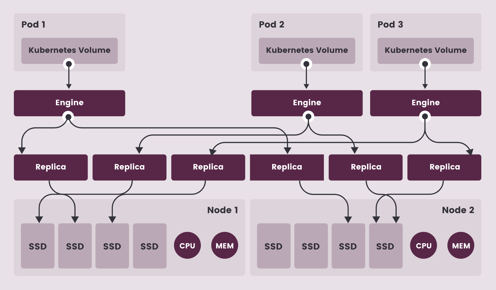
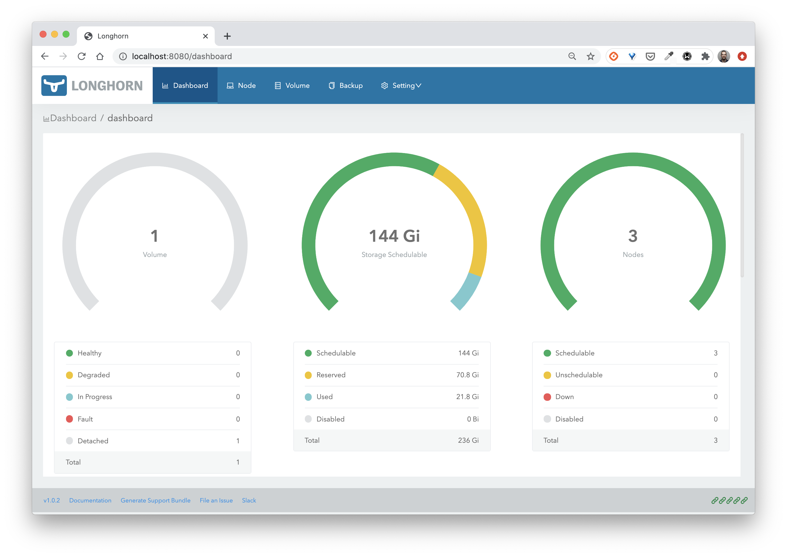
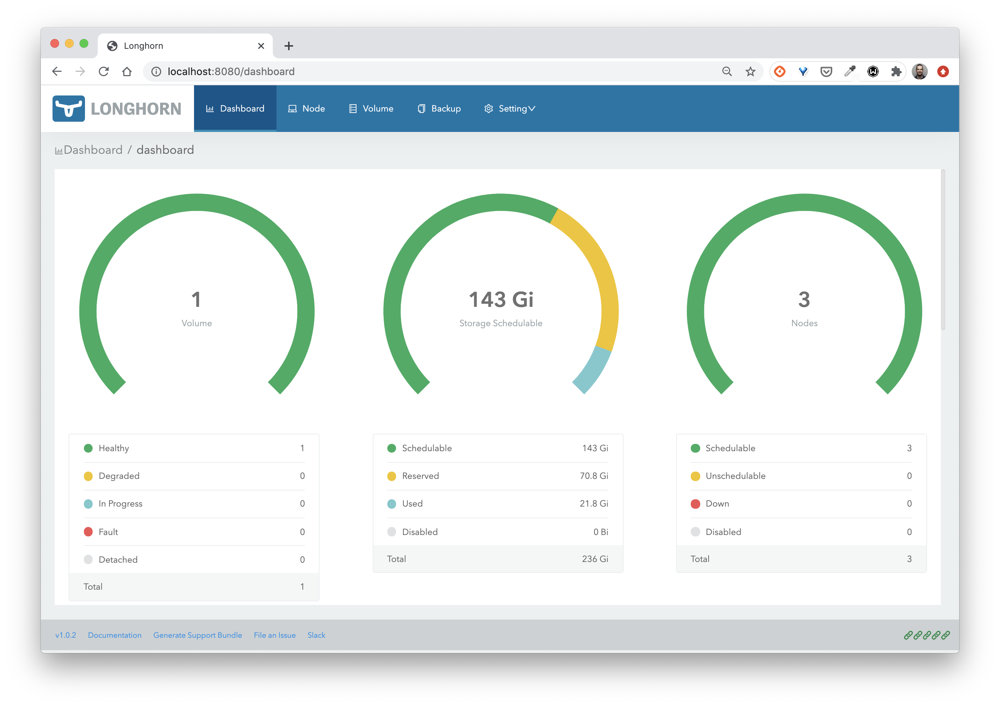
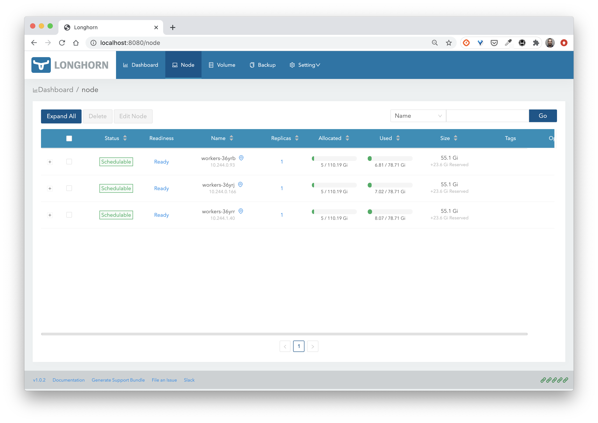

## Objectif

Dans cette mise en pratique, nous allons mettre en place *Longhorn*, une solution de stockage de type block provenant de Rancher. Longhorn est également un projet de la CNCF.



## Environnement

Pour cet exercice, nous utiliserons un cluster de 3 nodes.

## Déploiement de Longhorn

Utiliser la commande suivante pour déployer Longhorn sur votre cluster.

```
$ kubectl apply -f https://raw.githubusercontent.com/longhorn/longhorn/master/deploy/longhorn.yaml
```

Différents composants seront alors créés:

```
namespace/longhorn-system created
serviceaccount/longhorn-service-account created
clusterrole.rbac.authorization.k8s.io/longhorn-role created
clusterrolebinding.rbac.authorization.k8s.io/longhorn-bind created
customresourcedefinition.apiextensions.k8s.io/engines.longhorn.io created
customresourcedefinition.apiextensions.k8s.io/replicas.longhorn.io created
customresourcedefinition.apiextensions.k8s.io/settings.longhorn.io created
customresourcedefinition.apiextensions.k8s.io/volumes.longhorn.io created
customresourcedefinition.apiextensions.k8s.io/engineimages.longhorn.io created
customresourcedefinition.apiextensions.k8s.io/nodes.longhorn.io created
customresourcedefinition.apiextensions.k8s.io/instancemanagers.longhorn.io created
configmap/longhorn-default-setting created
podsecuritypolicy.policy/longhorn-psp created
role.rbac.authorization.k8s.io/longhorn-psp-role created
rolebinding.rbac.authorization.k8s.io/longhorn-psp-binding created
daemonset.apps/longhorn-manager created
service/longhorn-backend created
deployment.apps/longhorn-ui created
service/longhorn-frontend created
deployment.apps/longhorn-driver-deployer created
storageclass.storage.k8s.io/longhorn created
```

Après quelques dizaines de secondes vous pourrez vérifier que les Pods déployés par Longhorn tournent dans le namespace *longhorn-system*:

```
$ kubectl get po -n longhorn-system
csi-attacher-5b4745c5f7-5xjmm               1/1     Running   0          17s
csi-attacher-5b4745c5f7-s6sxm               1/1     Running   0          17s
csi-attacher-5b4745c5f7-xx5v4               1/1     Running   0          17s
csi-provisioner-57d6dbf5f4-kwtsl            1/1     Running   0          17s
csi-provisioner-57d6dbf5f4-lmfnx            1/1     Running   0          17s
csi-provisioner-57d6dbf5f4-rls8q            1/1     Running   0          17s
csi-resizer-75ff56bc48-76hv8                1/1     Running   0          16s
csi-resizer-75ff56bc48-7mfjb                1/1     Running   0          16s
csi-resizer-75ff56bc48-xkcbx                1/1     Running   0          16s
engine-image-ei-ee18f965-j4hxj              1/1     Running   0          51s
engine-image-ei-ee18f965-kv8gx              1/1     Running   0          51s
engine-image-ei-ee18f965-wv5p8              1/1     Running   0          51s
instance-manager-e-526d74eb                 1/1     Running   0          50s
instance-manager-e-662fb670                 1/1     Running   0          47s
instance-manager-e-daefebe0                 1/1     Running   0          50s
instance-manager-r-13be6934                 1/1     Running   0          49s
instance-manager-r-c51d4313                 1/1     Running   0          47s
instance-manager-r-e048e889                 1/1     Running   0          48s
longhorn-csi-plugin-4z78t                   2/2     Running   0          16s
longhorn-csi-plugin-dst2m                   2/2     Running   0          16s
longhorn-csi-plugin-jgs9j                   2/2     Running   0          16s
longhorn-driver-deployer-8558cf45fb-b7228   1/1     Running   0          65s
longhorn-manager-lfdbr                      1/1     Running   0          67s
longhorn-manager-m9snm                      1/1     Running   0          66s
longhorn-manager-qxnds                      1/1     Running   0          66s
longhorn-ui-65d76ddf9b-7wtkr                1/1     Running   0          66s
```

Une StorageClass a également été mise en place:

```
$ kubectl get sc
NAME       PROVISIONER          RECLAIMPOLICY   VOLUMEBINDINGMODE   ALLOWVOLUMEEXPANSION   AGE
longhorn   driver.longhorn.io   Delete          Immediate           true                   4m56s
```

## Accès à l'interface web

Utilisez la commande suivante pour exposer l'interface web de Longhorn via un *port-forward*:

```
$ kubectl port-forward -n longhorn-system service/longhorn-frontend 8080:80
```


## Création d'un volume

La spécification suivante définit un *PersistentVolumeClaim* basé sur la *StorageClass* créée précédemment:

```
$  cat << EOF | kubectl apply -f -
apiVersion: v1
kind: PersistentVolumeClaim
metadata:
  name: mongo-pvc
spec:
  storageClassName: longhorn
  accessModes:
  - ReadWriteOnce
  resources:
    requests:
      storage: 5G
EOF
```

Vous pouvez ensuite voir qu'un PVC et un PV ont été créés:

```
$ kubectl get pvc,pv
NAME                             STATUS  VOLUME      CAPACITY  ACCESS MODES  STORAGECLASS   AGE
persistentvolumeclaim/mongo-pvc  Bound   pvc-b5b...  5Gi       RWO           longhorn       61s

NAME           CAPACITY  ACCESS MODES  RECLAIM POLICY  STATUS   CLAIM               STORAGECLASS   REASON   AGE
pv/pvc-b5b...  5Gi       RWO           Delete          Bound    default/mongo-pvc   longhorn                57s
```

Depuis l'interface web de Longhorn on peut alors voir qu'un volume a été crée.



Dans la suite, vous allez utiliser ce volume dans un Deployment.

## Utilisation dans un workload de base de données

Lancez le Deployment suivant, celui-ci utilise le PVC *mongo-pvc* créé précédemment.

```
$ cat << EOF | kubectl apply -f -
apiVersion: apps/v1
kind: Deployment
metadata:
  name: db
spec:
  selector:
    matchLabels:
      app: db
  template:
    metadata:
      labels:
        app: db
    spec:
      containers:
      - image: mongo:4.0
        name: mongo
        ports:
        - containerPort: 27017
        volumeMounts:
        - name: mongo-persistent-storage
          mountPath: /data/db
      volumes:
      - name: mongo-persistent-storage
        persistentVolumeClaim:
          claimName: mongo-pvc          
EOF
```

Depuis l'interface web de Longhorn vous pourrez alors voir que le volume est maintenant disponible et actif.



Depuis le menu *Node*, vous pourrez également voir que les 5G du volume sont répliqués sur les différentes nodes.



## Cleanup

Supprimez ensuite les ressources que vous avez créées:

```
$ kubectl delete deploy db
$ kubectl delete pvc mongo-pvc
$ kubectl delete -f https://raw.githubusercontent.com/longhorn/longhorn/master/deploy/longhorn.yaml
```
