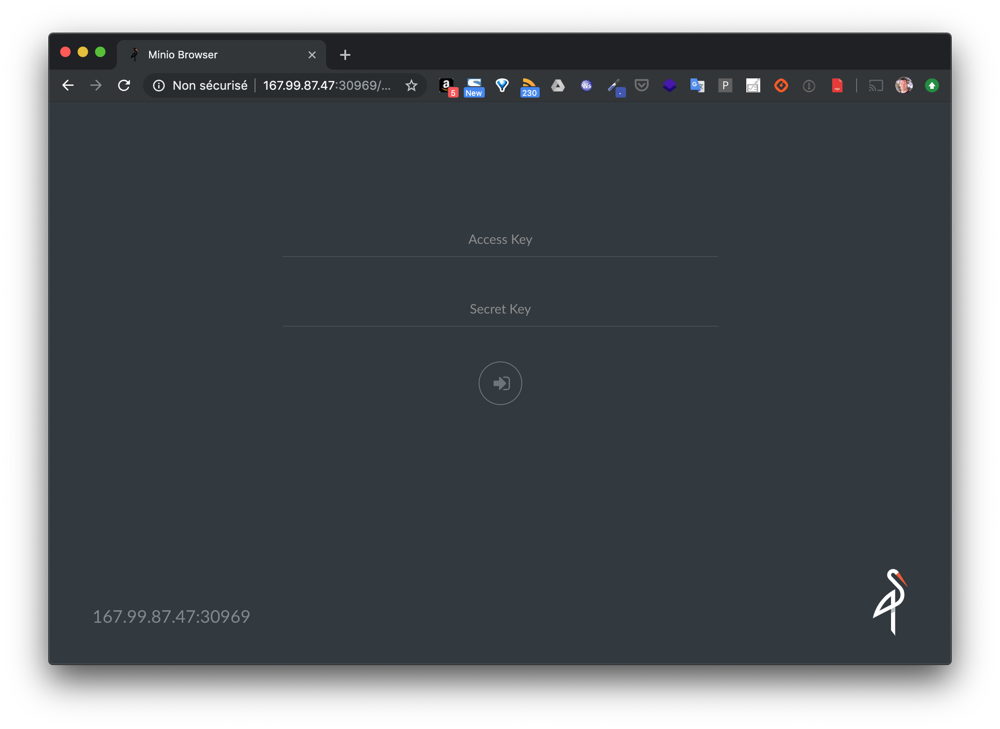
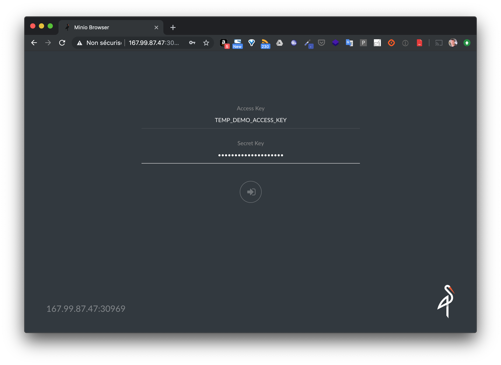
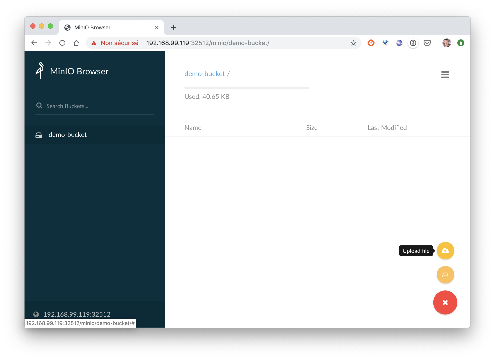

## Objectif

Dans cette mise en pratique, nous allons utiliser *Rook* afin de déployer un stockage objet basé sur *Minio*

Note: cet exemple est réalisé sur *Minikube* mais vous pouvez suivre ces instructions sur votre propre cluster Kubernetes

## Récupération du projet

Utilisez les commandes suivantes pour récupérez le projet *rook*. Vous utiliserez la release 1.2, dernière release stable en date.

```
$ git clone https://github.com/rook/rook.git
$ cd rook
$ git checkout release-1.2
$ cd cluster/examples/kubernetes/minio
```

## Déploiement de l'opérateur Rook

Utilisez la commande suivante pour déployer l'opérateur *Rook*. Ce process sera en charge d'orchestrer le stockage objet qui sera distribué au sein du cluster.

```
$ kubectl create -f operator.yaml
```

Vous devriez obtenir le résultat suivant, dans lequel sont listées les différentes ressources créées.

```
namespace/rook-minio-system created
customresourcedefinition.apiextensions.k8s.io/objectstores.minio.rook.io created
clusterrole.rbac.authorization.k8s.io/rook-minio-operator created
serviceaccount/rook-minio-operator created
clusterrolebinding.rbac.authorization.k8s.io/rook-minio-operator created
deployment.apps/rook-minio-operator created
```

## Vérification des Pods

Avec la commande suivante, vérifiez que le Pod de l'opérator a été correctement créé.

```
$ kubectl -n rook-minio-system get pod
NAME                                  READY   STATUS    RESTARTS   AGE
rook-minio-operator-dd6fd5c75-hnbnq   1/1     Running   0          37s
```

## Création d'un ObjectStore

Vous pouvez à présent créer une ressource de type *ObjectStore*. Cela mettera en place un cluster de stockage objet basé sur Minio.

```
$ kubectl create -f object-store.yaml
```

Par défault, ce fichier de spécification *object-store.yaml* définit 4 nodes pour la mise en place de ce cluster:

```
apiVersion: minio.rook.io/v1alpha1
kind: ObjectStore
metadata:
  name: my-store
  namespace: rook-minio
spec:
  scope:
    nodeCount: 4
...
```

Cela signifie que 4 Pods seront déployés, chacun avec un stockage associé. Cela est confirmé par la commande suivante qui liste les 4 Pods créés dans le namespace *rook-minio*.

```
$ kubectl get pod -n rook-minio
NAME         READY   STATUS    RESTARTS   AGE
my-store-0   1/1     Running   1          2m50s
my-store-1   1/1     Running   1          2m39s
my-store-2   1/1     Running   0          2m26s
my-store-3   1/1     Running   0          2m15s
```

Nous pouvons également voir que 4 ressources de type *PersistentVolume* ont été créées. Ces différents volumes seront utilisés pour persister les données et les répliquer à travers le cluster.

```
$ kubectl get pv
NAME                                       CAPACITY   ACCESS MODES   RECLAIM POLICY   STATUS   CLAIM                                    STORAGECLASS   REASON   AGE
pvc-92140e4e-cd73-11e9-9e3e-08002713dda7   8Gi        RWO            Delete           Bound    rook-minio/rook-minio-data1-my-store-0   standard                68s
pvc-9b5745ad-cd73-11e9-9e3e-08002713dda7   8Gi        RWO            Delete           Bound    rook-minio/rook-minio-data1-my-store-1   standard                48s
pvc-a432f222-cd73-11e9-9e3e-08002713dda7   8Gi        RWO            Delete           Bound    rook-minio/rook-minio-data1-my-store-2   standard                37s
pvc-a985b50b-cd73-11e9-9e3e-08002713dda7   8Gi        RWO            Delete           Bound    rook-minio/rook-minio-data1-my-store-3   standard                28s
```

Chacun de ces *PersistentVolume* a été créé à partir d'une ressource de type *PersistentVolumeClaim* utilisée par chacun des Pods *my-store-i* (0 <= i <= 4). La commande suivante montre les *PersistentVolumeClaim* qui ont été créés et associées (on parle de *Binding*) aux différents *PersistentVolume*.

```
$ kubectl get pvc -n rook-minio
NAME                          STATUS   VOLUME                                     CAPACITY   ACCESS MODES   STORAGECLASS   AGE
rook-minio-data1-my-store-0   Bound    pvc-92140e4e-cd73-11e9-9e3e-08002713dda7   8Gi        RWO            standard       98s
rook-minio-data1-my-store-1   Bound    pvc-9b5745ad-cd73-11e9-9e3e-08002713dda7   8Gi        RWO            standard       82s
rook-minio-data1-my-store-2   Bound    pvc-a432f222-cd73-11e9-9e3e-08002713dda7   8Gi        RWO            standard       67s
rook-minio-data1-my-store-3   Bound    pvc-a985b50b-cd73-11e9-9e3e-08002713dda7   8Gi        RWO            standard       58s
```

Pour aller un petit peu plus loin, on peut également voir que chacun des *PersistentVolume* est basé sur la *StorageClass* nommée *standard*.

```
$ kubectl get pv pvc-92140e4e-cd73-11e9-9e3e-08002713dda7 -o jsonpath='{ .spec.storageClassName }'
standard
```

Dans *Minikube*, cette *StorageClass* est utilisée par défaut. Elle permet de créer du stockage sur le filesystème de la machine hôte et de le mettre à disposition des Pods qui sont déployés.

Note: si vous utilisez un cluster autre que Minikube, vous aurez une StorageClass nommée différemment et reposant sur une solution de stockage différente (utilisant un autre stockage que le système de fichier de la machine hôte)

```
$ kubectl get sc standard -o jsonpath='{.provisioner}'
k8s.io/minikube-hostpath
```

## Accès à l'interface

Lors de l'étape précédente, le service *minio-service* a été créé.

```
$ kubectl get svc -n rook-minio
NAME             TYPE        CLUSTER-IP     EXTERNAL-IP   PORT(S)          AGE
minio-my-store   NodePort    10.107.81.88   <none>        9000:32512/TCP   23m
my-store         ClusterIP   None           <none>        9000/TCP         23m
```

Nous pouvons alors récupérer le port sur lequel celui-ci tourne, ici *32512*. Depuis chaque machine du cluster, vous pouvez alors accéder à l'interface Web de Minio.

Note: TEMP_DEMO_ACCESS_KEY / TEMP_DEMO_SECRET_KEY sont les credentials par défaut, ils peuvent être modifiés dans le fichier *object-store.yaml*.




Vous pouvez ensuite créer des *Buckets* et uploader des objets, ceux-ci seront persistés par Minio au sein du cluster kubernetes.





## Cleanup

Supprimez l'object store avec la commande suivante:

```
$ kubectl delete -f object-store.yaml
```

## En résumé

Au sein d'un cluster Kubernetes, nous avons donc déployé un cluster de stockage objet basé sur Minio. Cette solution offre une API compatible avec la solution de stockage objet Amazon S3.
