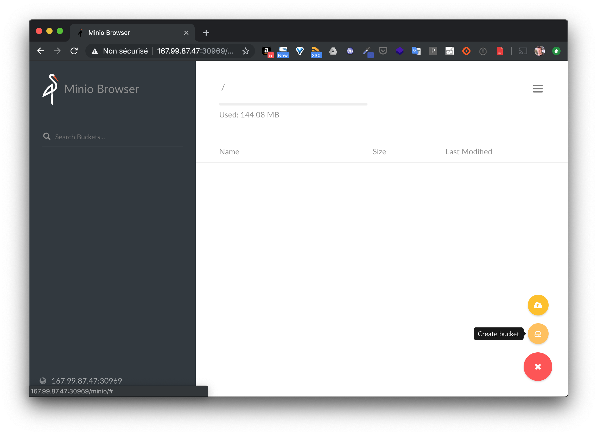

Dans cette mise en pratique, nous allons déployer **Rook** et utiliser le stockage object storage via *Minio*.

## Récupération du projet

Utilisez les commandes suivantes pour récupérez le projet *rook*. Vous utiliserez la release 0.9, dernière release stable.

```
$ git clone https://github.com/rook/rook.git
$ cd rook
$ git checkout release-0.9
$ cd cluster/examples/kubernetes/minio
```

## Déploiement de l'opérateur Rook

Utilisez les commandes suivantes pour déployer l'opérateur *Rook*.
C'est lui qui sera en charge d'orchestrer le stockage objet qui sera distribué au sein du cluster.

```
$ kubectl create -f operator.yaml
```

Vous devriez obtenir le résultat suivant, dans lequel sont listées les différentes ressources créées.

```
namespace/rook-minio-system created
customresourcedefinition.apiextensions.k8s.io/objectstores.minio.rook.io created
clusterrole.rbac.authorization.k8s.io/rook-minio-operator created
serviceaccount/rook-minio-operator created
clusterrolebinding.rbac.authorization.k8s.io/rook-minio-operator created
deployment.apps/rook-minio-operator created
```

## Vérification des Pods

Avec la commande suivante, vérifiez que le Pod de l'opérator a été correctement créé.

```
$ kubectl -n rook-minio-system get pod
```

## Création d'un objectstore

Vous pouvez à présent créer un object store basé sur Minio.

```
$ kubectl create -f object-store.yaml
```

## Accès à l'interface

Lors de l'étape précédente, le service *minio-service* a été créé, récupéré le port sur lequel celui-ci tourne.

```
$ kubectl -n rook-minio get service
NAME            TYPE        CLUSTER-IP       EXTERNAL-IP   PORT(S)          AGE
minio-service   NodePort    10.107.177.122   <none>        9000:31009/TCP   1m
my-store        ClusterIP   None             <none>        9000/TCP         1m
```

Ici, depuis le port *31009* de chaque machine du cluster, vous pouvez accéder à l'interface web de Minio.


Note: TEMP_DEMO_ACCESS_KEY / TEMP_DEMO_SECRET_KEY sont les credentials par défaut, ils peuvent être modifiés dans le fichier *object-store.yaml*.

Vous pouvez ensuite créer des *Buckets* et uploader des objets, ceux-ci seront persistés par Minio au sein du cluster kubernetes.



