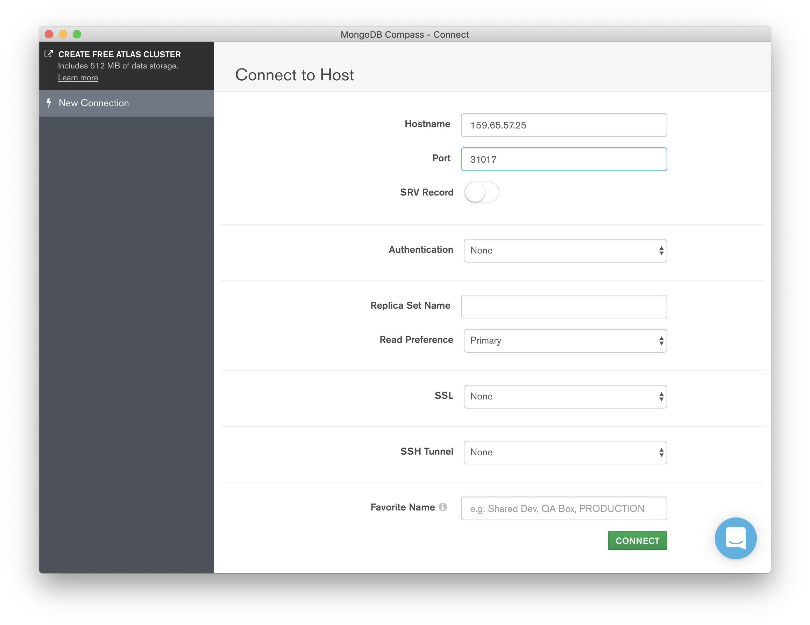
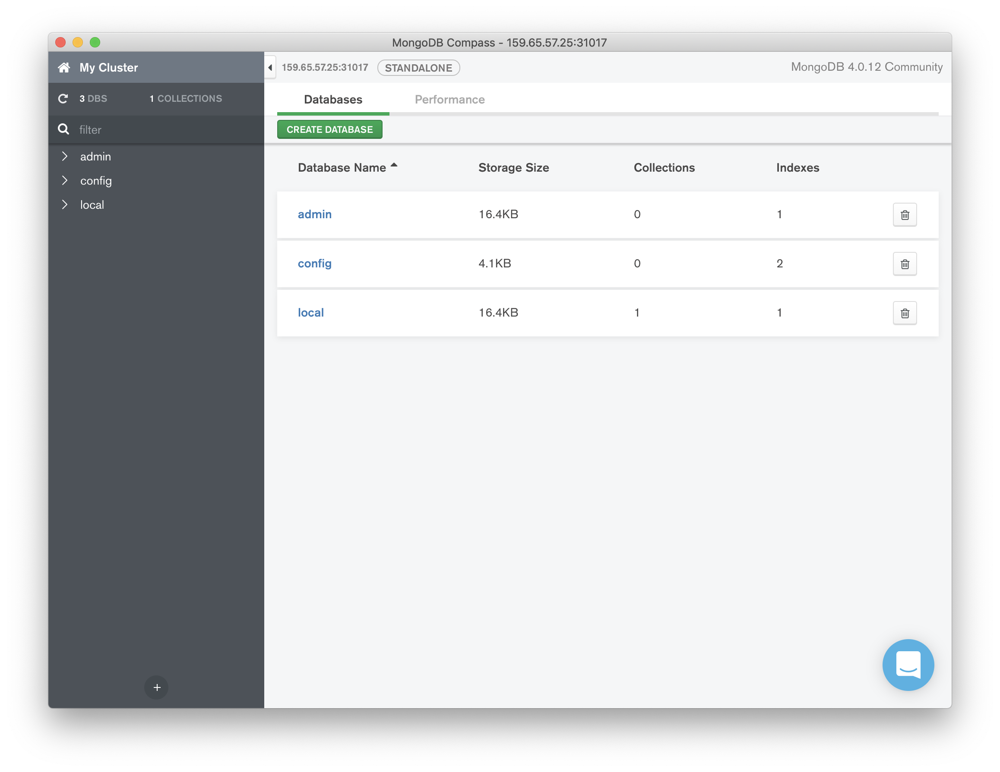

## Objectif

Dans cette mise en pratique, nous allons utiliser *Rook* pour mettre en place un cluster *Ceph* au sein d'un cluster Kubernetes. Nous utiliserons ensuite du stockage block pour persister une base de données *MongoDB*.

## Environnement

Nous utiliserons ici un cluster avec les spécifications suivantes:
- créé à l'aide de l'utilitaire *kubeadm*
- un node master, 2 nodes worker
- chaque node est basé sur *Ubuntu 18.04*

```
$ kubectl get nodes
NAME      STATUS   ROLES    AGE   VERSION
node-01   Ready    master   87m   v1.15.3
node-02   Ready    <none>   84m   v1.15.3
node-03   Ready    <none>   84m   v1.15.3
```

## Déploiement de rook

Vous allez commencer par récupérer le repository *git* du projet et vous positionner dans la branche correspondant à la release 1.1, dernière en date:

```
$ git clone https://github.com/rook/rook.git
$ cd rook
$ git checkout release-1.1
$ cd cluster/examples/kubernetes/ceph
```

Utilisez ensuite les commandes suivantes pour déployer l'opérateur Rook et ses dépendances:

```
$ kubectl create -f common.yaml
$ kubectl create -f operator.yaml
```

Vérifiez que toutes les ressources ont été créées correctement dans le namespace *rook-ceph*, vous devriez rapidement obtenir un résultat similaire à celui ci-dessous (un agent *rook-discover* tournant sur chaque node worker):


```
$ kubectl get pod -n rook-ceph -o wide
NAME                                  READY   STATUS    RESTARTS   AGE     IP          NODE      NOMINATED NODE   READINESS GATES
rook-ceph-operator-6dbdbc6b94-vkbnp   1/1     Running   0          5m39s   10.40.0.1   node-03   <none>           <none>
rook-discover-9dsn6                   1/1     Running   0          5m4s    10.32.0.3   node-02   <none>           <none>
rook-discover-bcbpb                   1/1     Running   0          5m4s    10.40.0.2   node-03   <none>           <none>
```

Nous allons également faire en sorte que des Pods puissent être schédulés sur le node master *node-01*. Pour cela, supprimez la taint utilisée pour empêcher le scheduling d'un Pod sur un node de type master:

```
$ kubectl taint nodes node-01 node-role.kubernetes.io/master:NoSchedule-
node/node-01 untainted
```

Si l'on liste une nouvelle fois les Pods du namespace *rook-ceph*, nous pouvons voir qu'il y a maintenant 3 Pods *rook-discover*, un sur chacun des nodes:

```
$ kubectl get pod -n rook-ceph -o wide
NAME                                  READY   STATUS    RESTARTS   AGE     IP          NODE      NOMINATED NODE   READINESS GATES
rook-ceph-operator-6dbdbc6b94-vkbnp   1/1     Running   0          19m     10.40.0.1   node-03   <none>           <none>
rook-discover-9dsn6                   1/1     Running   0          18m     10.32.0.3   node-02   <none>           <none>
rook-discover-bcbpb                   1/1     Running   0          18m     10.40.0.2   node-03   <none>           <none>
rook-discover-lp6qn                   1/1     Running   0          9m55s   10.46.0.2   node-01   <none>           <none>
```

## Création d'un cluster Ceph

Nous allons maintenant déployer un cluster Ceph à l'intérieur de notre cluster Kubernetes. Nous allons pour cela créer la ressource *CephCluster* dont la spécification est la suivante:


```
apiVersion: ceph.rook.io/v1
kind: CephCluster
metadata:
  name: rook-ceph
  namespace: rook-ceph
spec:
  cephVersion:
    # For the latest ceph images, see https://hub.docker.com/r/ceph/ceph/tags
    image: ceph/ceph:v14.2.2-20190826
  dataDirHostPath: /var/lib/rook
  mon:
    count: 3
  dashboard:
    enabled: true
  storage:
    useAllNodes: true
    useAllDevices: false
    # Important: Directories should only be used in pre-production environments
    directories:
    - path: /var/lib/rook
```

Dans cet exemple, les données du cluster Ceph seront sauvegardées, et répliquées, sur le système de fichiers des différents nodes. Dans un contexte de production, nous utiliserions des disques externes attachés à chaque node pour assurer la persistance.

Sauvegardez cette spécification dans le fichier *cluster-demo.yaml* et créez la ressource avec la commande suivante:

```
$ kubectl apply -f cluster-demo.yaml
```

Après quelques minutes, de nouveaux Pods, en charge du storage dans le cluster Ceph, seront déployés. Vérifiez le à l'aide de la commande suivante:

```
$ kubectl get pod -n rook-ceph
NAME                                           READY   STATUS    RESTARTS   AGE
csi-cephfsplugin-kfsz5                         3/3     Running   0          4m25s
csi-cephfsplugin-p244h                         3/3     Running   0          4m25s
csi-cephfsplugin-provisioner-c6b8b6dff-lqr9s   4/4     Running   1          4m25s
csi-cephfsplugin-provisioner-c6b8b6dff-vmwmx   4/4     Running   0          4m24s
csi-cephfsplugin-wt855                         3/3     Running   0          4m25s
csi-rbdplugin-j9gk9                            3/3     Running   0          4m25s
csi-rbdplugin-l4pxs                            3/3     Running   0          4m25s
csi-rbdplugin-mzlw9                            3/3     Running   0          4m25s
csi-rbdplugin-provisioner-68f5664455-4jt27     5/5     Running   1          4m25s
csi-rbdplugin-provisioner-68f5664455-h4cbc     5/5     Running   1          4m25s
rook-ceph-agent-dcq69                          1/1     Running   0          4m25s
rook-ceph-agent-mn6zf                          1/1     Running   0          4m25s
rook-ceph-agent-xsmjb                          1/1     Running   0          4m25s
rook-ceph-mgr-a-7d585cb886-82xs8               1/1     Running   0          26s
rook-ceph-mon-a-7cf4746d74-rd9vv               1/1     Running   0          2m7s
rook-ceph-mon-b-84d84b5bcd-7bzpn               1/1     Running   0          111s
rook-ceph-mon-c-7557846d5c-8wndx               1/1     Running   0          70s
rook-ceph-operator-6dbdbc6b94-vkbnp            1/1     Running   0          33m
rook-discover-9dsn6                            1/1     Running   0          32m
rook-discover-bcbpb                            1/1     Running   0          32m
rook-discover-lp6qn                            1/1     Running   0          24m
```

Ceph peut mettre à disposition du stockage de différente forme:
- filesystem partagé
- object
- block

Dans la suite, nous allons mettre en place du stockage sous la forme block et l'utiliser pour persister les données d'une base de données.

## StorageClass

La spécification suivante (présente dans le fichier *cluster/examples/kubernetes/ceph/csi/rbd/storageclass.yaml*) définie une StorageClass permettant l'utilisation de stockage de type block dans le cluster Ceph.

```
apiVersion: ceph.rook.io/v1
kind: CephBlockPool
metadata:
  name: replicapool
  namespace: rook-ceph
spec:
  failureDomain: host
  replicated:
    size: 3
---
apiVersion: storage.k8s.io/v1
kind: StorageClass
metadata:
   name: rook-ceph-block
# Change "rook-ceph" provisioner prefix to match the operator namespace if needed
provisioner: rook-ceph.rbd.csi.ceph.com
parameters:
    # clusterID is the namespace where the rook cluster is running
    clusterID: rook-ceph
    # Ceph pool into which the RBD image shall be created
    pool: replicapool

    # RBD image format. Defaults to "2".
    imageFormat: "2"

    # RBD image features. Available for imageFormat: "2". CSI RBD currently supports only `layering` feature.
    imageFeatures: layering

    # The secrets contain Ceph admin credentials.
    csi.storage.k8s.io/provisioner-secret-name: rook-ceph-csi
    csi.storage.k8s.io/provisioner-secret-namespace: rook-ceph
    csi.storage.k8s.io/node-stage-secret-name: rook-ceph-csi
    csi.storage.k8s.io/node-stage-secret-namespace: rook-ceph

    # Specify the filesystem type of the volume. If not specified, csi-provisioner
    # will set default as `ext4`.
    csi.storage.k8s.io/fstype: xfs

# Delete the rbd volume when a PVC is deleted
reclaimPolicy: Delete
```

Créez la StorageClass avec la commande suivante :

```
$ kubectl apply -f ./csi/rbd/storageclass.yaml
cephblockpool.ceph.rook.io/replicapool created
storageclass.storage.k8s.io/rook-ceph-block created
```

## Création d'un PVC

La spécification suivante définie un PersistentVolumeClaim utilisant la storageClass *rook-ceph-block* créée précédemment.

```
apiVersion: v1
kind: PersistentVolumeClaim
metadata:
  name: mongo-pvc
spec:
  storageClassName: rook-ceph-block
  accessModes:
  - ReadWriteOnce
  resources:
    requests:
      storage: 1Gi
```

Copiez le contenu ci-dessus dans un fichier *pvc-rook-ceph-block.yaml* et créez la resource :

```
$ kubectl apply -f pvc-rook-ceph-block.yaml
```

La création d'un PersistentVolumeClaim, utilisant la storageClass définie précédemment, déclenche la création d'un PersistentVolume de manière automatique. Le PVC est alors bindé au PV, comme vous pourrez le vérifier avec la commande suivante:

```
$ kubectl get pv,pvc
NAME                                 CAPACITY   ACCESS MODES   RECLAIM POLICY   STATUS   CLAIM               STORAGECLASS      REASON   AGE
persistentvolume/pvc-98ad4953-2044   1Gi        RWO            Delete           Bound    default/mongo-pvc   rook-ceph-block            14s

NAME                              STATUS   VOLUME              CAPACITY   ACCESS MODES   STORAGECLASS      AGE
persistentvolumeclaim/mongo-pvc   Bound    pvc-98ad4953-2044   1Gi        RWO            rook-ceph-block   17s
```

## Création d'un Deployment MongoDB

Nous allons maintenant créer un Deployment utilisant le PVC précédent.

La spécification suivante définie :
- un Deployment avec 1 Pod, celui-ci contenant un containeur basé sur MongoDB. Ce container utilise le PVC créé précédemment, et monté sur /data/db
- un Service de type NodePort exposant mongo sur le port 31017 des machines du cluster

```
apiVersion: apps/v1
kind: Deployment
metadata:
  name: mongo
spec:
  selector:
    matchLabels:
      app: mongo
  template:
    metadata:
      labels:
        app: mongo
    spec:
      containers:
      - image: mongo:4.0
        name: mongo
        ports:
        - containerPort: 27017
          name: mongo
        volumeMounts:
        - name: mongo-persistent-storage
          mountPath: /data/db
      volumes:
      - name: mongo-persistent-storage
        persistentVolumeClaim:
          claimName: mongo-pvc
---
apiVersion: v1
kind: Service
metadata:
  name: mongo
  labels:
    app: mongo
spec:
  selector:
    app: mongo
  type: NodePort
  ports:
    - port: 27017
      nodePort: 31017
```

Copiez le contenu de cette spécification dans le fichier *mongo.yaml* et créez les ressources avec la commande suivante:

```
$ kubectl apply -f mongo.yaml
```

Vérifiez que le Pod a été correctement démarré

```
$ kubectl get pods
NAME                     READY   STATUS    RESTARTS   AGE
mongo-7484f8b86b-9jrs9   1/1     Running   0          41s
```

## Test de la connection

Avec un client Mongo (ligne de commande, Compass, ...) testez la connection.





Créez des données, celles-ci seront persistées dans le cluster de stockage *Ceph* et répliquées entre les différents nodes.

## En résumé

Rook a permis de mettre en place un cluster Ceph dans notre cluster Kubernetes. Nous avons pu utiliser du stockage block afin de persister des données d'une base mongo.

Rook permet d'orchestrer différentes solutions de stockage, notamment:
- Ceph (stable)
- EdgeFS (stable)
- Cassandra (alpha)
- CockroachDB (alpha)
- Minio (alpha)
- NFS (alpha)

Rook est un projet très prometteur, n'hésitez pas à également le tester avec l'une des autres solutions de stockage proposées.
