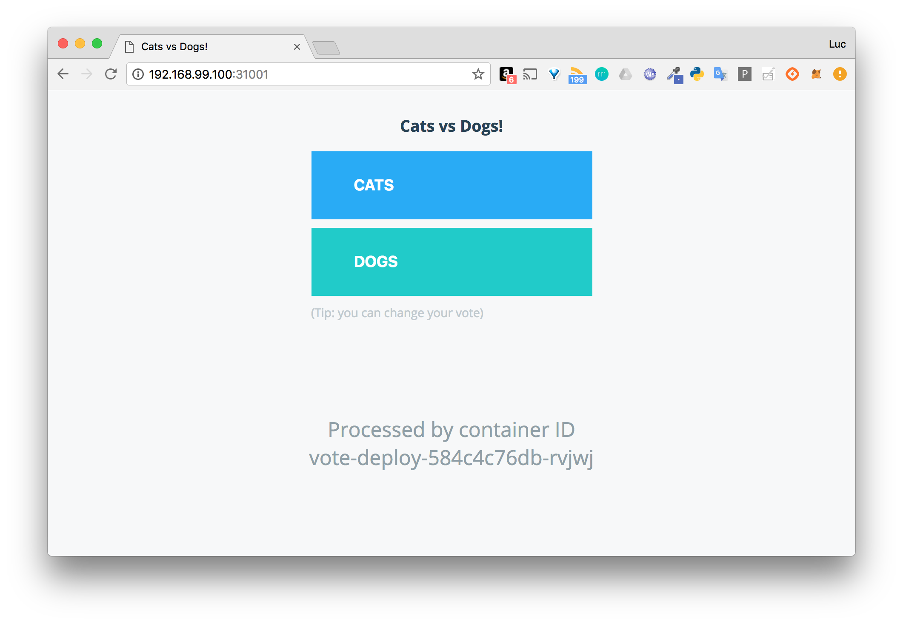

## Exercice

Dans cet exercice, vous allez créer un Deployment et l'exposer à l'extérieur du cluster via un service de type NodePort.

### 1. Spécification d'un Deployment

Créez un fichier *vote_deployment.yaml* définissant un Deployment ayant les propriétés suivantes:
- nom: *vote*
- nombre de replicas: 3
- définition d'un selector sur le label *app: vote*
- spécification du Pod:
  * label *app: vote*
  * un container nommé *vote* basé sur l'image *instavote/vote* et exposant le port *80*

### 2. Création du Deployment

Utilisez *kubectl apply* pour créer le Deployment

### 3. Status du Deployment

A l'aide de *kubectl*, examinez le status du Deployment *vote*.

A partir de ces informations, que pouvez-vous dire par rapport au nombre de Pods gérés par ce Deployment ?

### 4. Status des Pods associés

A l'aide de *kubectl*, lister les Pods associés à ce Deployment.

### 5. Exposition des Pods du Deployment

Créez un Service permettant d'exposer les Pods du Deployment à l'extérieur du cluster

Conseils:

- vous pourrez commencer par créer une spécification pour le Service, en spécifiant que le *selector* doit permettre de regrouper les Pods ayant le label *app: vote*.

- utilisez un service de type *NodePort*, vous pourrez par exemple le publier sur le port *31001* des nodes du cluster

- le container basé sur l'image *instavote/vote* tourne sur le port *80*, ce port devra donc être référencé en tant que *targetPort* dans la spécification du Service.

Note: n'hésitez pas à vous reporter à l'exercice sur les Services de type NodePort que nous avons vu précédemment

Une fois le service créé, vous pourrez accéder à l'interface de vote sur *http://IP:31001* ou IP est l'adresse IP d'une machine du cluster Kubernetes.

Note: vous pouvez récupérer les IPs des machines de votre cluster avec la commande `$ kubectl get nodes -o wide`

Attention: cette interface n'est pas branchée à un backend, il n'est pas encore possible de voter, si vous cliquez sur l'un des choix, vous obtiendrez une erreur. Nous reviendrons sur l'application de vote dans sa totalité très bientôt.



### 6. Cleanup

Supprimez le Deployment ainsi que le Service créés précédemment.

---

## Correction

### 1. Spécification d'un Deployment

La spécification, définie dans le fichier *vote_deployment.yaml* est la suivante:

```
apiVersion: apps/v1
kind: Deployment
metadata:
  name: vote
spec:
  replicas: 3
  selector:
    matchLabels:
      app: vote
  template:
    metadata:
      labels:
        app: vote
    spec:
      containers:
      - name: vote
        image: instavote/vote
        ports:
        - containerPort: 80
```

### 2. Création du Deployment

La commande suivante permet de créer le Deployment

```
$ kubectl apply -f vote_deployment.yaml
```

### 3. Status du Deployment

La commande suivante permet d'obtenir le status du Deployment

```
$ kubectl get deploy
NAME   READY   UP-TO-DATE   AVAILABLE   AGE
vote   3/3     3            3           10s
```

### 4. Status des Pods associés

La commande suivante permet de lister les Pods qui tournent sur le cluster

```
$ kubectl get po
NAME                    READY   STATUS    RESTARTS   AGE
vote-579dcf5f74-f4lhf   1/1     Running   0          67s
vote-579dcf5f74-ffjx9   1/1     Running   0          67s
vote-579dcf5f74-frhg7   1/1     Running   0          67s
```

On voit que les 3 Pods relatifs au Deployment *vote* sont listés. Ils sont tous les 3 actifs.

### 5. Exposition des Pods du Deployment

Dans un fichier *vote_service.yaml* nous définissons la spécification suivante:

```
apiVersion: v1
kind: Service
metadata:
  name: vote
spec:
  selector:
    app: vote
  type: NodePort
  ports:
  - port: 80
    targetPort: 80
    nodePort: 31001
```

On crée ensuite le Service avec la commande:

```
$ kubectl apply -f vote_service.yaml
service/vote created
```

### 6. Cleanup

Utilisez les commandes suivantes pour supprimer le Deployment et le Service:

```
$ kubectl delete deploy/vote
$ kubectl delete svc/vote
```
