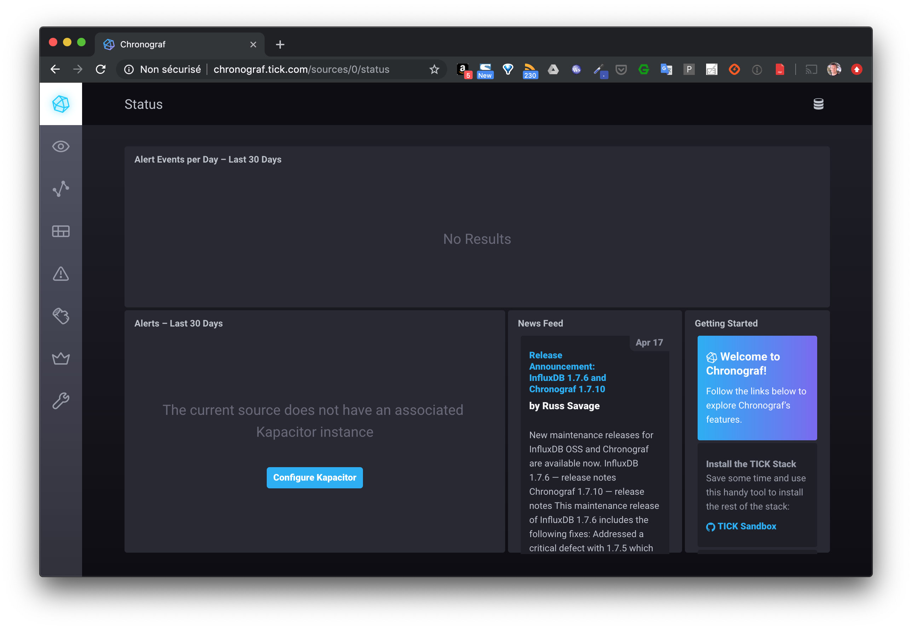
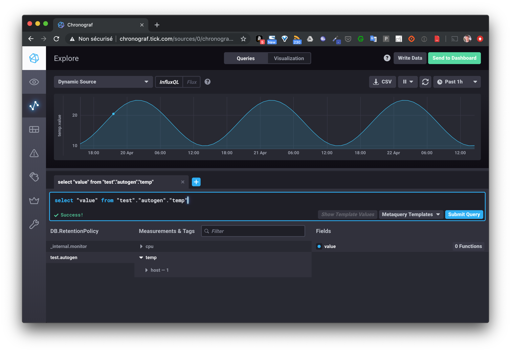

Le but de cet exercice est de packager une stack TICK dans un chart Helm. Cela permettra tout d'abord de présenter cette stack applicative et surtout de voir les étapes nécessaires pour le packaging d'une application. Etapes que vous pourrez suivre par la suite pour packager vos propres applications.

## 1. La stack TICK

Cette stack applicative est utilisée pour la gestion des séries temporelles. C'est par exemple un bon candidat pour les projets IoT dans lesquels des capteurs envoient des données (temperature, pression atmosphérique, ...) en continu.

Son nom vient des différents éléments dont elle est composée:

- Telegraf
- InfluxDB
- Chronograf
- Kapacitor

Le schema suivant illustre l'architecture globale:


Les données sont envoyées à *Telegraf*, et stockées dans un base de données *InfluxDB*. *Chronograf* permet de faire des queries via une interface web. *Kapacitor* est un moteur qui permet de traiter ces données en temps réel et par exemple de lever des alertes basées sur l'évolution de celles-ci.

## 2. Fichiers manifests

L'archive *manifests.zip* (en annexe) contient un répertoire *manifests* dans lequel se trouve l'ensemble des fichiers de configuration nécessaires pour déployer cette stack dans un cluster kubernetes:

- un *Service* et un *Deployment* pour chaque composant (*Telegraf*, *Influxdb*, *Chronograf*, *Kapacitor*)
- une *ConfigMap* contenant la configuration de *Telegraf*
- une ressource *Ingress* pour exposer les différents services:
  - le service *telegraf* sera exposé via *telegraf.tick.com*
  - le service *chronograf* sera exposé via *chronograf.tick.com*

Créez un répertoire *tick*, récupérez l'archive *manifests.zip*, placez la dans le répertoire *tick* puis dézippez la.
Le répertoire *tick* contiendra alors les fichiers suivants:

```
$ cd tick
$ tree .
.
├── manifests
|  ├── configmap-telegraf.yaml
│  ├── deploy-chronograf.yaml
│  ├── deploy-influxdb.yaml
│  ├── deploy-kapacitor.yaml
│  ├── deploy-telegraf.yaml
│  ├── ingress.yaml
│  ├── service-chronograf.yaml
│  ├── service-influxdb.yaml
│  ├── service-kapacitor.yaml
│  └── service-telegraf.yaml
└── manifests.zip
```

## 3. Installation d'un Ingress controller

Pré-requis: assurez-vous que vous avez le daemon *tiller* est bien lancé sur le cluster

### Mise en place

Un Ingress controller est nécessaire afin de prendre en compte la ressource Ingress qui est utilisée pour exposer les services à l'extérieur du cluster.

- 1er cas

Si votre cluster est déployé chez un cloud provider, utilisez la commande suivante afin de l'installer avec helm:

```
$ helm install stable/nginx-ingress --name my-nginx --set rbac.create=true
```

- 2ème cas

Si vous êtes sur minikube, vous pouvez installer un Ingress Controller via un addon avec la commande suivante:

```
$ minikube addons enable ingress
```

### Vérification

Après quelques secondes, vous devriez voir le Pod *nginx-ingress-controller* dans l'état running:

```
$ kubectl get po --all-namespaces | grep ingress
NAME                                                READY  STATUS   RESTARTS  AGE
my-nginx-nginx-ingress-controller-656698fdb8-s9c69  1/1    Running  0         78s
```

## 4. Test de l'application

### Création

Placez vous dans le répertoire *tick* et créez les différentes ressources présentes dans le folder *manifests*:

```
$ kubectl apply -f manifests/
configmap/telegraf-config created
deployment.apps/chronograf created
deployment.apps/influxdb created
deployment.apps/kapacitor created
deployment.apps/telegraf created
ingress.extensions/tick created
service/chronograf created
service/influxdb created
service/kapacitor created
service/telegraf created
```

Vérifiez ensuite que la création s'est déroulée correctement:

```
$ kubectl get deploy,po,svc,ingress
```

Après quelques secondes, vous devriez obtenir un résultat proche de celui ci-dessous:

```
$ kubectl  get deploy,po,svc,ingress
NAME                                                           READY   UP-TO-DATE   AVAILABLE   AGE
deployment.extensions/chronograf                               1/1     1            1           3m36s
deployment.extensions/influxdb                                 1/1     1            1           3m36s
deployment.extensions/kapacitor                                1/1     1            1           3m36s
deployment.extensions/my-nginx-nginx-ingress-controller        1/1     1            1           23m
deployment.extensions/my-nginx-nginx-ingress-default-backend   1/1     1            1           23m
deployment.extensions/telegraf                                 1/1     1            1           3m36s

NAME                                                          READY   STATUS    RESTARTS   AGE
pod/chronograf-8bfff754d-qb28p                                1/1     Running   0          3m36s
pod/influxdb-8b8df4bff-wmvzc                                  1/1     Running   0          3m36s
pod/kapacitor-6d7bc6955c-s2tnj                                1/1     Running   0          3m36s
pod/my-nginx-nginx-ingress-controller-656698fdb8-s9c69        1/1     Running   0          23m
pod/my-nginx-nginx-ingress-default-backend-7dbf76c549-8q7pg   1/1     Running   0          23m
pod/telegraf-85546c59b5-4tlpt                                 1/1     Running   0          3m35s

NAME                                             TYPE           CLUSTER-IP       EXTERNAL-IP    PORT(S)                      AGE
service/chronograf                               NodePort       10.245.132.131   <none>         8888:31101/TCP               3m35s
service/influxdb                                 ClusterIP      10.245.92.85     <none>         8086/TCP                     3m35s
service/kapacitor                                NodePort       10.245.33.11     <none>         9092:31102/TCP               3m35s
service/kubernetes                               ClusterIP      10.245.0.1       <none>         443/TCP                      3h52m
service/my-nginx-nginx-ingress-controller        LoadBalancer   10.245.238.36    138.68.119.157   80:31827/TCP,443:31973/TCP   23m
service/my-nginx-nginx-ingress-default-backend   ClusterIP      10.245.192.10    <none>         80/TCP                       23m
service/telegraf                                 ClusterIP      10.245.14.123    <none>         8186/TCP                     3m35s

NAME                      HOSTS                                   ADDRESS          PORTS   AGE
ingress.extensions/tick   telegraf.tick.com,chronograf.tick.com   138.68.157.142   80      3m35s
```

### Configuration du point d'entrée

- 1er cas

Si votre cluster est déployé chez un cloud provider qui supporte les services de type *LoadBalancer*, un composant load-balancer sera automatiquement créé sur l'infrastructure et il faudra utiliser l'adresse IP externe de ce dernier afin d'envoyer des requêtes HTTP à l'application. Dans l'exemple ci-dessus, l'IP externe est *138.68.119.157*, elle est obtenue dans le champ *EXTERNAL_IP* du service nginx-ingress-controller.

Pour cet exercice, il vous faudra mettre à jour le fichier */etc/hosts* de votre machine local de façon à ce que les sous-domaines *telegraf.tick.com* et *chronograf.tick.com* soient résolus vers cette adresse IP.

Dans l'exemple ci-dessus, j'ai ajouté les entrées suivantes dans le fichier */etc/hosts*:

```
138.68.119.157    telegraf.tick.com
138.68.119.157    chronograf.tick.com
```

- 2nd cas

si vous utilisez *minikube*, vous n'aurez pas d'adresse IP dédiée, il vous faudra mettre à jour le fichier */etc/hosts* avec l'IP de la VM de *minikube*. Si l'adresse IP de minikube est *192.168.99.100*, le fichier */etc/hosts/* devra avoir les entrées suivantes:

```
192.168.99.100   telegraf.tick.com
192.168.99.100   chronograf.tick.com
```

### Accès à l'application

Dépuis un navigateur, vous pourrez accèder à l'interface de *chronograf* depuis l'URL *http://chronograf.tick.com*



### Envoi de données de test

En utilisant le script *test.sh* (en annexe) vous allez générer des données fictives, simulant une distribution sinusoidale de la température, et les envoyer à la stack *tick* via le endpoint exposé par *Telegraf*. Copiez le fichier *test.sh* dans le répertoire *tick* et lancez la commande suivante:

```
$ ./test.sh
```

Vous devriez alors obtenir une succession de status 204, indiquant que l'ensemble des requêtes ont été créées correctement.

Vous pouvez alors visualiser les données en utilisant la query suivante depuis l'interface web de *Chronograf*:

```
select "value" from "test"."autogen"."temp"
```



### Cleanup

Supprimez l'application avec la commande suivante:

```
$ kubectl delete -f manifests/
```

Vous allez maintenant packager cette application dans un chart HELM.

## 5. Création du chart

Toujours depuis le répertoire *tick*, utilisez la commande suivante afin de créer un Chart nommé *tick_chart*.

```
$ helm create tick_chart
```

Par défaut, celui-ci contient principalement les éléments suivants:

- un fichier *Chart.yaml* qui définit les metadata du projet,
- un template pour la création d'un Deployment qui gère un Pod unique
- un template pour la création d'un Service afin d'exposer ce Pod à l'intérieur du cluster
- un template pour la création d'une ressource Ingress pour exposer le service à l'extérieur
- un fichier *values.yaml* utilisé pour substituer les placeholders présents dans les templates par des valeurs dynamiques
- un fichier *NOTES.txt* qui donne des informations à la création de la release et lors des mises à jour

```
$ tree tick_chart
tick
├── Chart.yaml
├── charts
├── templates
│  ├── NOTES.txt
│  ├── _helpers.tpl
│  ├── deployment.yaml
│  ├── ingress.yaml
│  ├── service.yaml
│  └── tests
│    └── test-connection.yaml
└── values.yaml
```

### Copie des fichiers manifests

La première chose que vous allez faire est de supprimer tous les fichiers contenus dans le répertoire *templates* et d'y copier les fichiers présents dans le répertoire *manifests* (fichiers que nous avons manipulés précédemment).

Supprimez également le contenu du fichier *values.yaml* (mais ne supprimez pas le fichier), le fichier *NOTES.txt* et le répertoire *test*.

```
$ rm tick_chart/templates/*.yaml
$ rm -r tick_chart/templates/tests
$ rm tick_chart/templates/NOTES.txt
$ cp manifests/*.yaml tick_chart/templates
$ echo > tick_chart/values.yaml
```

Le répertoire *tick_chart* aura alors le contenu suivant:

```
tree tick_chart/
tick_chart/
├── Chart.yaml
├── charts
├── templates
│  ├── _helpers.tpl
│  ├── configmap-telegraf.yaml
│  ├── deploy-chronograf.yaml
│  ├── deploy-influxdb.yaml
│  ├── deploy-kapacitor.yaml
│  ├── deploy-telegraf.yaml
│  ├── ingress.yaml
│  ├── service-chronograf.yaml
│  ├── service-influxdb.yaml
│  ├── service-kapacitor.yaml
│  ├── service-telegraf.yaml
└── values.yaml
```

### Lancement du chart

En utilisant la commande suivante, lancez l'application maintenant packagée dans un chart Helm:

```
$ helm install --name tick ./tick_chart
```

Vous devriez obtenir un résultat comme le suivant:

```
NAME:   tick

LAST DEPLOYED: Wed Apr 24 19:47:08 2019
NAMESPACE: default
STATUS: DEPLOYED

RESOURCES:
==> v1/ConfigMap
NAME             DATA  AGE
telegraf-config  1     1s

==> v1/Deployment
NAME        READY  UP-TO-DATE  AVAILABLE  AGE
chronograf  0/1    1           0          1s
influxdb    0/1    1           0          1s
kapacitor   0/1    1           0          1s
telegraf    0/1    1           0          1s

==> v1/Pod(related)
NAME                        READY  STATUS             RESTARTS  AGE
chronograf-8bfff754d-p45m4  0/1    ContainerCreating  0         1s
influxdb-8b8df4bff-j6b9w    0/1    ContainerCreating  0         1s
kapacitor-6d7bc6955c-55zsg  0/1    ContainerCreating  0         1s
telegraf-85546c59b5-kdknd   0/1    ContainerCreating  0         1s

==> v1/Service
NAME        TYPE       CLUSTER-IP      EXTERNAL-IP  PORT(S)   AGE
chronograf  ClusterIP  10.245.47.158   <none>       8888/TCP  1s
influxdb    ClusterIP  10.245.72.185   <none>       8086/TCP  1s
kapacitor   ClusterIP  10.245.229.112  <none>       9092/TCP  1s
telegraf    ClusterIP  10.245.95.48    <none>       8186/TCP  1s

==> v1beta1/Ingress
NAME  HOSTS                                  ADDRESS  PORTS  AGE
tick  telegraf.tick.com,chronograf.tick.com  80       1s
```

Vérifiez ensuite la liste des release (terminologie Helm) présentes:

```
$ helm ls
NAME       REVISION   UPDATED                    STATUS     CHART                APP VERSION   NAMESPACE
tick       1          Wed Apr 24 19:47:08 2019   DEPLOYED   tick_chart-0.1.0     1.0           default
```

Note: si vous avez utilisé *Helm* pour déployer le Ingress Controller vous obtiendrez une liste contenant 2 2 releases.

### Test de l'application

De la même façon que précédemment, lancez le script *test.sh* afin d'envoyer des données dans la stack maintenant deployée sous la forme d'un chart Helm. Visualisez ensuite le résultat dans l'interface de *Chronograf*.

### Utilisation du templating

L'intérêt d'une aplication packagée dans un Chart Helm est de faciliter sa distribution et son déploiement notamment en utilisant la puissance des templates.

Dans cet exercice, nous allons faire en sorte de rendre dynamique les tags des différentes images. Pour cela, commencez par modifier le fichier *tick_chart/values.yaml* de façon à ce qu'il ait le contenu suivant afin d'utiliser la déclinaison *alpine* du tag de chaque image.


```
telegraf:
  tag: 1.10-alpine
chronograf:
  tag: 1.7-alpine
kapacitor:
  tag: 1.5-alpine
influxdb:
  tag: 1.7-alpine
```

Ensuite, pour chaque fichier de Deployment présent dans *tick_chart/templates*, remplacer le tag de l'image par {{ .Values.COMPOSANT.tag }}, ou COMPOSANT est influxdb, telegraf, chronograf ou kapacitor. Par exemple, le fichier de Deployment de Influxdb sera modifié de la façon suivante:

```
apiVersion: apps/v1
kind: Deployment
metadata:
  name: influxdb
spec:
  selector:
    matchLabels:
      app: influxdb
  template:
    metadata:
      labels:
        app: influxdb
    spec:
      containers:
      - image: influxdb:{{ .Values.influxdb.tag }}
        name: influxdb
```

Toujours depuis le répertoire *tick*, vous pouvez alors mettre à jour la release avec la commande suivante:

```
$ helm upgrade tick tick_chart --values tick_chart/values.yaml
```

Vous devriez obtenir un résultat similaire à celui ci-dessous, dans lequel vous pourrez observer la création de nouveaux Pods pour chaque Deployment.

```
Release "tick" has been upgraded. Happy Helming!
LAST DEPLOYED: Mon May  6 16:32:33 2019
NAMESPACE: default
STATUS: DEPLOYED

RESOURCES:
==> v1/ConfigMap
NAME             DATA  AGE
telegraf-config  1     6m37s

==> v1/Deployment
NAME        READY  UP-TO-DATE  AVAILABLE  AGE
chronograf  1/1    1           1          6m37s
influxdb    1/1    1           1          6m37s
kapacitor   1/1    1           1          6m37s
telegraf    1/1    1           1          6m37s

==> v1/Pod(related)
NAME                         READY  STATUS             RESTARTS  AGE
chronograf-556b657cc-zsdxk   0/1    ContainerCreating  0         0s
chronograf-6fccc5d4bc-kl62x  1/1    Running            0         6m37s
influxdb-5788568b6-2l9c5     1/1    Running            0         6m37s
influxdb-b655cc77d-n9x4f     0/1    ContainerCreating  0         0s
kapacitor-5cc97f9dcb-d5hmh   0/1    ContainerCreating  0         0s
kapacitor-5d845c48d4-vlhn4   1/1    Running            0         6m37s
telegraf-7b9f76bb64-fd7tv    0/1    ContainerCreating  0         0s
telegraf-855b58748d-6h6hw    1/1    Running            0         6m37s

==> v1/Service
NAME        TYPE       CLUSTER-IP      EXTERNAL-IP  PORT(S)   AGE
chronograf  ClusterIP  10.105.104.111  <none>       8888/TCP  6m37s
influxdb    ClusterIP  10.107.112.200  <none>       8086/TCP  6m37s
kapacitor   ClusterIP  10.98.88.150    <none>       9092/TCP  6m37s
telegraf    ClusterIP  10.108.132.178  <none>       8186/TCP  6m37s

==> v1beta1/Ingress
NAME  HOSTS                                  ADDRESS    PORTS  AGE
tick  telegraf.tick.com,chronograf.tick.com  10.0.2.15  80     6m37s
```

Vérifiez ensuite que les Pods sont bien basés sur les nouvelles versions des images.

Nous avons vu ici un exemple simple de l'utilisation du templating, l'important étant de comprendre son fonctionnement. Lorsque vous allez packager votre propre application dans un Chart Helm, vous allez généralement commencer par utiliser le templating pour des champs simples avant d'avancer dans une utilisation plus poussée.
