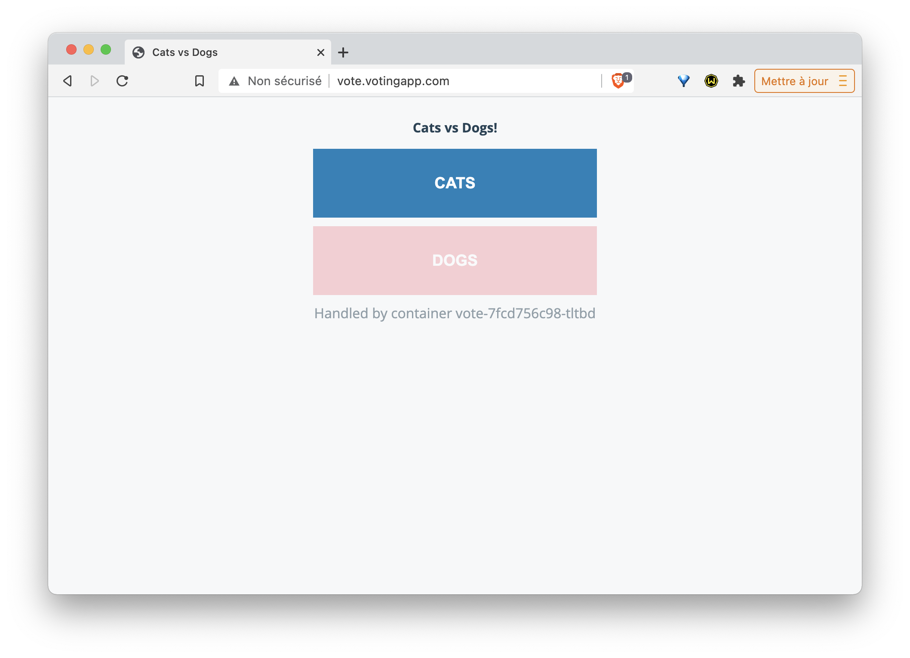
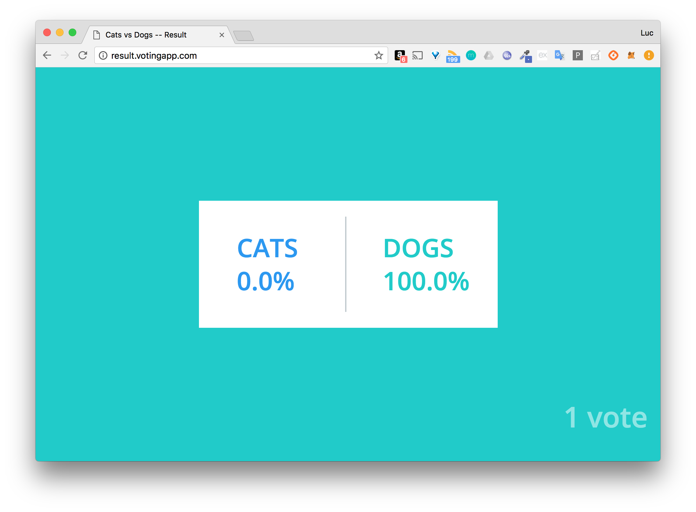

# Ressource Ingress pour le routage de la VotingApp

## Exercice

Dans cet exercice, vous allez créer une ressource *Ingress* et l'utiliser pour router les requêtes vers les interfaces de vote et de result de la VotingApp.

### 1. Installation d'un Ingress controller

Un Ingress controller est nécessaire afin de prendre en compte la ressource Ingress qui sera utilisée pour exposer les services à l'extérieur du cluster.

Lancez un ingress controller basé sur nginx.

### 2. Lancement de la VotingApp

De la même façon que nous l'avons fait dans un exercice précécent, clonez puis lancer la Voting App avec les commandes suivantes:

```
$ git clone https://github.com/dockersamples/example-voting-app
$ cd example-voting-app
$ kubectl create -f ./k8s-specifications
```

Note: attention, il faudra créer le namespace *vote* au préalable, la VotingApp étant lancé dans ce namespace.

### 3. Ports des Service vote et result

Quels sont les ports utilisés pour exposer les micro-services *vote* et *result* à l'intérieur du cluster ?

### 4. Définition de la ressource Ingress

Créez, dans le fichier *vote_ingress.yaml*, la spécification *Ingress* permettant le routage suivant:
- *vote.votingapp.com* sur le micro-service *vote*
- *result.votingapp.com* sur le micro-service *result*

Assurez vous que la resource Ingress soit déployée dans le namespace *vote*.

### 5. Création de la ressource Ingress

Créez la ressource précédente à l'aide de *kubectl*

### 6. Accès à l'application

Dans le fichier */etc/hosts*, assurez-vous d'avoir défini les résolutions DNS des sous-domaines *vote.votingapp.com* et *result.votingapp.com* vers l'adresse d'une des machines de votre cluster.

Vous pouvez maintenant voter depuis l'interface disponible sur *http://vote.votingapp.com* et visualiser les résultats sur l'interface disponible sur *http://result.votingapp.com*.

---

## Correction

### 1. Installation d'un Ingress controller

- Si vous utilisez *Minikube*, vous pouvez installer un Ingress controller basé sur *nginx* en temps que *addon* avec la commande suivante:

```
$ minikube addons enable ingress
```

- Si vous n'êtes pas sur *Minikube*, vous pouvez installer un Ingress controller avec la commande suivante:

```
$ kubectl apply -f https://raw.githubusercontent.com/kubernetes/ingress-nginx/master/deploy/mandatory.yaml
```

Après quelques secondes, vous devriez voir un Pod *nginx-ingress-controller* dans l'état running:

```
$ kubectl get po --all-namespaces | grep ingress
ingress-nginx   nginx-ingress-controller-5694ccb578-m9wqx   1/1     Running   0          7m48s
```

### 3. Ports des Service vote et result

La commande suivante liste les services existants

```
$ kubectl get svc -n vote
NAME         TYPE        CLUSTER-IP      EXTERNAL-IP   PORT(S)          AGE
db           ClusterIP   10.99.192.60    <none>        5432/TCP         36m
kubernetes   ClusterIP   10.96.0.1       <none>        443/TCP          16h
redis        ClusterIP   10.111.62.16    <none>        6379/TCP         36m
result       NodePort    10.107.254.26   <none>        5001:31001/TCP   36m
vote         NodePort    10.99.171.171   <none>        5000:31000/TCP   36m
```

Nous pouvons voir que le Service *vote* expose le port *5000* à l'intérieur du cluster, et le port *31000* à l'extérieur.

De la même façon, nous voyons que le Service *result* expose le port *5001* à l'intérieur du cluster, et le port *31001* à l'extérieur.

Note: nous pouvons également obtenir ces informations depuis les fichiers de spécifications des Services de *vote* et *result*.

### 4. Définition de la ressource Ingress

Le fichier *vote_ingress.yaml* contient la spécification suivante:

```
apiVersion: extensions/v1beta1
kind: Ingress
metadata:
  name: voting-domain
  namespace: vote
spec:
  rules:
  - host: vote.votingapp.com
    http:
      paths:
      - path: /
        backend:
          serviceName: vote
          servicePort: 5000
  - host: result.votingapp.com
    http:
      paths:
      - path: /
        backend:
          serviceName: result
          servicePort: 5001
```

Nous définissons 2 *rules*:
- la première spécifie que les requêtes qui arrivent sur *http://vote.votingapp.com* sont forwardées sur le port *5000* du Service nommé *vote*
- la seconde spécifie que les requêtes qui arrivent sur *http://result.votingapp.com* sont forwardées sur le port *5001* du Service nommé *result*

### 5. Création de la ressource Ingress

La commande suivante permet de créer la ressource définie dans le fichier *vote_ingress.yaml*

```
$ kubectl create -f vote_ingress.yaml
ingress "voting-domain" created
```

### 6. Accès à l'application

L'interface de vote est disponible sur *http://vote.votingapp.com*.



L'interface de resultats est disponible sur *http://result.votingapp.com*.



### En résumé

Une ressource Ingress permet de diriger les flux HTTP (et HTTPS) vers différents services de l'application en fonction du nom de domaine utilisé. Il est aussi possible d'établir des règles beaucoup plus fine en se basant sur l'URL de la requête. On se sert également souvent d'une ressource Ingress pour assurer la terminaison TLS.
