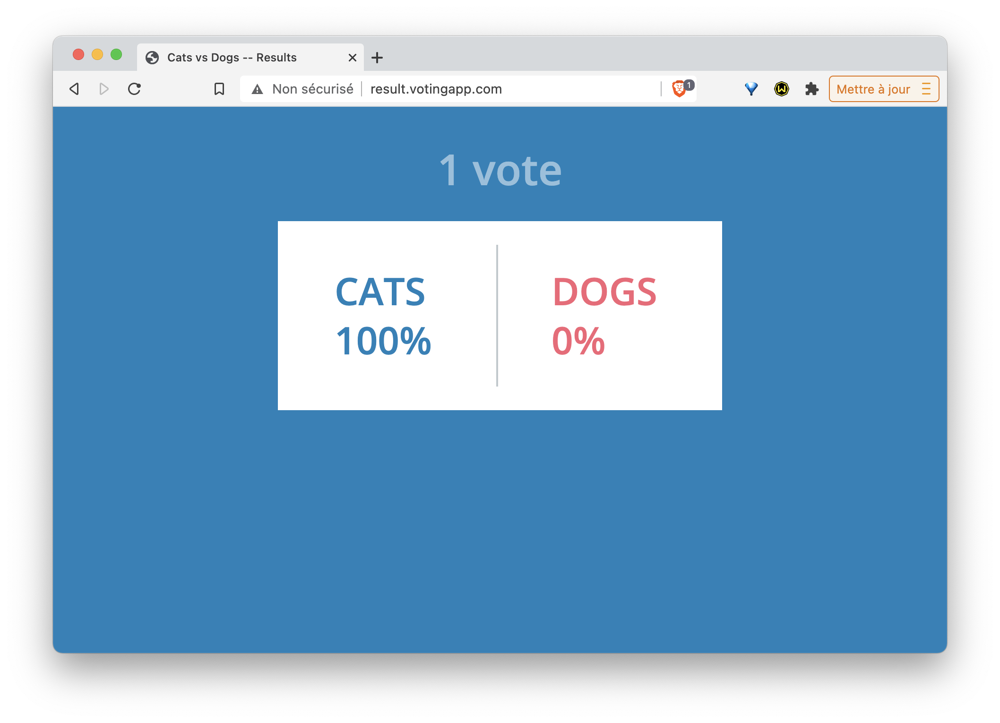

# Ressource Ingress pour le routage de la VotingApp

Dans cet exercice, vous allez créer une ressource *Ingress* et l'utiliser pour router les requêtes vers les interfaces de vote et de result de la VotingApp.

## 1. Installation d'un Ingress Controller

Un Ingress Controller est nécessaire afin de prendre en compte la ressource Ingress qui sera utilisée pour exposer les services à l'extérieur du cluster. C'est un reverse-proxy qui sera automatiquement configuré à l'aide des ressource Ingress.

Dans cet exercice nous allons déployer un Ingress Controller basé sur Nginx mais il est possible d'utiliser un autre type d'Ingress Controller (*HAProxy*, *Traefik*, ...).

### 1er cas: vous utilisez Minikube

Vous pouvez installer un Ingress controller basé sur *nginx* en temps que *addon* avec la commande suivante:

```
$ minikube addons enable ingress
```

Vérifiez que le Pod du Ingress Controller tourne correctement:

```
$ kubectl get pods -n kube-system | grep ingress
nginx-ingress-controller-5d9cf9c69f-hjgrj   1/1     Running   0          9m46s
```

### 2ème cas: vous n'utilisez pas Minikube

Vous pouvez installer un Nginx Ingress controller en lançant la commande suivante:

```
$ kubectl apply -f https://raw.githubusercontent.com/kubernetes/ingress-nginx/master/deploy/static/mandatory.yaml
```

Vérifiez que le Pod du Ingress Controller tourne correctement:

```
$ kubectl get pods -n ingress-nginx
NAME                                        READY   STATUS    RESTARTS   AGE
nginx-ingress-controller-79f6884cf6-98bc5   1/1     Running   0          47s
```

Il faut ensuite exposer ce Pod à l'aide d'un Service:

- si vous êtes sur un cloud provider qui supporte les services de type LoadBalancer, vous pouvez utiliser la commande suivante:

```
$ kubectl apply -f -<<EOF
kind: Service
apiVersion: v1
metadata:
  name: ingress-nginx
  namespace: ingress-nginx
  labels:
    app.kubernetes.io/name: ingress-nginx
    app.kubernetes.io/part-of: ingress-nginx
spec:
  type: LoadBalancer
  selector:
    app.kubernetes.io/name: ingress-nginx
    app.kubernetes.io/part-of: ingress-nginx
  ports:
    - name: http
      port: 80
      targetPort: http
    - name: https
      port: 443
      targetPort: https
EOF
```

Notez alors l'adresse IP externe associée à ce Service, vous en aurez besoin dans la suite de cet exercice. Vous pouvez la récupérez avec la commande suivante:

```
$ kubectl get svc ingress-nginx -n ingress-nginx
```

- sinon, vous pouvez utiliser un Service de type *NodePort* avec la commande suivante:

```
$ kubectl apply -f -<<EOF
apiVersion: v1
kind: Service
metadata:
  name: ingress-nginx
  namespace: ingress-nginx
  labels:
    app.kubernetes.io/name: ingress-nginx
    app.kubernetes.io/part-of: ingress-nginx
spec:
  type: NodePort
  ports:
    - name: http
      port: 80
      targetPort: 80
      nodePort: 32000
      protocol: TCP
    - name: https
      port: 443
      targetPort: 443
      nodePort: 32001
      protocol: TCP
  selector:
    app.kubernetes.io/name: ingress-nginx
    app.kubernetes.io/part-of: ingress-nginx
EOF
```

Notez ici que les ports 32000 et 32001 seront ouverts sur l'ensemble des machines du cluster. Ils redirigeront le traffic respectivement sur les ports 80 et 443 du Pod dans lequel tourne le Ingress Controller.

## 2. Lancement de la VotingApp

Déployez la Voting App avec la commande suivante, celle-ci fait référence à une URL pointant vers un fichier définissant l'ensemble des ressources de la Voting App

```
$ kubectl apply -f https://files.techwhale.io/voting.yaml
```

## 3. Ports des Service vote et result

La commande suivante liste les services existants:

```
$ kubectl get svc
NAME         TYPE        CLUSTER-IP      EXTERNAL-IP   PORT(S)          AGE
db           ClusterIP   10.99.192.60    <none>        5432/TCP         36m
kubernetes   ClusterIP   10.96.0.1       <none>        443/TCP          16h
redis        ClusterIP   10.111.62.16    <none>        6379/TCP         36m
result       NodePort    10.107.254.26   <none>        5001:31001/TCP   36m
vote         NodePort    10.99.171.171   <none>        5000:31000/TCP   36m
```

Nous pouvons voir que le Service *vote* expose le port *5000* à l'intérieur du cluster, et le port *31000* à l'extérieur.

De la même façon, nous voyons que le Service *result* expose le port *5001* à l'intérieur du cluster, et le port *31001* à l'extérieur.

Note: nous pouvons également obtenir ces informations depuis les fichiers de spécifications des Services de *vote* et *result*.


## 4. Création de la ressource Ingress

Créez, dans le fichier *vote_ingress.yaml*, la spécification suivante:

```
apiVersion: networking.k8s.io/v1beta1
kind: Ingress
metadata:
  name: voting-domain
spec:
  rules:
  - host: vote.votingapp.com
    http:
      paths:
      - path: /
        backend:
          serviceName: vote
          servicePort: 5000
  - host: result.votingapp.com
    http:
      paths:
      - path: /
        backend:
          serviceName: result
          servicePort: 5001
```

Celle-ci définit une ressource Ingress contenant 2 *rules*:
- la première spécifie que les requêtes qui arrivent sur *http://vote.votingapp.com* sont forwardées sur le port *5000* du Service nommé *vote*
- la seconde spécifie que les requêtes qui arrivent sur *http://result.votingapp.com* sont forwardées sur le port *5001* du Service nommé *result*

Créez cette ressource à l'aide de la commande suivante:

```
$ kubectl apply -f vote_ingress.yaml
```

## 6. Accès à l'application

Dans le fichier */etc/hosts*, définissez les résolutions DNS des sous-domaines *vote.votingapp.com* et *result.votingapp.com*. Ceux-ci devront pointer vers:

- l'adresse IP de Minikube (obtenue avec la commande ```minikube ip```) si vous utilisez cette solution
- l'adresse IP d'une des machines de votre cluster si le Ingress Controller est exposé via un Service de type NodePort
- l'adresse IP du LoadBalancer si le Ingress Controller est exposé via un Service de type LoadBalancer

Vous pouvez maintenant voter depuis l'interface de vote et visualiser les résultats sur l'interface de results.

L'interface de vote est disponible:
- sur http://vote.votingapp.com (port 80) si vous avez exposé le Ingress Controller avec un service de type LoadBalancer
- sur http://vote.votingapp.com:32000 si vous avez exposé le Ingress Controller avec un service de type NodePort (nous avions fixé la valeur de ce port à 32000 lors de la définition du Service)


L'interface de result est disponible:
- sur http://result.votingapp.com (port 80) si vous avez exposé le Ingress Controller avec un service de type LoadBalancer
- sur http://result.votingapp.com:32000 si vous avez exposé le Ingress Controller avec un service de type NodePort (nous avions fixé la valeur de ce port à 32000 lors de la définition du Service)



## 7. Cleanup

Supprimez la Voting App à l'aide de la commande suivante:

```
$ kubectl delete -f https://gitlab.com/snippets/1893427/raw
```

Vous pouvez également supprimer le Ingress Controller:

- si vous êtes sur Minikube, utilisez la commande suivante:

```
$ minikube addons disable ingress
```

-  si vous n'êtes pas sur Minikube, supprimez le namespace *ingress-nginx* avec la commande suivante:

```
$ kubectl delete ns ingress-nginx
```

### En résumé

Une ressource Ingress permet de diriger les flux HTTP (et HTTPS) vers différents services de l'application en fonction du nom de domaine utilisé. Il est aussi possible d'établir des règles beaucoup plus fines en se basant sur l'URL de la requête. On peut également se servir d'une ressource Ingress pour mettre en place une terminaison TLS.
