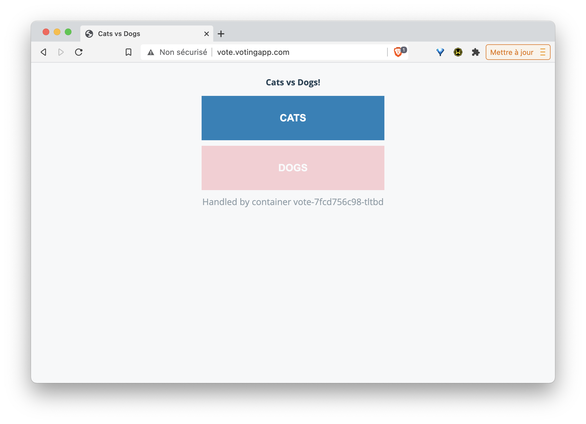

# Ressource Ingress pour le routage de la VotingApp

Dans cet exercice, vous allez créer une ressource *Ingress* et l'utiliser pour router les requêtes vers les interfaces de vote et de result de la VotingApp.

## 1. Installation d'un Ingress Controller

Un Ingress Controller est nécessaire afin de prendre en compte la ressource Ingress qui sera utilisée pour exposer les services à l'extérieur du cluster. C'est un reverse-proxy qui sera automatiquement configuré à l'aide des ressource Ingress.

Dans cet exercice nous allons déployer un Ingress Controller basé sur *Traefik* mais il est possible d'utiliser un autre type d'Ingress Controller (*HAProxy*, *Nginx*, ...).


### a. Création droits d'accès

Le Ingress Controller que nous allons déployer à besoin de droits particuliers pour pouvoir intéragir avec l'API Server. La spécification suivante définit les éléments nécessaires:
- un ServiceAccount
- un ClusterRole
- un ClusterRoleBinding

```
apiVersion: v1
kind: ServiceAccount
metadata:
  name: traefik-ingress-controller
  namespace: kube-system
---
kind: ClusterRole
apiVersion: rbac.authorization.k8s.io/v1beta1
metadata:
  name: traefik-ingress-controller
rules:
  - apiGroups:
      - ""
    resources:
      - services
      - endpoints
      - secrets
    verbs:
      - get
      - list
      - watch
  - apiGroups:
      - extensions
    resources:
      - ingresses
    verbs:
      - get
      - list
      - watch
---
kind: ClusterRoleBinding
apiVersion: rbac.authorization.k8s.io/v1beta1
metadata:
  name: traefik-ingress-controller
roleRef:
  apiGroup: rbac.authorization.k8s.io
  kind: ClusterRole
  name: traefik-ingress-controller
subjects:
- kind: ServiceAccount
  name: traefik-ingress-controller
  namespace: kube-system
```

Copiez celle-ci dans le fichier *rbac.yaml* et créez l'ensemble de ces ressources:

```
$ kubectl apply -f rbac.yaml
```

### b. Lancement du Ingress Controller

Vous pouvez installer un Trafik Ingress Controller en utilisant la spécification suivante:

```
kind: Deployment
apiVersion: apps/v1
metadata:
  name: traefik-ingress-controller
  namespace: kube-system
  labels:
    k8s-app: traefik-ingress-lb
spec:
  replicas: 1
  selector:
    matchLabels:
      k8s-app: traefik-ingress-lb
  template:
    metadata:
      labels:
        k8s-app: traefik-ingress-lb
        name: traefik-ingress-lb
    spec:
      serviceAccountName: traefik-ingress-controller
      terminationGracePeriodSeconds: 60
      containers:
      - image: traefik
        name: traefik-ingress-lb
        ports:
        - name: http
          containerPort: 80
        - name: admin
          containerPort: 8080
        args:
        - --api
        - --kubernetes
        - --logLevel=INFO
```

Sauvegardez celle-ci dans le fichier *traefik-deploy.yaml* et créez la ressource avec la commande suivante:

```
$ kubectl apply -f traefik-deploy.yaml
```

Vérifiez que le Pod du Ingress Controller tourne correctement:

```
$ kubectl get pods -n kube-system -l "name=traefik-ingress-lb"
NAME                                          READY   STATUS    RESTARTS   AGE
traefik-ingress-controller-668df9b887-tdxz9   1/1     Running   0          7s
```

### c. Exposition via un Service

Il faut ensuite exposer ce Pod à l'aide d'un Service:

- si vous êtes sur un cloud provider qui supporte les services de type LoadBalancer, vous pouvez utiliser la spécification suivante:


```
kind: Service
apiVersion: v1
metadata:
  name: traefik-ingress-service
  namespace: kube-system
spec:
  selector:
    k8s-app: traefik-ingress-lb
  ports:
    - protocol: TCP
      port: 80
      name: web
    - protocol: TCP
      port: 8080
      name: admin
  type: LoadBalancer
```

Sauvegardez celle-ci dans le fichier *traefik-svc-lb.yaml* et créez la ressource avec la commande suivante:

```
$ kubectl apply -f traefik-svc-lb.yaml
```

En utilisant la commande suivante, on peut alors vérifier que le Service a été créé correctement et récupérer l'adresse IP externe du LoadBalancer:

```
$ kubectl get svc traefik-ingress-service -n kube-system
NAME                      TYPE           CLUSTER-IP      EXTERNAL-IP      PORT(S)                       AGE
traefik-ingress-service   LoadBalancer   10.245.143.25   159.89.250.114   80:30381/TCP,8080:31341/TCP   2m50s
```

- sinon, vous pouvez utiliser la spécification suivante qui définit un Service de type *NodePort*:

```
kind: Service
apiVersion: v1
metadata:
  name: traefik-ingress-service
  namespace: kube-system
spec:
  selector:
    k8s-app: traefik-ingress-lb
  ports:
    - protocol: TCP
      port: 80
      nodePort: 32000
      name: web
    - protocol: TCP
      port: 8080
      nodePort: 32001
      name: admin
  type: NodePort
```

Sauvegardez celle-ci dans le fichier *traefik-svc-np.yaml* et créez la ressource avec la commande suivante:

```
$ kubectl apply -f traefik-svc-np.yaml
```

Vérifiez ensuite que le Service a été créé correctement:

```
$ kubectl get svc traefik-ingress-service -n kube-system
NAME                      TYPE       CLUSTER-IP     EXTERNAL-IP   PORT(S)                       AGE
traefik-ingress-service   NodePort   10.110.0.226   <none>        80:32000/TCP,8080:32001/TCP   15m
```

### d. Accès à l'interface web de Traefik

L'interface web de Traefik est alors accessible via le Service crée précédemment. En fonction du type de Service créé, il faudra utiliser:
- soit l'IP du LoadBalancer suivi du port 8080
- soit l'IP d'une des machines du cluster suivi du NodePort associé au port 8080 (32626 dans l'exemple ci-dessus)


Pour le moment, aucun Frontend ni Backend ne sont définis car nous n'avons pas encore créé de configuration via des ressources Ingress

## 2. Lancement de la VotingApp

Déployez la Voting App avec la commande suivante:

```
$ kubectl apply -f https://gitlab.com/snippets/1893427/raw
```

Note: l'ensemble des ressources de la Voting App sont définies dans le fichier à l'emplacement spécifié

## 3. Ports des Service vote et result

La commande suivante liste les services existants:

```
$ kubectl get svc -n vote
NAME         TYPE        CLUSTER-IP      EXTERNAL-IP   PORT(S)          AGE
db           ClusterIP   10.99.192.60    <none>        5432/TCP         36m
kubernetes   ClusterIP   10.96.0.1       <none>        443/TCP          16h
redis        ClusterIP   10.111.62.16    <none>        6379/TCP         36m
result       NodePort    10.107.254.26   <none>        5001:31001/TCP   36m
vote         NodePort    10.99.171.171   <none>        5000:31000/TCP   36m
```

Nous pouvons voir que le Service *vote* expose le port *5000* à l'intérieur du cluster, et le port *31000* à l'extérieur.

De la même façon, nous voyons que le Service *result* expose le port *5001* à l'intérieur du cluster, et le port *31001* à l'extérieur.

Note: nous pouvons également obtenir ces informations depuis les fichiers de spécifications des Services de *vote* et *result*.


## 4. Création de la ressource Ingress

Créez, dans le fichier *vote_ingress.yaml*, la spécification suivante:

```
apiVersion: extensions/v1beta1
kind: Ingress
metadata:
  name: voting-domain
  namespace: vote
spec:
  rules:
  - host: vote.votingapp.com
    http:
      paths:
      - path: /
        backend:
          serviceName: vote
          servicePort: 5000
  - host: result.votingapp.com
    http:
      paths:
      - path: /
        backend:
          serviceName: result
          servicePort: 5001
```

Celle-ci définit une ressource Ingress contenant 2 *rules*:
- la première spécifie que les requêtes qui arrivent sur *http://vote.votingapp.com* sont forwardées sur le port *5000* du Service nommé *vote*
- la seconde spécifie que les requêtes qui arrivent sur *http://result.votingapp.com* sont forwardées sur le port *5001* du Service nommé *result*

Cette ressource sera déployée dans le namespace *vote* (valeur de la clé *.metadata.namespace*)

La commande suivante permet de créer cette ressource:

```
$ kubectl create -f vote_ingress.yaml
```

## 6. Accès à l'application

Dans le fichier */etc/hosts*, assurez-vous d'avoir défini les résolutions DNS des sous-domaines *vote.votingapp.com* et *result.votingapp.com*. Ceux-ci devront pointer vers:
- l'adresse IP de Minikube (obtenue avec la commande ```minikube ip``` si vous utilisez cette solution
- l'adresse IP d'une des machines de votre cluster si le Ingress Controller est exposé via un Service de type NodePort
- l'adresse IP du LoadBalancer si le Ingress Controller est exposé via un Service de type LoadBalancer

Vous pouvez maintenant voter depuis l'interface de vote et visualiser les résultats sur l'interface de results.

L'interface de vote est disponible:
- sur http://vote.votingapp.com si vous avez exposé le Ingress Controller avec un service de type LoadBalancer
- sur http://vote.votingapp.com:32000 si vous avez exposé le Ingress Controller avec un service de type NodePort (nous avions fixé la valeur de ce port à 32000 lors de la définition du Service)



L'interface de result est disponible:
- sur http://result.votingapp.com si vous avez exposé le Ingress Controller avec un service de type LoadBalancer
- sur http://result.votingapp.com:32000 si vous avez exposé le Ingress Controller avec un service de type NodePort (nous avions fixé la valeur de ce port à 32000 lors de la définition du Service)


L'interface web de Traefik est alors accessible via le Service crée précédemment. En fonction du type de Service créé, il faudra utiliser:
- soit l'IP du LoadBalancer suivi du port 8080
- soit l'IP d'une des machines du cluster suivi du NodePort associé au port 8080 (nous avions fixé la valeur de ce port à 32001 lors de la définition du Service)


## 7. Cleanup

Supprimez la Voting App à l'aide de la commande suivante:

```
$ kubectl delete -f https://gitlab.com/snippets/1893427/raw
```

Vous pouvez également supprimer le Ingress Controller:

- si vous êtes sur Minikube, utilisez la commande suivante:

```
$ minikube addons disable ingress
```

-  si vous n'êtes pas sur Minikube, utilisez les commandes suivantes pour supprimer le Deployment et le Service associé:

```
$ kubectl delete delopy traefik-ingress-controller -n kube-system
$ kubectl delete svc traefik-ingress-service -n kube-system
```

### En résumé

Une ressource Ingress permet de diriger les flux HTTP (et HTTPS) vers différents services de l'application en fonction du nom de domaine utilisé. Il est aussi possible d'établir des règles beaucoup plus fine en se basant sur l'URL de la requête. On peut également se servir d'une ressource Ingress pour mettre en place une terminaison TLS.
