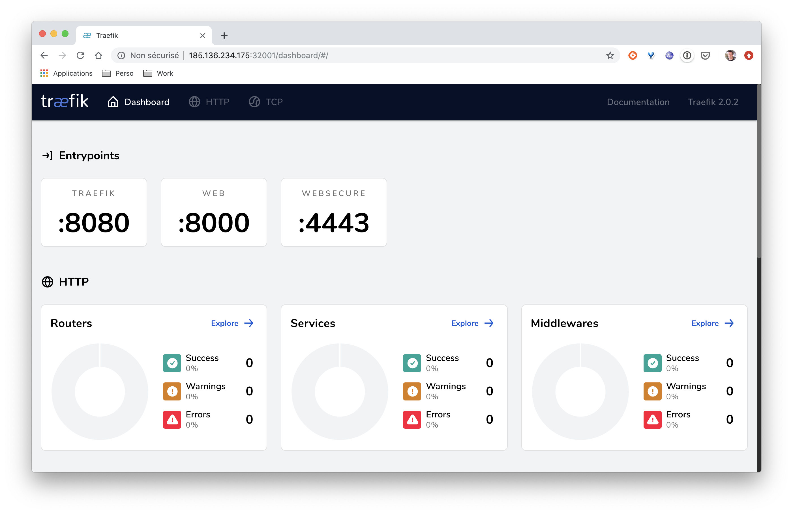
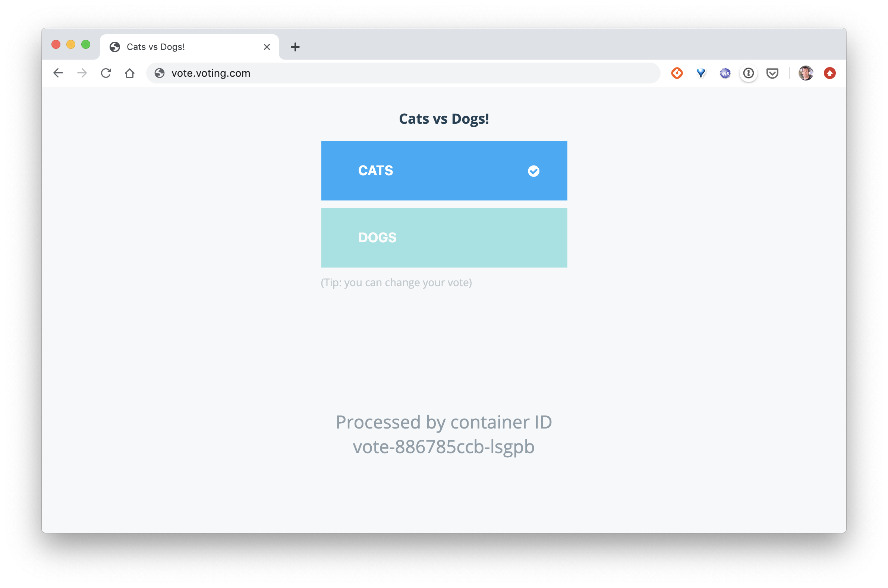
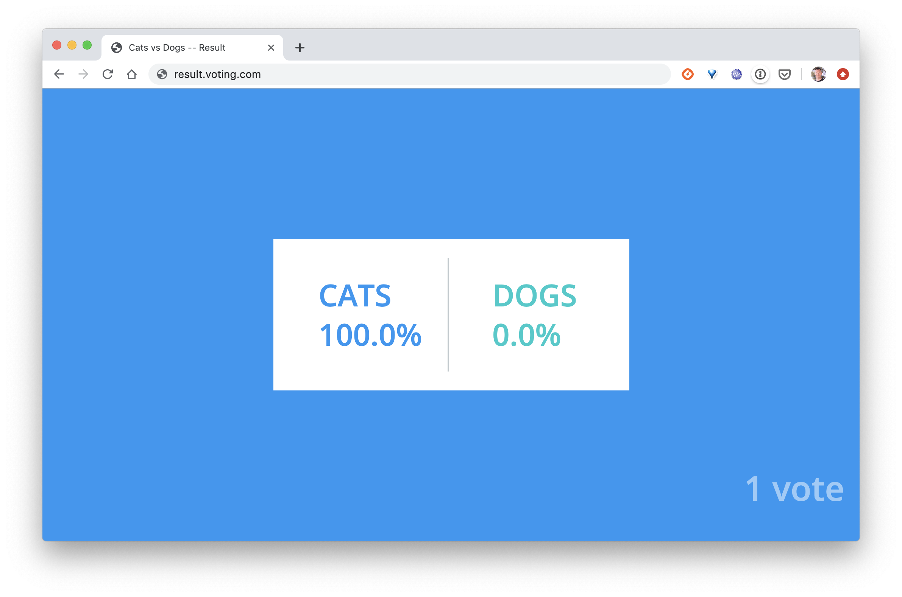
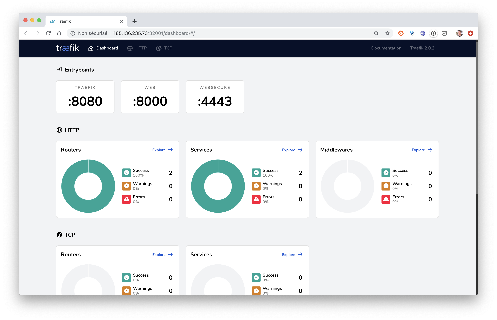
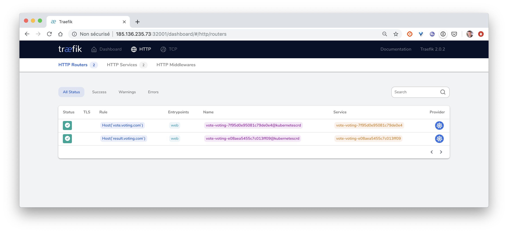
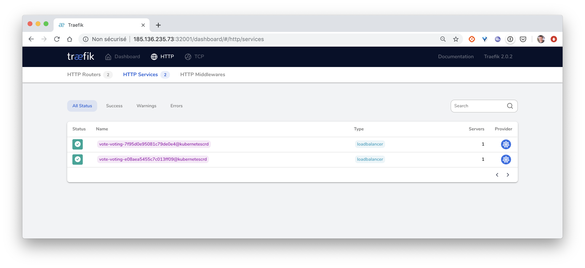

# Ressource Ingress pour le routage de la VotingApp

Dans cet exercice, vous allez créer une ressource *Ingress* et l'utiliser pour router les requêtes vers les interfaces de vote et de result de la VotingApp.

## 1. Installation d'un Ingress Controller

Un Ingress Controller est nécessaire afin de prendre en compte la ressource Ingress qui sera utilisée pour exposer les services à l'extérieur du cluster. C'est un reverse-proxy qui sera automatiquement configuré à l'aide des ressource Ingress.

Dans cet exercice nous allons déployer un Ingress Controller basé sur la version 2 de *Traefik* mais il est possible d'utiliser un autre type d'Ingress Controller (*HAProxy*, *Nginx*, ...).

Note: la version 2 de Traefik a une approche différente qui se base sur l'utilisation de CustomResourceDefinition.

### a. Création des ressources du cluster

Copiez le contenu suivant dans le fichier **crd.yaml**. Celui-ci définit les différentes ressources qui seront utilisées par Traefik. Ces ressources sont créées à partir de **CustomResourceDefinition**, objects qui permettent d'étendre Kubernetes.

```
apiVersion: apiextensions.k8s.io/v1beta1
kind: CustomResourceDefinition
metadata:
  name: ingressroutes.traefik.containo.us

spec:
  group: traefik.containo.us
  version: v1alpha1
  names:
    kind: IngressRoute
    plural: ingressroutes
    singular: ingressroute
  scope: Namespaced

---
apiVersion: apiextensions.k8s.io/v1beta1
kind: CustomResourceDefinition
metadata:
  name: ingressroutetcps.traefik.containo.us

spec:
  group: traefik.containo.us
  version: v1alpha1
  names:
    kind: IngressRouteTCP
    plural: ingressroutetcps
    singular: ingressroutetcp
  scope: Namespaced

---
apiVersion: apiextensions.k8s.io/v1beta1
kind: CustomResourceDefinition
metadata:
  name: middlewares.traefik.containo.us

spec:
  group: traefik.containo.us
  version: v1alpha1
  names:
    kind: Middleware
    plural: middlewares
    singular: middleware
  scope: Namespaced

---
apiVersion: apiextensions.k8s.io/v1beta1
kind: CustomResourceDefinition
metadata:
  name: tlsoptions.traefik.containo.us

spec:
  group: traefik.containo.us
  version: v1alpha1
  names:
    kind: TLSOption
    plural: tlsoptions
    singular: tlsoption
  scope: Namespaced
```

Créez ces ressources avec la commande suivante:

```
$ kubectl apply -f crd.yaml
```

### b. Création des droits d'accès

Le Ingress Controller que nous allons déployer à besoin de droits particuliers pour pouvoir intéragir avec l'API Server. La spécification suivante définit les éléments nécessaires:
- un ServiceAccount
- un ClusterRole
- un ClusterRoleBinding

Copiez le contenu suivant and le fichier `rbac.yaml`

```
apiVersion: v1
kind: ServiceAccount
metadata:
  namespace: default
  name: traefik-ingress-controller

---
kind: ClusterRole
apiVersion: rbac.authorization.k8s.io/v1beta1
metadata:
  name: traefik-ingress-controller

rules:
  - apiGroups:
      - ""
    resources:
      - services
      - endpoints
      - secrets
    verbs:
      - get
      - list
      - watch
  - apiGroups:
      - extensions
    resources:
      - ingresses
    verbs:
      - get
      - list
      - watch
  - apiGroups:
      - extensions
    resources:
      - ingresses/status
    verbs:
      - update
  - apiGroups:
      - traefik.containo.us
    resources:
      - middlewares
    verbs:
      - get
      - list
      - watch
  - apiGroups:
      - traefik.containo.us
    resources:
      - ingressroutes
    verbs:
      - get
      - list
      - watch
  - apiGroups:
      - traefik.containo.us
    resources:
      - ingressroutetcps
    verbs:
      - get
      - list
      - watch
  - apiGroups:
      - traefik.containo.us
    resources:
      - tlsoptions
    verbs:
      - get
      - list
      - watch

---
kind: ClusterRoleBinding
apiVersion: rbac.authorization.k8s.io/v1beta1
metadata:
  name: traefik-ingress-controller

roleRef:
  apiGroup: rbac.authorization.k8s.io
  kind: ClusterRole
  name: traefik-ingress-controller
subjects:
  - kind: ServiceAccount
    name: traefik-ingress-controller
    namespace: default
```

Créez ensuite ces ressources:

```
$ kubectl apply -f rbac.yaml
```

### c. Création du Ingress controller

La spécification suivante définit le Deployment permettant de lancer le Controller basé sur la version 2 de Traefik.

```
kind: Deployment
apiVersion: apps/v1
metadata:
  namespace: default
  name: traefik
  labels:
    app: traefik

spec:
  replicas: 1
  selector:
    matchLabels:
      app: traefik
  template:
    metadata:
      labels:
        app: traefik
    spec:
      serviceAccountName: traefik-ingress-controller
      containers:
        - name: traefik
          image: traefik:v2.0
          args:
            - --api.insecure
            - --accesslog
            - --entrypoints.web.Address=:8000
            - --entrypoints.websecure.Address=:4443
            - --providers.kubernetescrd
            - --certificatesresolvers.default.acme.tlschallenge
            - --certificatesresolvers.default.acme.email=foo@you.com
            - --certificatesresolvers.default.acme.storage=acme.json
            # Please note that this is the staging Let's Encrypt server.
            # Once you get things working, you should remove that whole line altogether.
            - --certificatesresolvers.default.acme.caserver=https://acme-staging-v02.api.letsencrypt.org/directory
          ports:
            - name: web
              containerPort: 8000
            - name: websecure
              containerPort: 4443
            - name: admin
              containerPort: 8080
```

Sauvegardez cette spécification dans le fichier *traefik-deploy.yaml* et créez la ressource avec la commande suivante:

```
$ kubectl apply -f traefik-deploy.yaml
```

Vérifiez ensuite que le Pod du Ingress Controller tourne correctement:

```
$ kubectl get pods -l "app=traefik"
NAME                      READY   STATUS    RESTARTS   AGE
traefik-5bdb49489-p5j5m   1/1     Running   0          76s
```

### d. Exposition via un Service

Il faut ensuite exposer le Controller à l'aide d'un Service:

- si vous êtes sur un cloud provider qui supporte les services de type LoadBalancer, vous pouvez utiliser la spécification suivante:

```
apiVersion: v1
kind: Service
metadata:
  name: traefik
spec:
  type: LoadBalancer
  selector:
    app: traefik
  ports:
    - protocol: TCP
      name: web
      port: 80
    - protocol: TCP
      name: admin
      port: 8080
    - protocol: TCP
      name: websecure
      port: 4443
```

Sauvegardez celle-ci dans le fichier *traefik-svc.yaml* et créez la ressource avec la commande suivante:

```
$ kubectl apply -f traefik-svc.yaml
```

Vérifiez ensuite que le Service a été créé correctement et récupérez l'adresse IP externe du LoadBalancer:

```
$ kubectl get svc/traefik
NAME      TYPE           CLUSTER-IP      EXTERNAL-IP      PORT(S)                       AGE
traefik   LoadBalancer   10.245.143.25   159.89.250.114   80:30381/TCP,8080:31341/TCP   2m50s
```

- si vous n'êtes pas sur un cloud provider et n'avez pas accès à une load balancer, vous pouvez utiliser la spécification suivante qui définit un Service de type *NodePort*:

```
kind: Service
apiVersion: v1
metadata:
  name: traefik
spec:
  type: NodePort
  selector:
    app: traefik
  ports:
    - protocol: TCP
      name: web
      port: 80
      nodePort: 32000
    - protocol: TCP
      name: admin
      port: 8080
      nodePort: 32001
    - protocol: TCP
      name: websecure
      port: 4443
      nodePort: 32002
```

Sauvegardez celle-ci dans le fichier *traefik-svc.yaml* et créez la ressource avec la commande suivante:

```
$ kubectl apply -f traefik-svc.yaml
```

### e. Accès à l'interface web de Traefik

L'interface web de Traefik est accessible via le Service crée précédemment. En fonction du type de Service créé, il faudra utiliser:
- soit l'IP du LoadBalancer suivie du port 8080
- soit l'IP d'une des machines du cluster suivie du NodePort associé au port 8080 (32001 ici)



Pour le moment, aucun Frontend ni Backend ne sont définis car nous n'avons pas encore créé de configuration, c'est ce que nous ferons dans la suite lorsque nous exposerons la Voting App au moyen de cet Ingress Controller.

## 2. Lancement de la VotingApp

Déployez la Voting App avec la commande suivante:

```
$ kubectl apply -f https://gitlab.com/snippets/1893427/raw
```

Note: l'ensemble des ressources de la Voting App sont définies dans le fichier à l'emplacement spécifié

Vérifiez que toutes les ressources ont été correctement créées (celles-ci appartiennent au namespace *vote*).

```
$ kubectl get all -n vote
NAME                          READY   STATUS    RESTARTS   AGE
pod/redis-c69c9b8f-kx6df      1/1     Running   0          41s
pod/db-6bfb94bf6-v8d6b        1/1     Running   0          41s
pod/result-54b4f5496b-rbq7d   1/1     Running   0          40s
pod/vote-886785ccb-lsgpb      1/1     Running   0          40s
pod/worker-6679776b94-7fhw6   1/1     Running   0          40s

NAME             TYPE        CLUSTER-IP        EXTERNAL-IP   PORT(S)          AGE
service/db       ClusterIP   192.168.234.150   <none>        5432/TCP         41s
service/redis    ClusterIP   192.168.221.57    <none>        6379/TCP         41s
service/result   NodePort    192.168.139.76    <none>        5001:31001/TCP   40s
service/vote     NodePort    192.168.242.136   <none>        5000:31000/TCP   40s

NAME                     READY   UP-TO-DATE   AVAILABLE   AGE
deployment.apps/redis    1/1     1            1           41s
deployment.apps/db       1/1     1            1           41s
deployment.apps/result   1/1     1            1           40s
deployment.apps/vote     1/1     1            1           40s
deployment.apps/worker   1/1     1            1           40s

NAME                                DESIRED   CURRENT   READY   AGE
replicaset.apps/redis-c69c9b8f      1         1         1       41s
replicaset.apps/db-6bfb94bf6        1         1         1       41s
replicaset.apps/result-54b4f5496b   1         1         1       40s
replicaset.apps/vote-886785ccb      1         1         1       40s
replicaset.apps/worker-6679776b94   1         1         1       40s
```

Si nous nous focalisons sur la liste des services, nous pouvons voir que:
- le Service *vote* expose le port *5000* à l'intérieur du cluster, et le port *31000* à l'extérieur
- le Service *result* expose le port *5001* à l'intérieur du cluster, et le port *31001* à l'extérieur


## 3. Création de IngressRouters

Pour router les requêtes entrantes sur le bon service nous allons définir une ressource de type *IngressRoute* depuis la spécification suivante:

```
apiVersion: traefik.containo.us/v1alpha1
kind: IngressRoute
metadata:
  name: voting
  namespace: vote
spec:
  entryPoints:
    - web
  routes:
  - match: Host(`vote.voting.com`)
    kind: Rule
    services:
    - name: vote
      port: 5000
  - match: Host(`result.voting.com`)
    kind: Rule
    services:
    - name: result
      port: 5001
```

Cette spécification définit 2 règles de routage:
- la première spécifie que les requêtes qui arrivent sur *http://vote.voting.com* sont forwardées sur le port *5000* du Service nommé *vote*
- la seconde spécifie que les requêtes qui arrivent sur *http://result.voting.com* sont forwardées sur le port *5001* du Service nommé *result*

Copiez cette spécification dans le fichier `ingress.yaml` et créez la ressource:

```
$ kubectl create -f ingress.yaml
```

## 4. Test

Dans le fichier */etc/hosts*, assurez-vous d'avoir défini les résolutions DNS des sous-domaines *vote.voting.com* et *result.voting.com*. Ceux-ci devront pointer vers:
- l'adresse IP de Minikube (obtenue avec la commande ```minikube ip``` si vous utilisez cette solution
- l'adresse IP d'une des machines de votre cluster si le Ingress Controller est exposé via un Service de type NodePort
- l'adresse IP du LoadBalancer si le Ingress Controller est exposé via un Service de type LoadBalancer

Vous pouvez maintenant voter depuis l'interface de vote et visualiser les résultats sur l'interface de results.

L'interface de vote est disponible:
- sur http://vote.voting.com si vous avez exposé le Ingress Controller avec un service de type LoadBalancer
- sur http://vote.voting.com:32000 si vous avez exposé le Ingress Controller avec un service de type NodePort (nous avions fixé la valeur de ce port à 32000 lors de la définition du Service)



L'interface de result est disponible:
- sur http://result.voting.com si vous avez exposé le Ingress Controller avec un service de type LoadBalancer
- sur http://result.voting.com:32000 si vous avez exposé le Ingress Controller avec un service de type NodePort (nous avions fixé la valeur de ce port à 32000 lors de la définition du Service)



Depuis le dashboard de Traefik, nous pouvons alors voir les différentes règles que nous avons définies.



Celles-ci apparaissent en tant que *Routers* et redirigent les requètes vers les services sous-jacents.





Nous n'avons vu la mise en place d'un routage basic avec la version 2 de Traefik. Cette nouvelle version propose un ensemble de fonctionnalités très intéressantes comme:
- le routage TCP
- l'utilisation de middlewares pour manipuler les requêtes avant de les envoyer au service

N'hésitez pas à parcourir la documentation pour avoir une vision globale des fonctionnalités offertes par Traefik v2 en tant que Ingress Controller: [https://docs.traefik.io](https://docs.traefik.io/)

## 5. Cleanup

Supprimez la Voting App et l'ensemble des ressources du namespace *vote* à l'aide de la commande suivante:

```
$ kubectl delete ns vote
```

Vous pouvez également supprimer Traefik.

```
$ kubectl delete -f traefik-deploy.yaml
$ kubectl delete -f traefik-svc.yaml
$ kubectl delete -f rbac.yaml
$ kubectl delete -f crd.yaml
```
