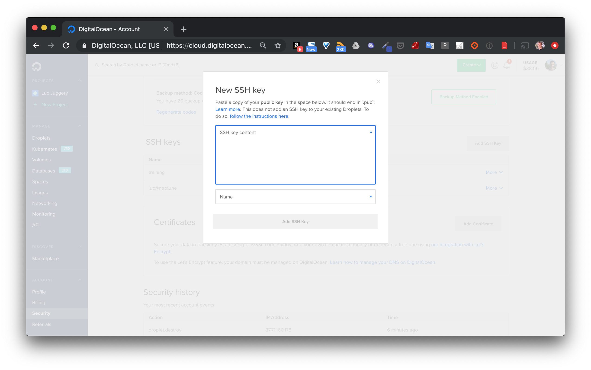
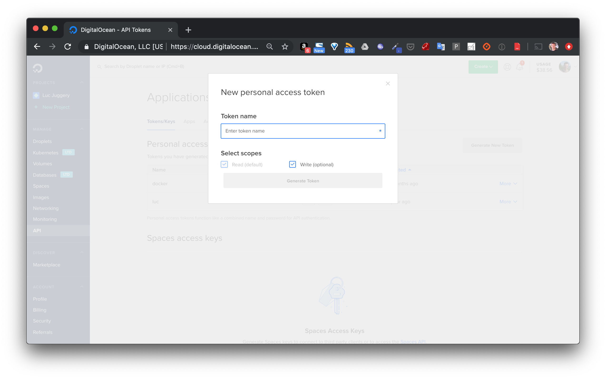
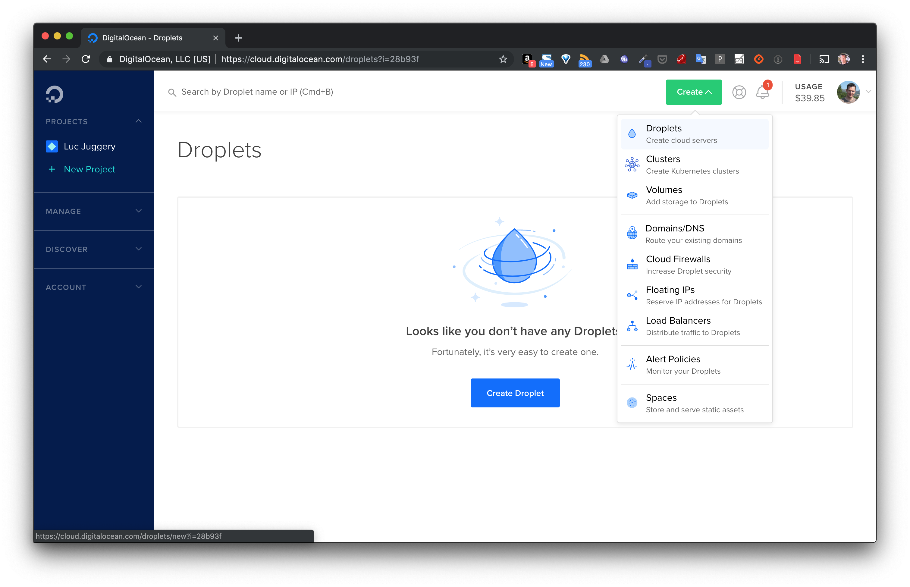
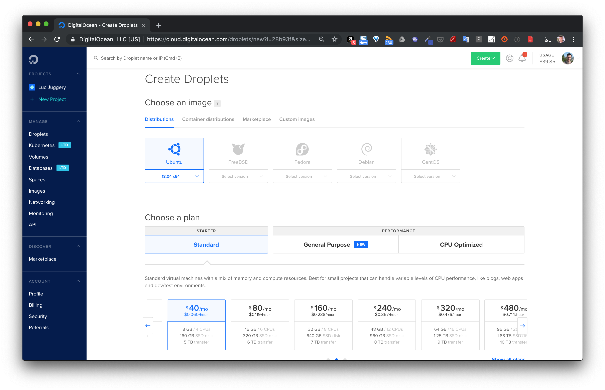
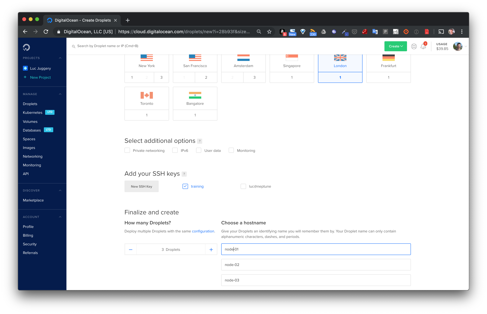
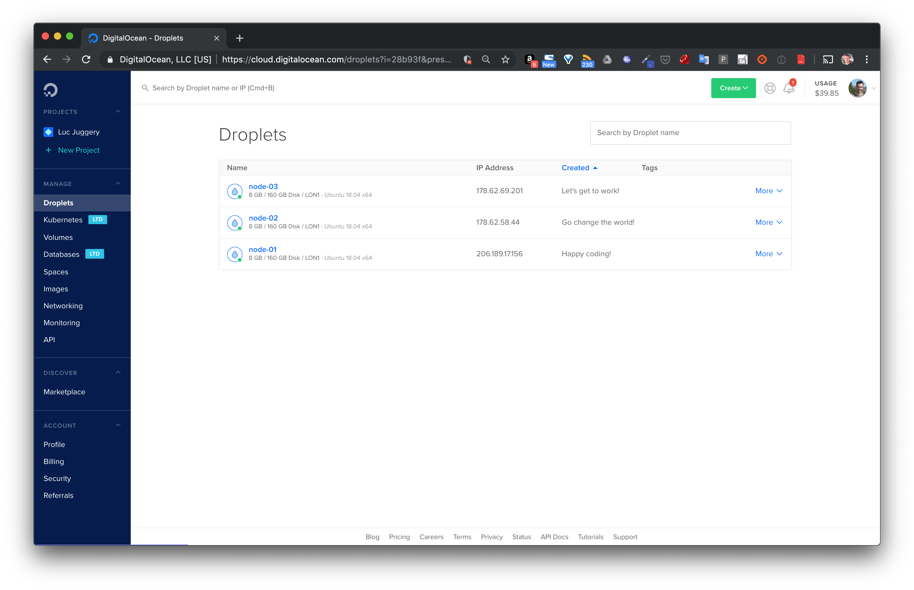

Dans cette mise en pratique, vous allez mettre en place un cluster Kubernetes sur le cloud provider [DigitalOcean](https://digitalocean.com) à l'aide de *kubeadm*.

> Attention:
DigitalOcean, un cloud provider très connu et simple à utiliser. Cependant, comme pour l'ensemble des cloud providers (Google Compute Engine, Amazon AWS, Packet, Rackspace, ...) l'instantiation de VMs est payante (peu cher pour un test de quelques heures cependant) et nécessite d'avoir un compte utilisateur provisionné avec quelques euros. Si vous ne souhaitez pas réaliser la manipulation, n'hésitez pas à suivre cet exercice sans l'appliquer.

# Quelques prérequis

## Installation de Kubectl

Le binaire kubectl est l'outil indispensable pour communiquer avec un cluster Kubernetes depuis la ligne de commande. Son installation est très bien documentée dans la documentation officielle que vous pouvez retrouver via le lien suivant: https://kubernetes.io/docs/tasks/tools/install-kubectl/

En fonction de votre environnement, vous trouverez les différentes options qui vous permettront d'installer kubectl

- si vous êtes sur macOS:

```
$ curl -LO https://storage.googleapis.com/kubernetes-release/release/$(curl -s https://storage.googleapis.com/kubernetes-release/release/stable.txt)/bin/darwin/amd64/kubectl
$ chmod +x ./kubectl
$ sudo mv ./kubectl /usr/local/bin/kubectl
```

- si vous êtes sur Linux

```
$ curl -LO https://storage.googleapis.com/kubernetes-release/release/$(curl -s https://storage.googleapis.com/kubernetes-release/release/stable.txt)/bin/linux/amd64/kubectl
$ chmod +x ./kubectl
$ sudo mv ./kubectl /usr/local/bin/kubectl
```

- si vous êtes sur Windows

```
$ curl -LO https://storage.googleapis.com/kubernetes-release/release/v1.17.0/bin/windows/amd64/kubectl.exe
```

note: si vous n'avez pas l'utilitaire curl vous pouvez télécharger kubectl v1.17.0 depuis ce https://storage.googleapis.com/kubernetes-release/release/v1.17.0/bin/windows/amd64/kubectl.exe.

Afin d'avoir les utilitaires comme curl, je vous conseille d'utiliser Git for Windows (https://gitforwindows.org), vous aurez alors Git Bash, un shell très proche de celui que l'on trouve dans un environnement Linux.

Il vous faudra ensuite mettre kubectl.exe dans le PATH.

## Création d'un compte sur DigitalOcean

Créez un compte depuis l'interface de [DigitalOcean](https://digitalocean.com).

Depuis le menu *Security* suivez la procédure pour ajouter une clé ssh.



Celle-ci sera utile dans la suite afin de permettre une connection ssh sans mot de passe sur les machines qui seront provisionnées.

*Optionnel*:

depuis le menu *API* générez un TOKEN, celui-ci vous sera utile dans la suite si vous souhaitez gérer les éléments d'infrastructure depuis la ligne de commande



# Provisionning

L'étape de provisionning de l'infrastructure consiste en la création des machines virtuelles qui seront utilisées pour le déploiement du cluster Kubernetes.

Il y a différentes façon de réaliser ce provisionning:
- depuis l'interface web de DigitalOcean
- en utilisant l'utilitaire [doctl](https://github.com/digitalocean/doctl) en ligne de commande
- en utilisant [Terraform](https://terraform.io), un excellent produit de [Hashicorp](https://hashicorp.com) permettant une approche IaC (Infrastructure As Code)

Nous utiliserons ici l'interface web mais n'hésitez pas à passer par une autre méthode si vous le souhaitez.

Cliquez sur le bouton *Create* en haut à droite et sélectionnez *Droplets*



Sélectionnez l'image *Ubuntu 18.04*, et laissez les options par défaut dans la section *Plan*.



Choisissez ensuite un datacenter proche de chez vous, et sélectionnez la clé ssh que vous avez définie plus haut, cette clé sera copiée sur les VMs lors de leur création. Indiquez que vous souhaitez créer 3 VMs et donnez leur les noms *node-01*, *node-02*, *node-03*.



Cliquez ensuite sur *Create*, les machines seront disponibles après quelques dizaines de secondes.



Note: chaque VM de ce type coute 40$ / mois. Pour un cluster de 3 machines que l'on utilise durant 4 heures, cela reviendra donc à mois d'1$. Attention cependant à bien supprimer vos VMs lorsque vous ne les utilisez plus.

# Configuration

L'étape de configuration consiste à installer les logiciels nécessaires sur l'infrastructure provisionnée lors de l'étape précédente.

Il y a différentes façon de réaliser cette configuration:
- en se connectant manuellement en ssh sur chaque machine
- en utilisant un utilitaire de configuration, comme *Ansible*, *Chef*, *Puppet*

Nous lancerons ici des commandes via ssh mais n'hésitez pas à passer par une autre méthode si vous le souhaitez.

## Installation des prérequis

Sur chaque machine, nous allons installer les éléments suivants:
- un runtime de container (nous utiliserons Docker)
- le binaire *kubeadm* pour la création du cluster
- le binaire *kubelet* pour la supervision des containers

Pour chaque VM, effectuer les opérations suivantes:
- installation du daemon Docker
- installation de kubelet
- installation de kubeadm

Pour cela, vous pouvez utiliser la commande suivante (en ayant au préalable positionné les variables d'environnement NODE01, NODE02, NODE03 avec les IP des nodes respectifs)

```
for IP in $NODE01 $NODE02 $NODE03; do
ssh -o "StrictHostKeyChecking=no" root@$IP << EOF /bin/bash
  curl https://get.docker.com | sh
  curl -s https://packages.cloud.google.com/apt/doc/apt-key.gpg | apt-key add -
  echo "deb https://apt.kubernetes.io/ kubernetes-xenial main" > /etc/apt/sources.list.d/kubernetes.list
  apt-get update && apt-get install -y kubelet kubeadm
EOF
done
```

## Initialisation du cluster

Lancer la commance suivante afin d'initialiser le cluster, à l'aide de *kubeadm*, depuis *node-01*:

```
$ ssh root@$NODE01 kubeadm init
````

La mise en place de l'ensemble des composants du master prendra quelques minutes. A la fin vous obtiendrez la commande à lancez depuis les autres VMs pour les ajouter au cluster.

## Ajout de nodes

Vous pouvez copier/coller cette commande de "join", ou bien la récupérer avec la commande suivante:

```
$ JOIN_CMD=$(ssh root@$NODE01 kubeadm token create --print-join-command)
```

puis la lancer sur les nodes *node-02* et *node-03* afin de les ajouter au cluster:

```
$ for IP in $NODE02 $NODE03; do ssh root@$IP $JOIN_CMD; done
```

## Récupération du context

Afin de pouvoir dialoguer avec le cluster que vous venez de mettre en place, vi le binaire *kubectl* que vous avez installé sur votre machine locale, il est nécessaire de récupérer le fichier de configuration du cluster. Utilisez pour cela les commandes suivantes depuis votre machine locale:

```
$ scp root@$NODE01:/etc/kubernetes/admin.conf do-kube-config
$ export KUBECONFIG=do-kube-config
```

Listez alors les nodes du cluster, ils apparaitront avec le status *NotReady*.

```
$ kubectl get nodes
NAME      STATUS     ROLES    AGE     VERSION
node-01   NotReady   master   2m57s   v1.15.3
node-02   NotReady   <none>   33s     v1.15.3
node-03   NotReady   <none>   29s     v1.15.3
```

## Installation d'un addons pour le networking entre les Pods

La commande suivante permet d'installer les composants nécessaires pour la communication entre les Pods qui seront déployés sur le cluster.

```
$ kubectl apply -f "https://cloud.weave.works/k8s/net?k8s-version=$(kubectl version | base64 | tr -d '\n')"
```

Note: il y a plusieurs solutions de networking qui peuvent être utilisées, la solution envisagées ici est Weave Net. L'article suivant donne une bonne comparaison des solutions les plus utilisées: [objectif-libre.com/fr/blog/2018/07/05/comparatif-solutions-reseaux-kubernetes/](objectif-libre.com/fr/blog/2018/07/05/comparatif-solutions-reseaux-kubernetes/)

## Vérification de l'état de santé des nodes

Maintenant que la solution de netorking a été installée, les nodes sont dans l'état *Ready*.

```
$ kubectl get nodes
NAME      STATUS   ROLES    AGE   VERSION
node-01   Ready    master   4m    v1.15.3
node-02   Ready    <none>   3m    v1.15.3
node-03   Ready    <none>   3m    v1.15.3
```

Le cluster est prêt à être utilisé.
