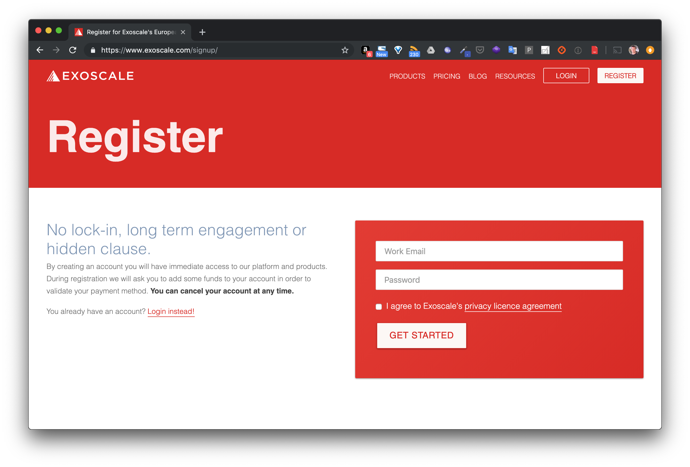
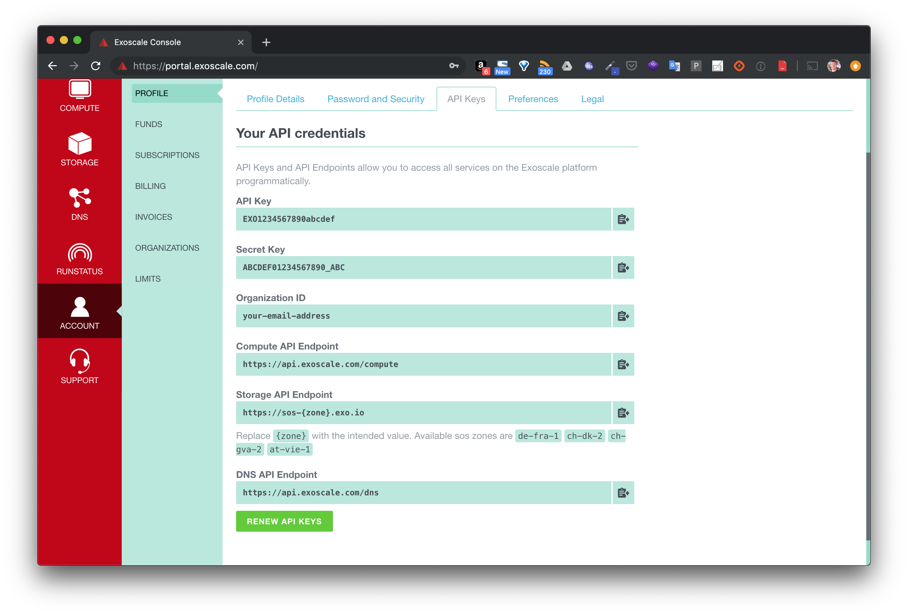

# Minikube sur Exoscale

## 1. Création d'un compte sur Exoscale

Rendez-vous sur [Exoscale](https://exoscale.com) et créez un compte.



## 2. Tokens de connection à l'API

Depuis votre compte, récupérez votre *API Key* et votre *Secret Key*, ces tokens vous serons demandés pour la configuration de l'utilitaire *exo* en ligne de commande.



## 3. Installation du binaire *exo*

Depuis le lien *https://github.com/exoscale/cli/releases*, récupérez la release du binaire *exo* qui correspond à votre architecture et placez le dans votre PATH.

## 4. Installation de kubectl

Le binaire kubectl est l'outils indispensable pour communiquer avec un cluster Kubernetes depuis la ligne de commande. Son installation est très bien documentée dans la documentation officielle que vous pouvez retrouver via le lien suivant: https://kubernetes.io/docs/tasks/tools/install-kubectl/

En fonction de votre environnement, vous trouverez les différentes options qui vous permettront d'installer kubectl

- si vous êtes sur macOS:

```
$ curl -LO https://storage.googleapis.com/kubernetes-release/release/v1.13.0/bin/darwin/amd64/kubectl
$ chmod +x ./kubectl
$ sudo mv ./kubectl /usr/local/bin/kubectl
```

- si vous êtes sur Linux

```
$ curl -LO https://storage.googleapis.com/kubernetes-release/release/v1.13.0/bin/linux/amd64/kubectl
$ chmod +x ./kubectl
$ sudo mv ./kubectl /usr/local/bin/kubectl
```

- si vous êtes sur Windows

```
$ curl -LO https://storage.googleapis.com/kubernetes-release/release/v1.14.0/bin/windows/amd64/kubectl.exe
```

note: si vous n'avez pas l'utilitaire curl vous pouvez télécharger kubectl v1.14.0 depuis ce https://storage.googleapis.com/kubernetes-release/release/v1.14.0/bin/windows/amd64/kubectl.exe.

Afin d'avoir les utilitaires comme curl, je vous conseille d'utiliser Git for Windows (https://gitforwindows.org), vous aurez alors Git Bash, un shell très proche de celui que l'on trouve dans un environnement Linux.

Il vous faudra ensuite mettre kubectl.exe dans le PATH.

## 5. Création d'une instance kubernetes sur Exoscale

Utilisez ensuite la commande suivante pour créer l'équivalent d'une instance *minikube* sur l'infrastructure de *Exoscale*.

```
$ exo lab kube create mykube
```

Suivez ensuite les instructions afin de pouvoir setter le context.
