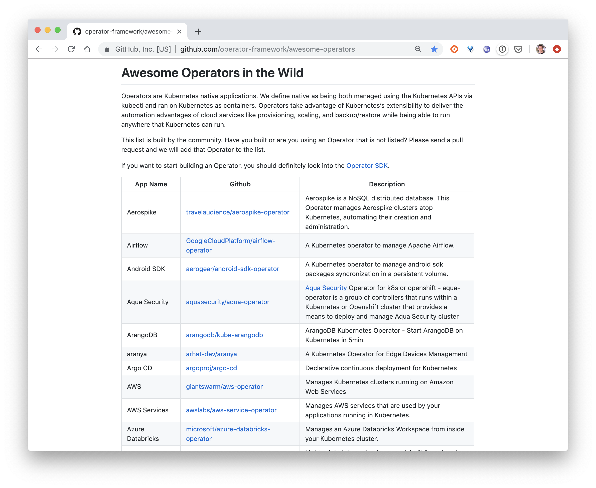
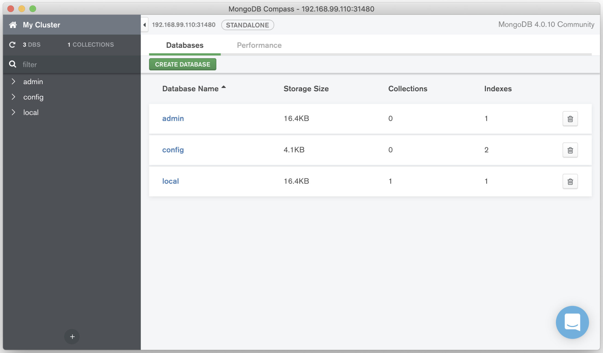

## Kubernetes Operator

Le concept d'Operator Kubernetes a été introduit fin 2016 par CoreOS. On peut définir un opérateur comme étant un processus (qui tourne dans un pod) qui utilise des ressources Kubernetes personnalisées (des ressources qui n'existent pas par défaut dans Kubernetes) et qui communique avec l'API Server pour automatiser la gestion d'applications complexes. Par application complexe, on peut par exemple penser à un cluster de base de données.

À la mi-2018, RedHat et la communauté Kubernetes ont publié Operator Framework (https://github.com/operator-framework/operator-sdk) afin de simplifier le développement de nouveaux opérateurs utilisant le langage de programmation Go. De nombreux opérateurs ont été créés en utilisant ce framework, comme on peut le voir sur https://github.com/operator-framework/awesome-operators:



Si l'on ne parle pas couramment le Go, Zalando a publié un framework permettant de créer des opérateurs en utilisant le langage Python. Dans cet exercice nous allons créer un Operator simple avec ce framework. L'important ici n'est pas tant le langage utilisé pour le développer mais plutôt de comprendre le fonctionnement d'un Operator en général et les différents composants et ressources qui peuvent intervenir.

## Kubernetes Operator Pythonic Framework

Le projet Kopf (nom abrégé de ce framework) est disponible sur https://github.com/zalando-incubator/kopf. Il est bien documenté et contient de nombreux exemples https://kopf.readthedocs.io.

## Objectif de notre Operator

L'Operator que nous allons développer définira sa propre ressource que l'on appelera *Database*. Lorsqu'une ressource de ce type sera créée, l'Operator déclenchera automatiquement la création d'un *Pod* et d'un *Service*:
- le *Pod* définissant un container basé sur l'image *mongo* ou *mysql*, en fonction de la valeur du champ *type* définit dans la ressource *Database*
- le *Service* servant à exposer ce *Pod* à l'extérioeur du cluster

Ne vous inquiétez pas si ce n'est pas tout à fait clair, nous allons voir les étapes les unes après les autres.

### CustomResourceDefinition (CRD)

Un Operator définit généralement ses propres ressources Kubernetes sur lesquelles il opère. La définition d'une nouvelle ressource Kubernetes est effectuée à partir d'une *CustomResourceDefinition* (ou *CRD*).

A l'aide de la commande ci-dessous, créez une *CustomResourceDefinition* définissant une ressource nommée *Database*, cette dernière définit un champ *Type* de type *string*.

```
$ cat <<EOF | kubectl apply -f -
apiVersion: apiextensions.k8s.io/v1beta1
kind: CustomResourceDefinition
metadata:
  name: databases.zalando.org
spec:
  scope: Namespaced
  group: zalando.org
  versions:
    - name: v1
      served: true
      storage: true
  names:
    kind: Database
    plural: databases
    singular: database
    shortNames:
      - db
      - dbs
  additionalPrinterColumns:
    - name: Type
      type: string
      priority: 0
      JSONPath: .spec.type
      description: The type of the database
EOF
```

Vous obtiendrez la réponse suivante indiquant que la nouvelle ressource a été correctement créée:

```
customresourcedefinition.apiextensions.k8s.io/databases.zalando.org created
```

Un nouveau type de ressource existe maintenant dans le cluster. Nous allons définir un Operator qui va l'utiliser.

### Code de notre Operator

Afin de déclencher des actions lors de la création ou de la suppression d'une ressource *Database*, nous allons utiliser le script python suivant, que nous sauvegarderons dans le fichier *handler.py*:

```
import kopf
import kubernetes
import yaml

@kopf.on.create('zalando.org', 'v1', 'databases')
def create_fn(body, spec, **kwargs):
    # Get info from Database object
    name = body['metadata']['name']
    namespace = body['metadata']['namespace']
    type = spec['type']

    # Make sure type is provided
    if not type:
        raise kopf.HandlerFatalError(f"Type must be set. Got {type}.")

    # Pod template
    pod = {'apiVersion': 'v1', 'metadata': {'name' : name, 'labels': {'app': 'db'}}}

    # Service template
    svc = {'apiVersion': 'v1', 'metadata': {'name' : name}, 'spec': { 'selector': {'app': 'db'}, 'type': 'NodePort'}}

    # Update templates based on Database specification

    if type == 'mongo':
      image = 'mongo:4.0'
      port = 27017
      pod['spec'] = { 'containers': [ { 'image': image, 'name': type } ]}
      svc['spec']['ports'] = [{ 'port': port, 'targetPort': port}]
    if type == 'mysql':
      image = 'mysql:8.0'
      port = 3306
      pod['spec'] = { 'containers': [ { 'image': image, 'name': type, 'env': [ { 'name': 'MYSQL_ROOT_PASSWORD', 'value': 'my_passwd' } ] } ]}
      svc['spec']['ports'] = [{ 'port': port, 'targetPort': port}]

    # Make the Pod and Service the children of the Database object
    kopf.adopt(pod, owner=body)
    kopf.adopt(svc, owner=body)

    # Object used to communicate with the API Server
    api = kubernetes.client.CoreV1Api()

    # Create Pod
    obj = api.create_namespaced_pod(namespace, pod)
    print(f"Pod {obj.metadata.name} created")

    # Create Service
    obj = api.create_namespaced_service(namespace, svc)
    print(f"NodePort Service {obj.metadata.name} created, exposing on port {obj.spec.ports[0].node_port}")

    # Update status
    msg = f"Pod and Service created by Database {name}"
    return {'message': msg}

@kopf.on.delete('zalando.org', 'v1', 'databases')
def delete(body, **kwargs):
    msg = f"Database {body['metadata']['name'])} and its Pod / Service children deleted"
    return {'message': msg}
```

Ce script n'est pas très compliqué, voyons les parties principales:

- on définit la fonction déclenchée lorsqu'une ressource *Database* est créée:

```
@kopf.on.create('zalando.org', 'v1', 'databases')
def create_fn(body, spec, **kwargs):
```

- on récupère les champs de la ressource *Database* et on s'assure que le *type* est renseigné

```
    # Get info from Database object
    name = body['metadata']['name']
    namespace = body['metadata']['namespace']
    type = spec['type']

    # Make sure type is provided
    if not type:
        raise kopf.HandlerFatalError(f"Type must be set. Got {type}.")
```

- on définit un modèle pour le Pod de base de données et un autre pour le Service qui sera utilisé pour exposer le pod.

```
    # Pod template
    pod = {'apiVersion': 'v1', 'metadata': {'name' : name, 'labels': {'app': 'db'}}}

    # Service template
    svc = {'apiVersion': 'v1', 'metadata': {'name' : name}, 'spec': { 'selector': {'app': 'db'}, 'type': 'NodePort'}}

```

- on ajout des éléments supplémentaires dans le modèle Pod et Service en fonction de la valeur du champ *type*

```
if type == 'mongo':
  image = 'mongo:4.0'
  port = 27017
  pod['spec'] = { 'containers': [ { 'image': image, 'name': type } ]}
  svc['spec']['ports'] = [{ 'port': port, 'targetPort': port}]
if type == 'mysql':
  image = 'mysql:8.0'
  port = 3306
  pod['spec'] = { 'containers': [ { 'image': image, 'name': type, 'env': [ { 'name': 'MYSQL_ROOT_PASSWORD', 'value': 'my_passwd' } ] } ]}
  svc['spec']['ports'] = [{ 'port': port, 'targetPort': port}]
```

- on associe le Pod et le Service à la ressource *Database*. La suppression de cette ressource entrainera automatiquement la suppression du Pod et du Service

```
# Make the Pod and Service the children of the Database object
kopf.adopt(pod, owner=body)
kopf.adopt(svc, owner=body)
```

- on appelle l'API Server et on lui demande de créer le Pod et le Service dont on a définit la spécification précédemment:

```
    # Object used to communicate with the API Server
    api = kubernetes.client.CoreV1Api()

    # Create Pod
    obj = api.create_namespaced_pod(namespace, pod)
    print(f"Pod {obj.metadata.name} created")

    # Create Service
    obj = api.create_namespaced_service(namespace, svc)
    print(f"NodePort Service {obj.metadata.name} created, exposing on port {obj.spec.ports[0].node_port}")
```

- on définit la fonction déclenchée lorsqu'une ressource *Database* est supprimée

```
@kopf.on.delete('zalando.org', 'v1', 'databases')
def delete(body, **kwargs):
```

### Création d'une image Docker

L'Operator est un process qui tournera dans un Pod. Il faut donc que l'on le package dans une image Docker. Nous utiliserons pour cela le *Dockerfile* suivant:

```
FROM python:3.7
COPY handlers.py /handlers.py
RUN pip install kopf
CMD kopf run --standalone /handlers.py
```

Nous construisons ensuite l'image avec la commande suivante:

```
$ docker image build -t lucj/op-db:latest .
```

Attention: si vous voulez contruire et utilisez votre propre image Docker dans la suite, il vous faudra replacer l'utilisateur *lucj* avec votre propre utilisateur *DockerHub* dans tout ce qui suit.

Nous envoyons ensuite cette image le *DockerHub*:

```
$ docker image push lucj/op-db:latest
```

### RBAC Rules

L'Operator que nous sommes en train de développer aura besoin des droits lui permettant de créer des ressources de type *Pod* et *Service*. Nous allons commencer par créer un *ServiceAccount* que nous utiliserons pour cet Operator:

```
$ cat <<EOF | kubectl apply -f -
apiVersion: v1
kind: ServiceAccount
metadata:
  name: db-operator
EOF
```

puis nous associons ce *ServiceAccount* au role *cluster-admin*

```
$ cat <<EOF > kubectl apply -f -
apiVersion: rbac.authorization.k8s.io/v1
kind: ClusterRoleBinding
metadata:
  name: db-operator
roleRef:
  apiGroup: rbac.authorization.k8s.io
  kind: ClusterRole
  name: cluster-admin
subjects:
  - kind: ServiceAccount
    name: db-operator
    namespace: default
EOF
```

Attention: le *Role* *cluster-admin* donne, aux Pods qui l'utilisent, tous les droits sur le cluster. Dans un contexte de production, il faudrait définir un *Role* n'authorisant que les actions dont l'Operator a réellement besoin (principe de moindres privilèges).

### Deployment de l'Operator

Nous deployons maintenant l'Operator avec la commande suivante:

```
$ cat <<EOF | kubectl apply -f -
apiVersion: apps/v1
kind: Deployment
metadata:
  name: op
spec:
  selector:
    matchLabels:
      app: op
  template:
    metadata:
      labels:
        app: op
    spec:
      serviceAccountName: db-operator
      containers:
      - image: lucj/db-op:latest
        name: op
EOF
```

puis nous vérifions ensuite que le *Deployment* et le *Pod* associé ont bien été crées:

```
$ kubectl get deploy,pod
NAME                       READY   UP-TO-DATE   AVAILABLE   AGE
deployment.extensions/op   1/1     1            1           5m54s
NAME                      READY   STATUS    RESTARTS   AGE
pod/op-5f578856fd-cmkv2   1/1     Running   0          5m54s
```

### Test

Pour vérifier que notre Operator fonctionne correctement, nous allons créer une ressource *Database* avec la commande suivante:

```
$ cat <<EOF | kubectl apply -f -
apiVersion: zalando.org/v1
kind: Database
metadata:
  name: mongo-db
spec:
  type: mongo
EOF
```

Nous pouvons ensuite vérifier que cela a bien déclenché la création d'un *Pod* et d'un *Service*:

```
$ kubectl get pod,svc
NAME                      READY   STATUS    RESTARTS   AGE
pod/mongo-db              1/1     Running   0          2m39s
pod/op-5f578856fd-cmkv2   1/1     Running   0          9m10s
NAME               TYPE      CLUSTER-IP     EXTERNAL-IP PORT(S)           AGE
service/kubernetes ClusterIP 10.96.0.1      <none>      443/TCP           14m
service/mongo-db   NodePort  10.105.157.68  <none>      27017:31480/TCP   2m39s
```

Comme le champ *type* de la ressource *Database* a comme valeur *mongo*, le *Pod* qui vient d'être créé est basé sur l’image *mongo:4.0* (cela est déterminé par l'Operator). Nous pouvons alors utiliser le NodePort associé au service pour accéder à ce Pod depuis un client MongoDB:




Comme le *Pod* et le *Service* sont définis en tant qu'enfants de la ressource *Database* nous pouvons vérifier qu'ils sont supprimés avec celle-ci.

```
$ kubectl delete -f mongo.yml
database.zalando.org "mongo-db" deleted
```

```
$ kubectl get pod,svc
NAME                      READY   STATUS    RESTARTS   AGE
pod/op-5f578856fd-cmkv2   1/1     Running   0          11m
NAME                TYPE       CLUSTER-IP  EXTERNAL-IP PORT(S)   AGE
service/kubernetes  ClusterIP  10.96.0.1   <none>      443/TCP   16m
```

Nous pourrions également créer une ressource *Database* dont le champ *type* a pour valeur *mysql*. Notre *Operator* déclencherait automatiquement la création d'un *Pod* dont lequel tourne un container basé sur *mysql:8*, ainsi qu'un *Service*, de type *NodePort* pour l'exposer à l'extérieur du cluster.

## En résumé

Cet exercice présente sur un exemple simple le fonctionnement d'un *Operator* et j'espère qu'il permet de démistifier un peu ce concept. Les choses importantes à retenir:
- un *Operator* utilise généralement des ressources qui sont créées à partir de *CustomResourceDefinition*
- un Operator contient toutes la logique d'administration d'une application
- un Operator est un process qui tourne dans un *Pod*
- un Operator communique avec l'API Server pour manipuler les ressources de base de Kubernetes (Deployment, Pod, Service, DaemonSet, StatefulSet, ...)
