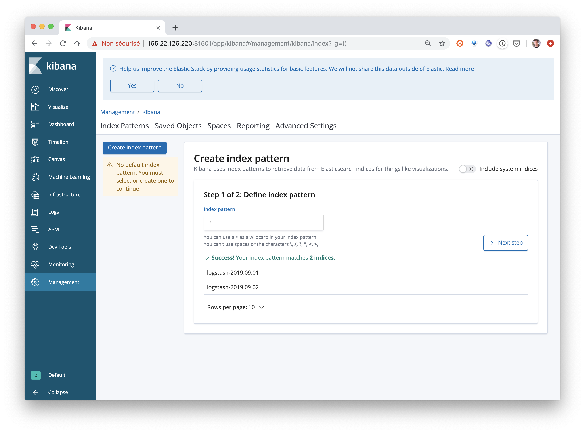
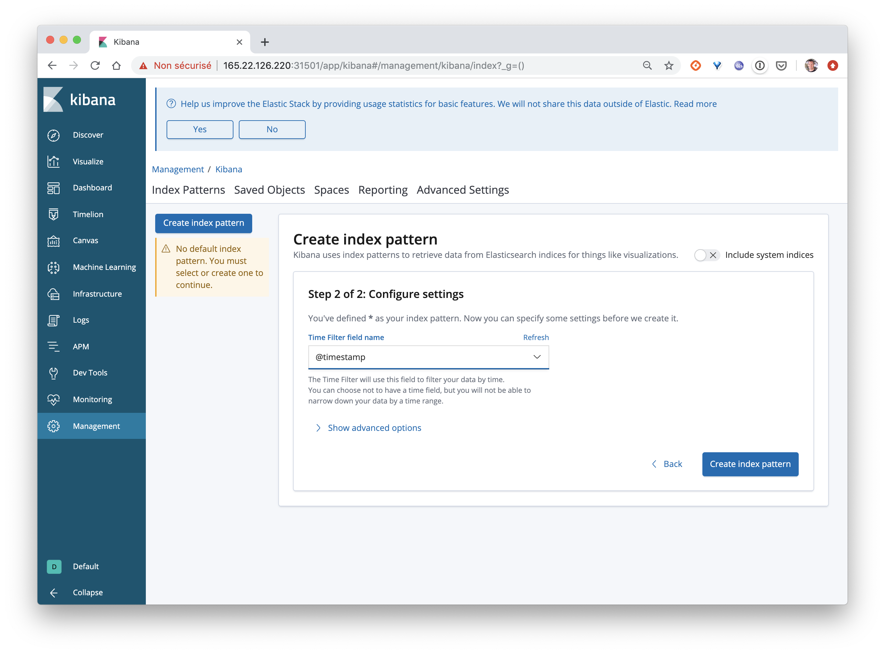

# La stack Elastic

Cette stack est très souvent utilisée notamment pour la gestion centralisée des logs.

Elle est composée de 3 logiciels:
- Logstash qui permet d'ingérer / filtrer / formater des données et de les envoyer à Elasticsearch
- Elasticsearch, le moteur responsable de l'indexation des données
- Kibana, l'application web permettant la visualisation et la manipulation des données


## 1. But de cet exercice

Dans cet exercice, vous allez lancer une stack Elastic et configurer Logstash de façon à ce:
- qu'il puisse recevoir des entrées de log sur un endpoint HTTP
- qu'il ajoute des informations de reverse-geocoding à chaque entrées reçue
- qu'il envoye chaque enregistrement dans Elasticsearch

Vous enverrez ensuite des entrées de log à Logstash et les visualiserez dans l'interface de Kibana.

Dans cet exercice nous allons, dans un premier temps, déployer la stack elastic (Logstash, Elasticsearch, Kibana) en utilisant différents éléments que nous avons vu jusqu'à présent:
- Deployment
- Service
- ConfigMap

Vous pouvez faire cette manipulation sur Minikube ou un cluster Kubernetes de votre choix.

## 2. Création des fichiers manifests

Créez un nouveau répertoire, nommé *elastic*, et un répertoire *manifests* dans celui-ci.

```
$ mkdir -p elastic/manifests
```

### 2.1. Elasticsearch

#### Spécification du Deployment

La spécification suivante définit le Deployment de *elasticsearch*. Copiez celle-ci dans le fichier *manifests/deploy-elasticsearch.yaml*.

```
apiVersion: apps/v1
kind: Deployment
metadata:
  name: elasticsearch
spec:
  replicas: 1
  selector:
    matchLabels:
      app: elasticsearch
  template:
    metadata:
      labels:
        app: elasticsearch
    spec:
      containers:
      - image: elasticsearch:6.6.0
        name: elasticsearch
      initContainers:
      - name: increase-vm-max-map
        image: busybox
        command: ["sysctl", "-w", "vm.max_map_count=262144"]
        securityContext:
          privileged: true
```

Note: la spécification du Pod contient une clé supplémentaire, *initContainers*, sous laquelle est définie une liste de containers qui seront lancés avant le container applicatif (celui basé sur l'image *elasticsearch*). L'unique container de cette liste est utilisé pour mettre à jour un paramètre du Kernel afin de permettre à Elasticsearch de se lancer correctement.

#### Specification du Service

La spécification suivante définit le Service, de type *ClusterIP*, utilisé pour exposer le Pod *elasticsearch* aux autres Pods du cluster. Copiez cette spécification dans le fichier *manifests/service-elasticsearch.yaml*.

```
apiVersion: v1
kind: Service
metadata:
  name: elasticsearch
spec:
  type: ClusterIP
  ports:
  - name: elasticsearch
    port: 9200
    targetPort: 9200
  selector:
    app: elasticsearch
```

### 2.2. Kibana

#### Spécification du Deployment

La spécification suivante définit le Deployment de *Kibana*. Copiez celle-ci dans le fichier *manifests/deploy-kibana.yaml*.

```
apiVersion: apps/v1
kind: Deployment
metadata:
  name: kibana
spec:
  replicas: 1
  selector:
    matchLabels:
      app: kibana
  template:
    metadata:
      labels:
        app: kibana
    spec:
      containers:
      - image: kibana:6.6.0
        name: kibana
```

#### Spécification du Service

La spécification suivante définit le Service, de type *NodePort*, utilisé pour exposer le Pod *kibana* à l'extérieur du cluster. Copiez cette spécification dans le fichier *manifests/service-kibana.yaml*.

```
apiVersion: v1
kind: Service
metadata:
  name: kibana
spec:
  type: NodePort
  ports:
  - port: 5601
    targetPort: 5601
    nodePort: 31501
  selector:
    app: kibana
```

### 2.3. Logstash

#### Fichier de configuration

Nous allons configurer logstash pour qu'il écoute sur HTTP, qu'il parse les entrées de logs au format apache et qu'il envoie les structures json résultantes dans *elasticsearch*. Nous allons pour cela créer le fichier *logstash.conf* dans le répertoire *elastic*. Ce fichier contient la configuration suivante:

```
input {
 http {}
}

filter {
 grok {
   match => [ "message" , "%{COMBINEDAPACHELOG}+%{GREEDYDATA:extra_fields}"]
   overwrite => [ "message" ]
 }
 mutate {
   convert => ["response", "integer"]
   convert => ["bytes", "integer"]
   convert => ["responsetime", "float"]
 }
 geoip {
   source => "clientip"
   target => "geoip"
   add_tag => [ "nginx-geoip" ]
 }
 date {
   match => [ "timestamp" , "dd/MMM/YYYY:HH:mm:ss Z" ]
   remove_field => [ "timestamp" ]
 }
 useragent {
   source => "agent"
 }
}

output {
 elasticsearch {
   hosts => ["elasticsearch:9200"]
 }
 stdout { codec => rubydebug }
}
```

Ce fichier peu sembler un peu compliqué, mais il ne l'est pas tant que ça :)
Il peut être découpé en 3 parties:

- *input*: permet de spécifier les données d'entrée. Nous spécifions ici que logstash peut recevoir des données via http

- *filter*: permet de spécifier quels traitement seront appliqués aux données reçues. Plusieurs instructions sont utilisées ici:
  - grok permet de spécifier comment chaque entrée doit être parsée. De nombreux parseurs sont disponibles par défaut et nous spécifions ici (avec COMBINEDAPACHELOG) que chaque ligne doit être parsée suivant un format de log apache, cela permettra une extraction automatique des champs comme l'heure de création, l'url de la requête, l'ip d'origine, le code retour, ...
  - mutate permet de convertir les types de certains champs
  - geoip permet d'obtenir des informations géographiques à partir de l'adresse IP d'origine
  - date est utilisée ici pour reformatter le timestamp

- *output*: permet de spécifier la destination d'envoi des données une fois que celles-ci sont passées par l'étape filter. Dans le cas présent, elles seront donc envoyées au service *elasticsearch*

#### Spécification du Deployment

La spécification suivante définit le Deployment de *Logstash*. Copiez celle-ci dans le fichier *manifests/deploy-logstash.yaml*.

```
apiVersion: apps/v1
kind: Deployment
metadata:
  name: logstash
spec:
  replicas: 1
  selector:
    matchLabels:
      app: logstash
  template:
    metadata:
      labels:
        app: logstash
    spec:
      containers:
      - image: logstash:6.6.0
        name: logstash
        volumeMounts:
        - mountPath: /config/logstash.conf
          name: config
        command:
        - "logstash"
        - "-f"
        - "/config/logstash.conf"
      volumes:
      - name: config
        configMap:
          name: logstash-config
```

L'unique container spécifié dans le Pod utilise une *ConfigMap* afin de monter le fichier de configuration *logstash.conf* à l'emplacement lu par *logstash* par défaut (*/config/logstash.conf*)

#### Spécification du Service

La spécification suivante définit le Service utilisé pour exposer le Pod *logstash* à l'extérieur du cluster et ainsi pouvoir lui envoyer des entrées de logs. Copiez cette spécification dans le fichier *manifests/service-logstash.yaml*.

```
apiVersion: v1
kind: Service
metadata:
  name: logstash
spec:
  type: NodePort
  ports:
  - name: logstash
    port: 8080
    targetPort: 8080
    nodePort: 31500
  selector:
    app: logstash
```

## 3. Création d'une ConfigMap pour configurer Logstash

Depuis un shell dans le répertoire *elastic*, lancez la commande suivante pour créer la configMap *logstash-config*. Celle-ci est créée à partir du fichier de configuration *logstash.conf* que nous avons défini précédemment.

```
$ kubectl create configmap logstash-config --from-file=./logstash.conf
```

La commande suivante permet de vérifiez le contenu de la ConfigMap que vous venez de créer:

```
$ kubectl get cm/logstash-config -o yaml
```

Vous devriez obtenir un résultat proche de celui ci-dessous dans lequel le contenu du fichier *logstash.conf* apparait sous la clé du même nom.

```
apiVersion: v1
data:
  logstash.conf: |
    input {
     http {}
    }

    filter {
     grok {
       match => [ "message" , "%{COMBINEDAPACHELOG}+%{GREEDYDATA:extra_fields}"]
       overwrite => [ "message" ]
     }
     mutate {
       convert => ["response", "integer"]
       convert => ["bytes", "integer"]
       convert => ["responsetime", "float"]
     }
     geoip {
       source => "clientip"
       target => "geoip"
       add_tag => [ "nginx-geoip" ]
     }
     date {
       match => [ "timestamp" , "dd/MMM/YYYY:HH:mm:ss Z" ]
       remove_field => [ "timestamp" ]
     }
     useragent {
       source => "agent"
     }
    }

    output {
     elasticsearch {
       hosts => ["elasticsearch:9200"]
     }
     stdout { codec => rubydebug }
    }
kind: ConfigMap
metadata:
  creationTimestamp: "2019-09-06T17:39:54Z"
  name: logstash-config
  namespace: default
  resourceVersion: "7353"
  selfLink: /api/v1/namespaces/default/configmaps/logstash-config
  uid: ec61380a-b394-4ca6-bc52-15c851d6510e
```


## 4. Déploiement de l'application

Note: afin que Elasticsearch puisse se lancer correctement, il est nécessaire d'augmenter la mémoire virtuelle de la machine hôte, ceci est effectué par le container d'init du Pod elasticsearch. Il est également possible de changer ce paramètre en ce connectant en ssh aux machines du cluster et en lançant la commande ```sudo sysctl -w vm.max_map_count=262144``` sur chacune d'entre elles.

Depuis un shell dans le répertoire *elastic*, lancer l'application avec la commande suivante:

```
$ kubectl apply -f manifests/
deployment "elasticsearch" created
deployment "kibana" created
deployment "logstash" created
service "elasticsearch" created
service "kibana" created
service "logstash" created
```

On peut alors vérifier que les différents Deployments, Pods et Services ont bien été créés et que les Pods ont le status *Running*. Cela peut prendre quelques dizaines de secondes car les images doivent être téléchargées depuis le Docker Hub.

```
$ kubectl get svc,deploy,pod
NAME                    TYPE        CLUSTER-IP       EXTERNAL-IP   PORT(S)          AGE
service/elasticsearch   ClusterIP   10.245.221.158   <none>        9200/TCP         2m25s
service/kibana          NodePort    10.245.241.64    <none>        5601:31501/TCP   2m25s
service/kubernetes      ClusterIP   10.245.0.1       <none>        443/TCP          88m
service/logstash        NodePort    10.245.56.41     <none>        8080:31500/TCP   2m25s

NAME                                  READY   UP-TO-DATE   AVAILABLE   AGE
deployment.extensions/elasticsearch   1/1     1            1           2m25s
deployment.extensions/kibana          1/1     1            1           2m25s
deployment.extensions/logstash        1/1     1            1           2m25s

NAME                                 READY   STATUS    RESTARTS   AGE
pod/elasticsearch-577ff589c5-cvrgl   1/1     Running   0          2m25s
pod/kibana-756d67774f-mnp8n          1/1     Running   0          2m25s
pod/logstash-779b98c567-42fhz        1/1     Running   0          2m25s
```

## 5. Test de la stack Elastic

Nous allons maintenant utiliser un fichier de log de test et envoyer son contenu, ligne par ligne, à Logstash. Ce dernier sera donc en charge de parser et enrichir ces données et de les envoyer à Elasticsearch.

Récupérez en local le fichier nginx.log avec la commande suivante :

```
curl -s -o nginx.log https://gist.githubusercontent.com/lucj/0602e8f8ef18f949677248048365fc6b/raw
```

Ce fichier contient 500 entrées de logs au format Apache. Si l'on considère une l'entrée suivante:

```
46.218.112.178 - - [01/Sep/2019:14:45:19 +0000] "GET /api/object/5996fc0f4c06fb000f83b7 HTTP/1.1" 200 501 "https://mydomain.net/map" "Mozilla/5.0 (Windows NT 10.0; WOW64; rv:55.0) Gecko/20100101 Firefox/55.0" "-"
```

On peut en extraire différentes information:
- reçue le 01 septembre 2019
- de type GET
- elle appele l'URL https://mydomain.net/api/object/5996fc0f4c06fb000f83b7
- l'IP d'origine est 46.218.112.178
- le navigateur est Firefox

Assurez-vous tout d'abord que l'interface de *Kibana* est disponible, cela permet d'être sur que *Elasticsearch* a finit de démarrer et que *Kibana* a pu s'y connecter. Vous devriez obtenir l'interface suivante en utilisant l'adresse IP de l'une des machines du cluster et le port 31501.


Vous pouvez alors utiliser la commande suivante pour envoyer chaque ligne contenue dans ce fichier à *Logstash* (assurez vous de remplacer *HOST* par l'adresse IP de l'une des machines du cluster):

```
while read -r line; do curl -s -XPUT -d "$line" http://HOST:31500; done < ./nginx.log
```

Une fois le script terminé, aller dnas l'onglet *Discover* de l'interface de *Kibana*. Dans un premier temps il faut créer un index en suivant les instructions suivantes:





Vous pourrez ensuite visualiser les logs en cliquant sur *Discover* et en sélectionnant une période englobant les premiers jours de septembre 2019 (date des logs)


Vous pouvez ensuite ajouter différents champs, comme par exemple le code du pays d'ou provient la requête et le status code de celle-ci.

## Résumé

Il est relativement simple de mettre en place une stack Elastic sur un cluster Kubernetes (cela deviendrait un peu plus compliqué si l'on souhaitait configurer un cluster Elasticsearch). Nous verrons dans l'exercice suivant comment utiliser cette stack pour la gestion centralisée des logs (logs provenant du cluster + logs applicatif).
