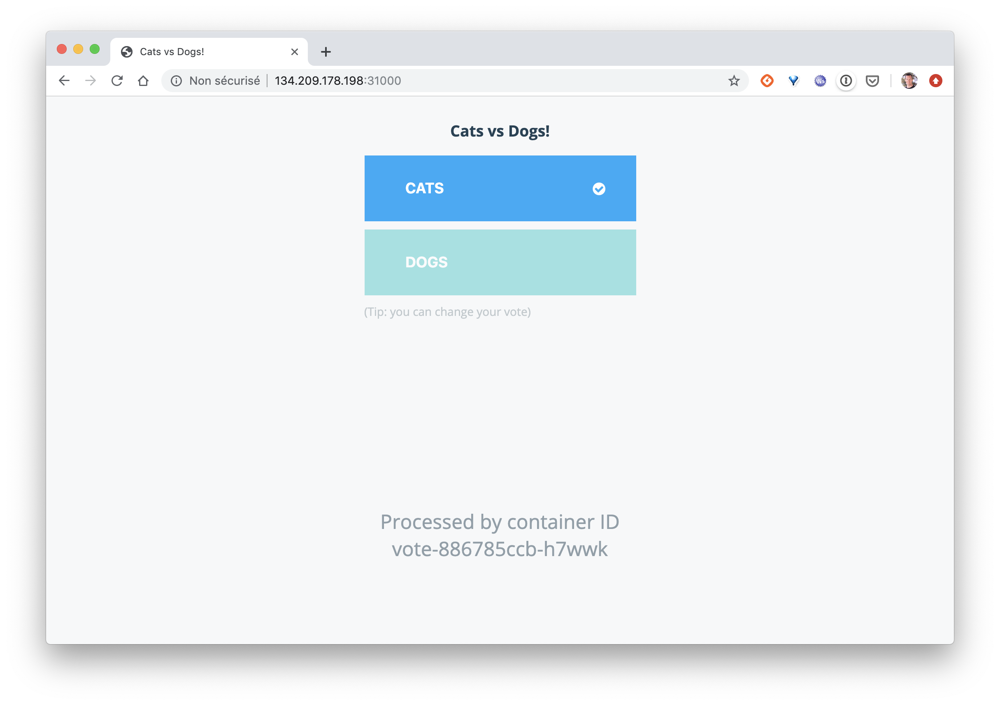
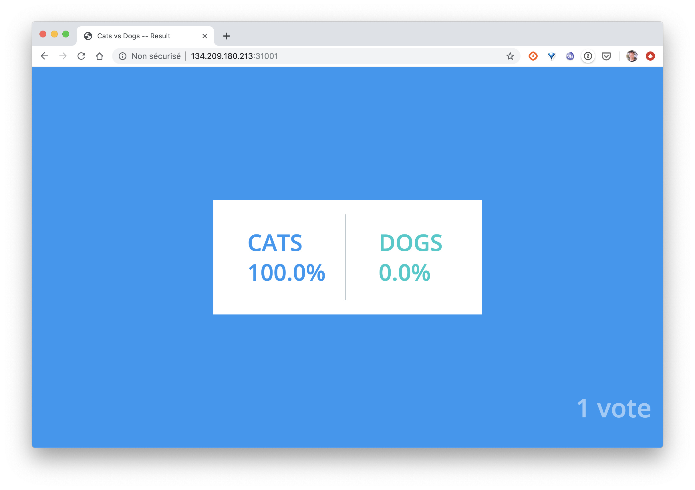

## Deploiement de la VotingApp

Dans cet exercice vous allez déployer la Voting App, une application de vote très souvent utilisée pour les démos et présentation. Cette application suit une architecture microservices, elle est très simple mais permet cependant d'illustrer de nombreux concepts notamment en ce qui concerne l'orchestration.

## 1. Récupération du projet

Dans un nouveau répertoire, clonez le repository avec la commande suivante:

```
$ git clone https://github.com/lucj/example-voting-app
$ cd example-voting-app
```

## 2. Création des ressources

Dans le répertoire *k8s-specifications* se trouvent l'ensemble des spécifications des ressources utilisées par la Voting App. Pour chaque micro-service de l'application, il y a un Deployment et un Service. Seul le micro-service *worker* n'a pas de Service associé, c'est le seul micro-service qui n'est pas exposé dans le cluster (aucun microservice ne l'appelle).

Nous commençons par créer le namespace nommé *vote* avec la commande suivante, ceci est nécessaire car toutes les ressources de l'application seront créées dans ce namespace :

```
$ kubectl create namespace vote
```

La commande suivante permet de créer l'ensemble des ressources de l'application:

```
$ kubectl apply -f ./k8s-specifications -n vote
deployment "db" created
service "db" created
deployment "redis" created
service "redis" created
deployment "result" created
service "result" created
deployment "vote" created
service "vote" created
deployment "worker" created
```

## 3. Liste des ressources

Avec la commande suivante, assurez-vous que toutes les ressources ont été créées correctement:

```
$ kubectl get deploy,pod,svc -n vote
NAME            DESIRED   CURRENT   UP-TO-DATE   AVAILABLE   AGE
deploy/db       1         1         1            1           1m
deploy/redis    1         1         1            1           1m
deploy/result   1         1         1            1           1m
deploy/vote     1         1         1            1           1m
deploy/worker   1         1         1            1           1m

NAME                         READY     STATUS    RESTARTS   AGE
po/db-549c4694d9-td9gj       1/1       Running   0          1m
po/redis-5ff865c7d-bxhd9     1/1       Running   0          1m
po/result-76784c98fb-4mq57   1/1       Running   0          1m
po/vote-65df68d6ff-ghcbv     1/1       Running   0          1m
po/worker-8875fdcc8-zbxl2    1/1       Running   0          1m

NAME             TYPE        CLUSTER-IP      EXTERNAL-IP   PORT(S)          AGE
svc/db           ClusterIP   10.99.192.60    <none>        5432/TCP         1m
svc/redis        ClusterIP   10.111.62.16    <none>        6379/TCP         1m
svc/result       NodePort    10.107.254.26   <none>        5001:31001/TCP   1m
svc/vote         NodePort    10.99.171.171   <none>        5000:31000/TCP   1m
```

## 4. Accès à l'application

L'interface de vote est disponible sur le port *31000* de n'importe quelle machine du cluster:

Note: vous pouvez récupérer les IPs externes des machines de votre cluster avec la commande ```$ kubectl get nodes -o wide```



De même, l'interface de resultat est disponible sur le port *31001* de n'importe quelle machine du cluster:



Note: si vous utilisez Minikube, les interfaces de vote et de result sont disponibles respectivement sur *http://MINIKUPE_IP:31000* et *http://MINIKUPE_IP:31001*, l'IP de Miniikube peut être obtenue avec la commande ```minikube ip```

Sélectionnez une option et visualisez le résultat dans l'interface *result*.

## 5. Cleanup

La commande suivante permet de supprimer le namespace *vote*, cela supprimera l'ensemble des ressources qu'il contient:

```
$ kubectl delete ns vote
```
