## Pré-requis

Pour faire cet exercice, il vous suffit d'avoir accès à un cluster Kubernetes.

Les manipulations seront faites sur un cluster géré par le cloud provider [DigitalOcean](https://digitalocean.com) mais vous êtes libre d'utiliser le cloud provider de votre choix ou bien d'installer un cluster en local.

## Téléchargement

Depuis votre machine locale, récupérez Istio avec la commande suivante:

Note: remplacer `X.Y.Z` par la version de la dernière release stable depuis [Istio releases](https://github.com/istio/istio/releases/)

```
$ curl -L https://git.io/getLatestIstio | ISTIO_VERSION=X.Y.Z sh -
```

Ajoutez dans votre PATH les binaires présents dans le répertoire istio-X.Y.Z/bin

```
$ cd istio-X.Y.Z
$ export PATH=$PWD/bin:$PATH
```

Vérifiez ensuite que le cluster est prêt pour que Istio soit installé:

```
$ istioctl verify-install

Checking the cluster to make sure it is ready for Istio installation...

#1. Kubernetes-api
-----------------------
Can initialize the Kubernetes client.
Can query the Kubernetes API Server.

#2. Kubernetes-version
-----------------------
Istio is compatible with Kubernetes: v1.16.2.

#3. Istio-existence
-----------------------
Istio will be installed in the istio-system namespace.

#4. Kubernetes-setup
-----------------------
Can create necessary Kubernetes configurations: Namespace,ClusterRole,ClusterRoleBinding,CustomResourceDefinition,Role,ServiceAccount,Service,Deployments,ConfigMap.

#5. SideCar-Injector
-----------------------
This Kubernetes cluster supports automatic sidecar injection. To enable automatic sidecar injection see https://istio.io/docs/setup/kubernetes/additional-setup/sidecar-injection/#deploying-an-app

-----------------------
Install Pre-Check passed! The cluster is ready for Istio installation.
```

## Installation

Plusieurs profils sont disponibles, chacun définissant une configuration spécifique du *Control Plane* et du *Data Plane* comme le montre la liste suivante:

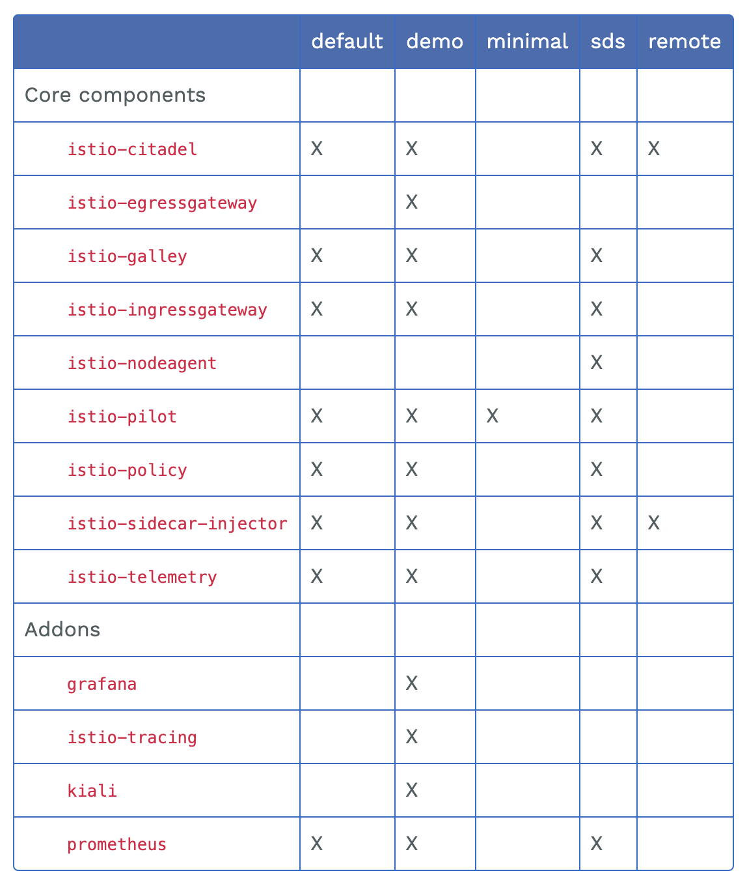

Dans cet exercice, nous utiliserons le profil *demo* afin d'avoir une overview de différentes fonctionnalités de Istio.

Utilisez la commande suivante pour mettre en place ce profil et visualiser la création des différentes ressources:

```
$ istioctl manifest apply --set profile=demo

Preparing manifests for these components:
- Injector
- Galley
- Citadel
- Pilot
- Tracing
- CoreDNS
- EgressGateway
- Base
- Prometheus
- Telemetry
- CertManager
- NodeAgent
- Policy
- Grafana
- Cni
- Kiali
- IngressGateway
- PrometheusOperator

Applying manifest for component Base
Finished applying manifest for component Base
Applying manifest for component Citadel
Applying manifest for component Policy
Applying manifest for component Kiali
Applying manifest for component IngressGateway
Applying manifest for component Prometheus
Applying manifest for component Pilot
Applying manifest for component Galley
Applying manifest for component Tracing
Applying manifest for component EgressGateway
Applying manifest for component Telemetry
Applying manifest for component Injector
Applying manifest for component Grafana
Finished applying manifest for component Citadel
Finished applying manifest for component Prometheus
Finished applying manifest for component Tracing
Finished applying manifest for component Kiali
Finished applying manifest for component Galley
Finished applying manifest for component Pilot
Finished applying manifest for component Injector
Finished applying manifest for component Policy
Finished applying manifest for component IngressGateway
Finished applying manifest for component EgressGateway
Finished applying manifest for component Grafana
Finished applying manifest for component Telemetry
...
```

### Vérification

Vérifiez ensuite avec que les services du namespace *istio-system* ont été correctement créés.

```
$ kubectl get svc -n istio-system
NAME                     TYPE           CLUSTER-IP       EXTERNAL-IP      PORT(S)                                                                                                                      AGE
grafana                  ClusterIP      10.245.14.178    <none>           3000/TCP                                                                                                                     9m43s
istio-citadel            ClusterIP      10.245.180.80    <none>           8060/TCP,15014/TCP                                                                                                           9m49s
istio-egressgateway      ClusterIP      10.245.131.199   <none>           80/TCP,443/TCP,15443/TCP                                                                                                     9m45s
istio-galley             ClusterIP      10.245.136.158   <none>           443/TCP,15014/TCP,9901/TCP,15019/TCP                                                                                         9m48s
istio-ingressgateway     LoadBalancer   10.245.164.55    159.89.251.210   15020:30445/TCP,80:32449/TCP,443:31092/TCP,15029:30326/TCP,15030:30437/TCP,15031:30568/TCP,15032:30120/TCP,15443:31270/TCP   9m47s
istio-pilot              ClusterIP      10.245.236.155   <none>           15010/TCP,15011/TCP,8080/TCP,15014/TCP                                                                                       9m46s
istio-policy             ClusterIP      10.245.173.24    <none>           9091/TCP,15004/TCP,15014/TCP                                                                                                 9m47s
istio-sidecar-injector   ClusterIP      10.245.46.115    <none>           443/TCP                                                                                                                      9m47s
istio-telemetry          ClusterIP      10.245.198.26    <none>           9091/TCP,15004/TCP,15014/TCP,42422/TCP                                                                                       9m37s
jaeger-agent             ClusterIP      None             <none>           5775/UDP,6831/UDP,6832/UDP                                                                                                   9m50s
jaeger-collector         ClusterIP      10.245.187.119   <none>           14267/TCP,14268/TCP,14250/TCP                                                                                                9m49s
jaeger-query             ClusterIP      10.245.119.249   <none>           16686/TCP                                                                                                                    9m49s
kiali                    ClusterIP      10.245.100.113   <none>           20001/TCP                                                                                                                    9m48s
prometheus               ClusterIP      10.245.160.66    <none>           9090/TCP                                                                                                                     9m48s
tracing                  ClusterIP      10.245.102.242   <none>           80/TCP                                                                                                                       9m48s
zipkin                   ClusterIP      10.245.156.192   <none>           9411/TCP
```

Note: à part le service *jaeger-agent* tous les services doivent avoir une adresse IP dans la colonne *CLUSTER-IP*

Vérifiez également que l'ensemble des Pods déployés par Istio sont dans l'état *Running*:

```
$ kubectl get pods -n istio-system
NAME                                      READY   STATUS    RESTARTS   AGE
grafana-6b65874977-svzkl                  1/1     Running   0          10m
istio-citadel-86dcf4c6b-96xh7             1/1     Running   0          10m
istio-egressgateway-68f754ccdd-tzjzg      1/1     Running   0          10m
istio-galley-5fc6d6c45b-xw86x             1/1     Running   0          10m
istio-ingressgateway-6d759478d8-9lmtq     1/1     Running   0          10m
istio-pilot-5c4995d687-j727m              1/1     Running   0          10m
istio-policy-57b99968f-tzxfx              1/1     Running   2          10m
istio-sidecar-injector-746f7c7bbb-qrv4m   1/1     Running   0          10m
istio-telemetry-854d8556d5-99wmr          1/1     Running   2          10m
istio-tracing-c66d67cd9-smq7p             1/1     Running   0          10m
kiali-8559969566-rqtgj                    1/1     Running   0          10m
prometheus-66c5887c86-6hjhf               1/1     Running   0          10m
```

## Application BookInfo

### Présentation

Nous allons considérer ici l'application *bookinfo*, très utilisée pour montrer les capacités de Istio. C'est une application composée de 4 micro-services :
- le service *productpage* est un frontend web en Python qui expose un ensemble de livres, il récupère des informations depuis les services *reviews* et *details*
- le service *details*, en Ruby, contient les informations relatives à chaque livre
- le service *reviews*, en Java, contient une revue de chaque livre. 3 versions de ce service sont disponibles:
  - la version 1 n'appelle pas le service *rating*
  - la version 2 appelle le service *rating* et affiche la note avec des étoiles noires
  - la version 2 appelle le service *rating* et affiche la note avec des étoiles rouges
- le service *rating* contient une note pour chaque livre

Le schéma suivant illustre les liens entre les différents services de cette application.

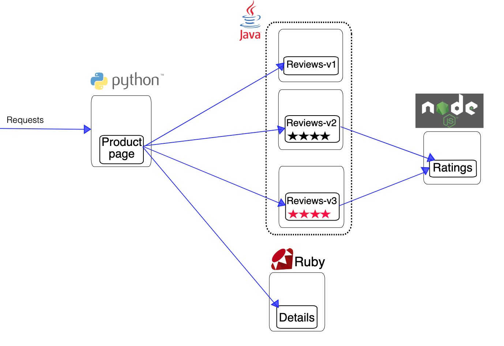

### Installation

Avant de déployer cette application, nous allons nous assurer que le namespace qui sera utilisé (*default*) injecte automatiquement un proxy Envoy dans chaque Pod qui sera créé. Pour cela, il faut ajouter le label *istio-injection=enabled*  sur le namespace:

```
$ kubectl label namespace default istio-injection=enabled
namespace/default labeled
```

Note: si ce label n'est pas ajouté sur le namespace, il faudra injecter les proxy manuellement

Déployez ensuite l'application *Bookinfo* avec la commande suivante:

```
$ kubectl apply -f samples/bookinfo/platform/kube/bookinfo.yaml
service/details created
serviceaccount/bookinfo-details created
deployment.apps/details-v1 created
service/ratings created
serviceaccount/bookinfo-ratings created
deployment.apps/ratings-v1 created
service/reviews created
serviceaccount/bookinfo-reviews created
deployment.apps/reviews-v1 created
deployment.apps/reviews-v2 created
deployment.apps/reviews-v3 created
service/productpage created
serviceaccount/bookinfo-productpage created
deployment.apps/productpage-v1 created
```

Dans chaque Pod de l'application, un proxy Envoy a été injecté, chaque proxy intercepte les flux réseau entrant et sortant du Pod dans lequel il se trouve. Les microservices de l'application communiquent via leur proxy respectif. L'ensemble de ces proxies constitue le *Data Plane*.

Le schéma suivant illustre les différents composants de l'application lorsque celle-ci est déployée dans un context utilisant Istio.

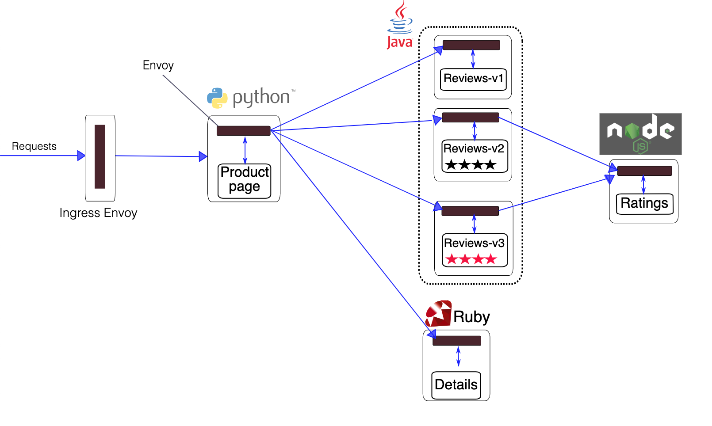

### Vérification

Listez les différentes ressources créées dans le namespace *default*.

```
$ kubectl get deploy,po,svc
NAME                             READY   UP-TO-DATE   AVAILABLE   AGE
deployment.apps/details-v1       1/1     1            1           3m7s
deployment.apps/productpage-v1   1/1     1            1           3m5s
deployment.apps/ratings-v1       1/1     1            1           3m6s
deployment.apps/reviews-v1       1/1     1            1           3m6s
deployment.apps/reviews-v2       1/1     1            1           3m6s
deployment.apps/reviews-v3       1/1     1            1           3m5s

NAME                                  READY   STATUS    RESTARTS   AGE
pod/details-v1-78d78fbddf-88kxk       2/2     Running   0          3m7s
pod/productpage-v1-596598f447-2swnw   2/2     Running   0          3m5s
pod/ratings-v1-6c9dbf6b45-8pbbh       2/2     Running   0          3m6s
pod/reviews-v1-7bb8ffd9b6-s4rxk       2/2     Running   0          3m6s
pod/reviews-v2-d7d75fff8-7x58f        2/2     Running   0          3m6s
pod/reviews-v3-68964bc4c8-xfg4j       2/2     Running   0          3m5s

NAME                  TYPE        CLUSTER-IP      EXTERNAL-IP   PORT(S)    AGE
service/details       ClusterIP   10.245.80.63    <none>        9080/TCP   3m7s
service/kubernetes    ClusterIP   10.245.0.1      <none>        443/TCP    25m
service/productpage   ClusterIP   10.245.127.55   <none>        9080/TCP   3m5s
service/ratings       ClusterIP   10.245.46.88    <none>        9080/TCP   3m7s
service/reviews       ClusterIP   10.245.184.17   <none>        9080/TCP   3m6s
```

On peut voir qu'un Pod a été déployé pour chacun des services *details*, *productpage* et *ratings*. 3 Pods ont été déployés pour le service *reviews*, chacun correspondant à une version du service.

On vérifie ensuite, depuis l'un des Pods (celui de ratings), que l'on peut accéder au service *productpage*.

```
$ kubectl exec -it $(kubectl get pod -l app=ratings -o jsonpath='{.items[0].metadata.name}') -c ratings -- curl productpage:9080/productpage | grep -o "<title>.*</title>"
<title>Simple Bookstore App</title>
```

### Ingress gateway

Pour pouvoir entrer dans le *mesh*, il faut déployer un *Gateway* ainsi qu'un *VirtualService*. Utilisez pour cela la commande suivante:

```
$ kubectl apply -f samples/bookinfo/networking/bookinfo-gateway.yaml
gateway.networking.istio.io/bookinfo-gateway created
virtualservice.networking.istio.io/bookinfo created
```

Vérifiez que ces 2 ressources ont été correctement créées:

```
$ kubectl get gw,vs
NAME                                           AGE
gateway.networking.istio.io/bookinfo-gateway   19s

NAME                                          GATEWAYS             HOSTS   AGE
virtualservice.networking.istio.io/bookinfo   [bookinfo-gateway]   [*]     19s
```

### Accès depuis l'extérieur

Lors du deployment des ressources nécessaires au fonctionnement de Istio, le service *istio-ingressgateway* de type LoadBalancer a été crée:

```
$ kubectl -n istio-system get svc istio-ingressgateway
NAME                   TYPE           CLUSTER-IP      EXTERNAL-IP      PORT(S)                                                                                                                      AGE
istio-ingressgateway   LoadBalancer   10.245.164.55   159.89.251.210   15020:30445/TCP,80:32449/TCP,443:31092/TCP,15029:30326/TCP,15030:30437/TCP,15031:30568/TCP,15032:30120/TCP,15443:31270/TCP   18m
```

Ce service, couplé au Gateway et VirtualService créés précedemment permet de rentrer dans le mesh depuis l'extérieur. Pour cela de récupérez l'adresse IP exposée ainsi que le port d'écoute:

```
$ export INGRESS_HOST=$(kubectl -n istio-system get service istio-ingressgateway -o jsonpath='{.status.loadBalancer.ingress[0].ip}')

$ export INGRESS_PORT=$(kubectl -n istio-system get service istio-ingressgateway -o jsonpath='{.spec.ports[?(@.name=="http2")].port}')
```

L'URL pour accéder à l'application est donc la suivante:

```
$ export GATEWAY_URL=$INGRESS_HOST:$INGRESS_PORT
```

Note: si le cluster Kubernetes est déployé sur un environnement qui ne supporte pas les services de type *LoadBalancer*, il faudra utiliser le port provenant du *NodePort*

### Accès à l'interface

Utilisez le endpoint */productpage* sur l'URL *GATEWAY_URL* pour accéder à l'application depuis un navigateur.

Comme nous n'avons pas mis en place de règles de routage, le service *ratings* forward les requêtes les Pods sous-jacents en round-robin. Observez ce comportement en rechargeant plusieurs fois la page.

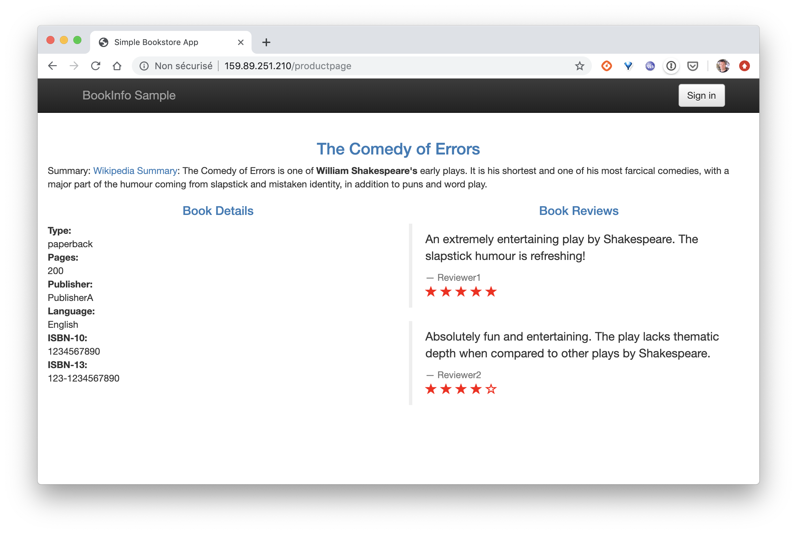

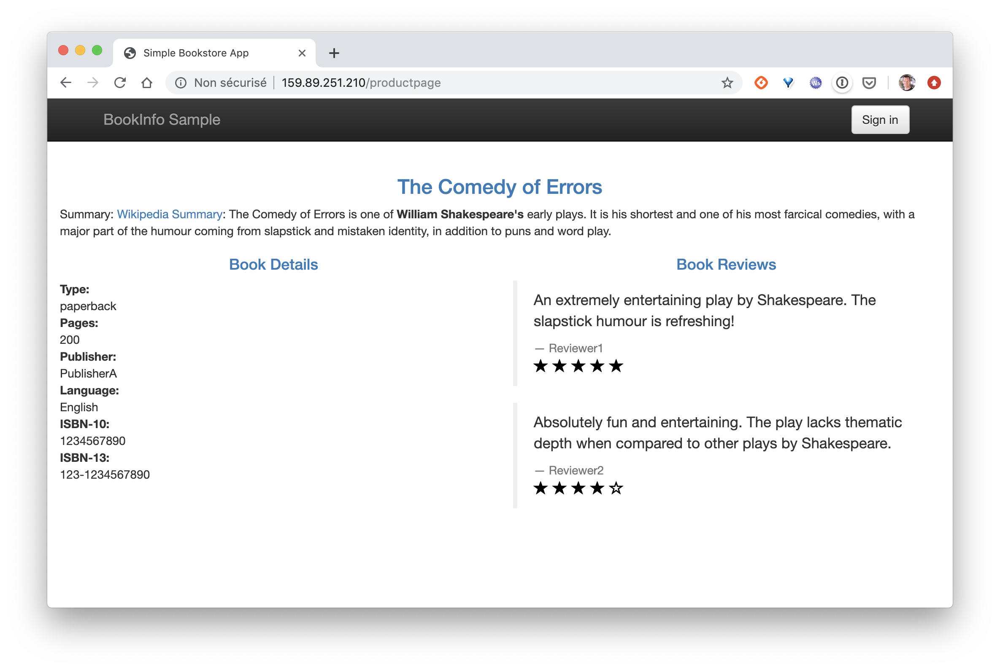

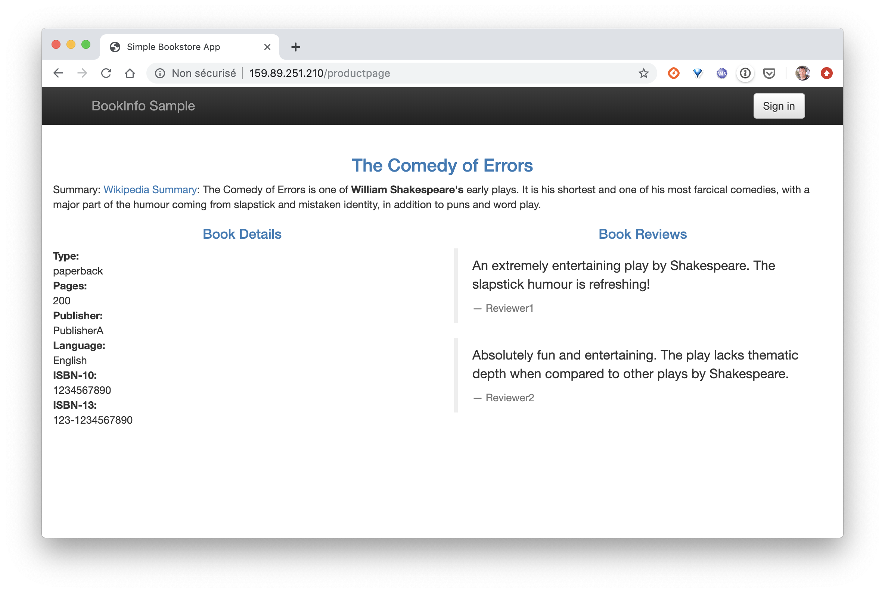

## Gestion du trafic

### Règles de destination

Afin d'aiguiller les requêtes vers les différentes versions des microservices de l'application, mettez en place des ressources de type *DestinationRules* en utilisant la commande suivante:

```
$ kubectl apply -f samples/bookinfo/networking/destination-rule-all.yaml
destinationrule.networking.istio.io/productpage created
destinationrule.networking.istio.io/reviews created
destinationrule.networking.istio.io/ratings created
destinationrule.networking.istio.io/details created
```

Si vous regardez le contenu du fichier de spécifications utilisé (*samples/bookinfo/networking/destination-rule-all.yaml*) vous verrez que pour chaque service est défini une *DestinationRule* et dans celle-ci une liste de *subsets*. Chacun des *subset* correspond à une version du microservice. Par exemple, la spécification de la ressource *DestinationRule* pour le microservice *review* est la suivante, on y retrouve 3 subsets qui seront utilisés dans la suite de l'exercice.

```
apiVersion: networking.istio.io/v1alpha3
kind: DestinationRule
metadata:
  name: reviews
spec:
  host: reviews
  subsets:
  - name: v1
    labels:
      version: v1
  - name: v2
    labels:
      version: v2
  - name: v3
    labels:
      version: v3
```

La liste des *DestinationRules*, existantes peut être obtenues en utilisant le raccourci *dr* comme le montre la commande suivante:

```
$ kubectl get dr
NAME          HOST          AGE
details       details       8s
productpage   productpage   9s
ratings       ratings       9s
reviews       reviews       9s
```

### Routing

Nous allons à présent faire en sorte de n'utiliser que la version v1 de chaque service. Créez pour cela les ressources de *VirtualService* correspondantes avec la commande suivante:

```
$ kubectl apply -f samples/bookinfo/networking/virtual-service-all-v1.yaml
virtualservice.networking.istio.io/productpage created
virtualservice.networking.istio.io/reviews created
virtualservice.networking.istio.io/ratings created
virtualservice.networking.istio.io/details created
```

Si vous regardez le contenu du fichier de spécification (*samples/bookinfo/networking/virtual-service-all-v1.yaml*), vous remarquerez que pour chaque microservice un seul des subsets définis dans les *DestinationRules* est utilisé. Par exemple, toutes les requêtes arrivant sur le service *reviews* seront traitées par la version v1:

```
apiVersion: networking.istio.io/v1alpha3
kind: VirtualService
metadata:
  name: reviews
spec:
  hosts:
  - reviews
  http:
  - route:
    - destination:
        host: reviews
        subset: v1
```

Rafraichissez plusieurs fois votre natigateur, vous ne verez plus les étoiles utilisées pour noter chaque livre car dans la version v1 du service *reviews*, le service *ratings* n'est pas appelé.


### User login

Nous allons à présent faire en sorte qu'un utilisateur loggué puisse avoir accès à la version v2 du service *reviews* (celle présentant la note avec des étoiles noires), les utilisateurs non loggués continueront à voir la version v1 du service.

Créez le VirtualService correspondant avec la commande suivante:

```
$ kubectl apply -f samples/bookinfo/networking/virtual-service-reviews-test-v2.yaml
virtualservice.networking.istio.io/reviews configured
```

Note: cette commande modifie seulement le virtualservice *reviews*

Si nous regardons de plus près le contenu du fichier de spécification (*samples/bookinfo/networking/virtual-service-reviews-test-v2.yaml*), nous pouvons voir que le routage de la requête vers la version 2 du service *reviews* est faite grace à la présence ou non du header *end-user* dans la requête envoyées par le service *productpage*. Si ce header est égal à *jason* la version v2 du service *reviews* sera utilisé, la version v1 sera utilisée dans les autres cas.

```
apiVersion: networking.istio.io/v1alpha3
kind: VirtualService
metadata:
  name: reviews
spec:
  hosts:
    - reviews
  http:
  - match:
    - headers:
        end-user:
          exact: jason
    route:
    - destination:
        host: reviews
        subset: v2
  - route:
    - destination:
        host: reviews
        subset: v1
```

Cliquez sur le bouton *Signin* en précisant le user *jason* (le mot de passe n'a pas d'importance)

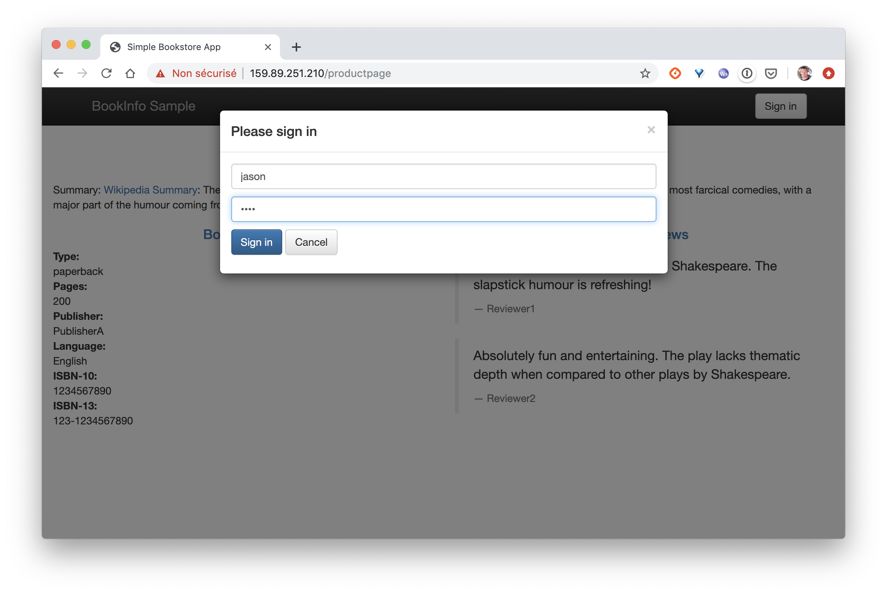

Vous devriez alors voir la version du service *reviews* présentant la vue avec les étoiles noires.

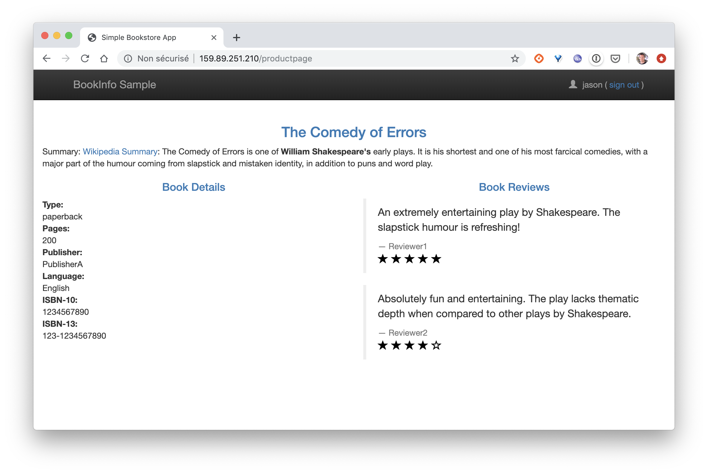

Faites ensuite un *Signout* et vérifiez que vous avez  accès à la version du service *reviews* qui n'appelle pas le service *ratings*.


Avant de passer à la suite, supprimez les *VirtualService* avec la commande suivante

```
$ kubectl delete -f samples/bookinfo/networking/virtual-service-all-v1.yaml
virtualservice.networking.istio.io "productpage" deleted
virtualservice.networking.istio.io "reviews" deleted
virtualservice.networking.istio.io "ratings" deleted
virtualservice.networking.istio.io "details" deleted
```

### Ajout d'un délai

Nous allons a présent faire en sorte d'ajouter un délai sur chaque requête qui arrive depuis l'utilisateur *jason*.

Avec la commande suivante, créez la ressource de type *VirtualService* qui définit la configuration du flow.

```
$ kubectl apply -f samples/bookinfo/networking/virtual-service-ratings-test-delay.yaml
virtualservice.networking.istio.io/ratings created
```

Si nous regardons ce que contient la spécification *samples/bookinfo/networking/virtual-service-ratings-test-delay.yaml*, nous pouvons voir que chaque requête provenant de l'utilisateur *jason* aura un delai supplémentaire de 7 secondes avant d'appeler la version v1 du service *ratings*. Les autres requêtes (celles provenant d'un utilisateur non loggué ou d'un utilisateur loggué autre que *jason*), atteindront la version v1 du service *ratings* sans délai supplémentaire.


```
apiVersion: networking.istio.io/v1alpha3
kind: VirtualService
metadata:
  name: ratings
spec:
  hosts:
  - ratings
  http:
  - match:
    - headers:
        end-user:
          exact: jason
    fault:
      delay:
        percentage:
          value: 100.0
        fixedDelay: 7s
    route:
    - destination:
        host: ratings
        subset: v1
  - route:
    - destination:
        host: ratings
        subset: v1
```

Logguez vous avec l'utilisateur *jason* et observez le comportement de l'application. Au lieu d'obtenir la page après le délai supplémentaire qui a été introduit, vous devriez obtenir une erreur dans la recupération des reviews.

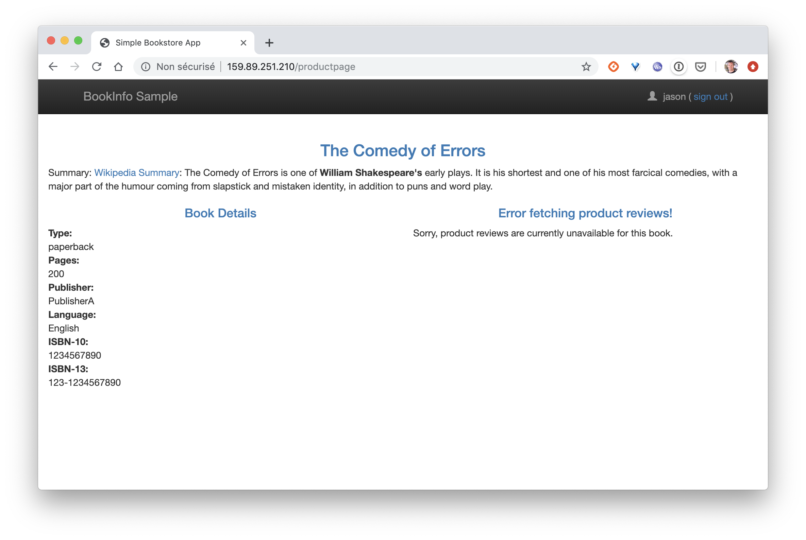

Ceci est du à une bug volontaire de l'application, le service *productpage* faisant un timeout si le service *reviews* ne répond pas après 6 seconds. Ce bug est corrigé dans la version v3 du service reviews comme on le verra dans la suite.

## Ajout d'une erreur HTTP

Pour tester la résilience de l'application, nous allons maintenant faire en sorte que le service *ratings* retourne une erreur HTTP 500 à chaque requête de l'utilisateur *jason*.

Avec la commande suivante, creez la ressource *VirtualService* correspondante.

```
$ kubectl apply -f samples/bookinfo/networking/virtual-service-ratings-test-abort.yaml
virtualservice.networking.istio.io/ratings configured
```

Si nous observons le contenu de cette spécification (*samples/bookinfo/networking/virtual-service-ratings-test-abort.yaml*), nous pouvons effectivement voir que si une requete arrive sur le service *ratings*,  et que celle-ci contient le header *end-user* dont la valeur est *jason*, alors une *fault* est ajoutée. Celle-ci à la forme d'un code de retour HTTP 500.

```
apiVersion: networking.istio.io/v1alpha3
kind: VirtualService
metadata:
  name: ratings
spec:
  hosts:
  - ratings
  http:
  - match:
    - headers:
        end-user:
          exact: jason
    fault:
      abort:
        percentage:
          value: 100.0
        httpStatus: 500
    route:
    - destination:
        host: ratings
        subset: v1
  - route:
    - destination:
        host: ratings
        subset: v1
```

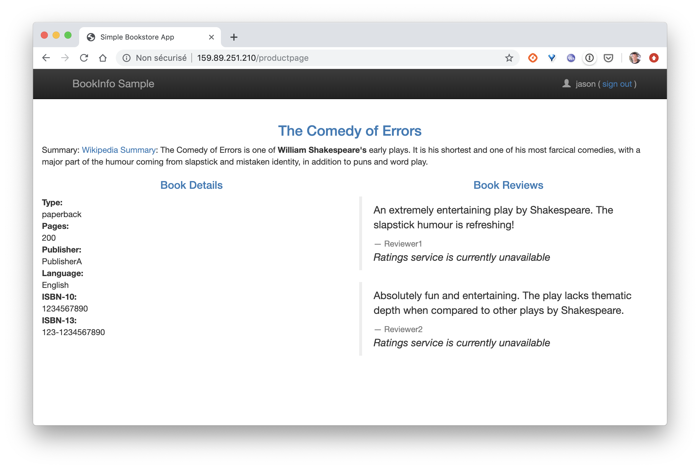

### Traffic shifting (Canary)

Dans cette partie, nous allons voir comment router une partie seulement du trafic vers une version différente d'un microservice.

En utilisant la commande suivante, définissez les *VirtualServices* de façon à router l'ensemble des requêtes sur les versions v1 de chaque microservices.

```
$ kubectl apply -f samples/bookinfo/networking/virtual-service-all-v1.yaml
virtualservice.networking.istio.io/productpage created
virtualservice.networking.istio.io/reviews created
virtualservice.networking.istio.io/ratings configured
virtualservice.networking.istio.io/details created
```

Avec la commande suivante, modifiez le service *reviews* de façon à ce que 50% des requêtes soient envoyées sur la version v1 et 50% sur la version v3.

```
$ kubectl apply -f samples/bookinfo/networking/virtual-service-reviews-50-v3.yaml
virtualservice.networking.istio.io/reviews configured
```

Si vous regardez le contenu de cette spécification, vous pouvez voir l'utilisation de la clé *weight*, un pourcentage qui permet de définir les proportions du trafic à rediriger sur les différentes versions.

```
apiVersion: networking.istio.io/v1alpha3
kind: VirtualService
metadata:
  name: reviews
spec:
  hosts:
    - reviews
  http:
  - route:
    - destination:
        host: reviews
        subset: v1
      weight: 50
    - destination:
        host: reviews
        subset: v3
      weight: 50
```

Si vous reloadez plusieurs fois votre navigateur, vous observerez une alternance de reviews sans étoile et de reviews avec des étoiles rouges.


Nous allons à présent envoyer tous le traffic vers la version v3 du service *reviews*. Utilisez pour cela la commande suivante.

```
$ kubectl apply -f samples/bookinfo/networking/virtual-service-reviews-v3.yaml
virtualservice.networking.istio.io/reviews configured
```

La spécification utilisée ici définit une seule route.

```
apiVersion: networking.istio.io/v1alpha3
kind: VirtualService
metadata:
  name: reviews
spec:
  hosts:
    - reviews
  http:
  - route:
    - destination:
        host: reviews
        subset: v3
```

Rachaichissez plusieurs fois votre navigateur et observerez que les reviews affichent systématiquement des étoiles rouges.

Avant de passer à la suite, redéfinissez les *VirtualServices* de façon à n'utiliser que les versions v1 de chaque microservice.

```
$ kubectl apply -f samples/bookinfo/networking/virtual-service-all-v1.yaml
virtualservice.networking.istio.io/productpage unchanged
virtualservice.networking.istio.io/reviews configured
virtualservice.networking.istio.io/ratings unchanged
virtualservice.networking.istio.io/details unchanged
```

## Télémétrie

Dans cette partie, nous allons visualiser des informations de télémétrie générées.

### Metrics

Vérifiez tout d'abord que le service *Prometheus* a été correctement créé.

```
$ kubectl -n istio-system get svc prometheus
NAME         TYPE        CLUSTER-IP      EXTERNAL-IP   PORT(S)    AGE
prometheus   ClusterIP   10.245.160.66   <none>        9090/TCP   43m
```

Lancez la commande suivante, celle-ci permet à Istio de générer et collecter des metrics.

```
$ kubectl apply -f samples/bookinfo/telemetry/metrics.yaml
instance.config.istio.io/doublerequestcount created
handler.config.istio.io/doublehandler created
rule.config.istio.io/doubleprom created
```

La spécification *samples/bookinfo/telemetry/metrics.yaml* définit plusieurs ressources:
- une *instance* nommée *doublerequestcount* configure *Mixer* afin de générer une nouvelle metric pour chaque requête
- un *handler* nommé *doublehandler* définit comment convertir les metrics généréés au format Prometheus
- *rule* spécifie que les metrics générées par l'instance *doublerequestcount* doivent être traitées par le handler *doublehandler*

Reloadez plusieurs fois l'application *ratings* depuis votre navigateur, cela va générer des métrics. Afin de visualiser celles-ci, utilisez un *port-forward* pour établir une connection entre votre machine locale et le service *prometheus*.

```
$ kubectl -n istio-system port-forward $(kubectl -n istio-system get pod -l app=prometheus -o jsonpath='{.items[0].metadata.name}') 9090:9090
```

En lançant un navigateur sur *http://localhost:9090*, vous obtiendrez l'interface web de Prometheus et pourrez visualiser les métriques collectées. L'exemple ci-dessous montre la métric *istio_double_request_count*:

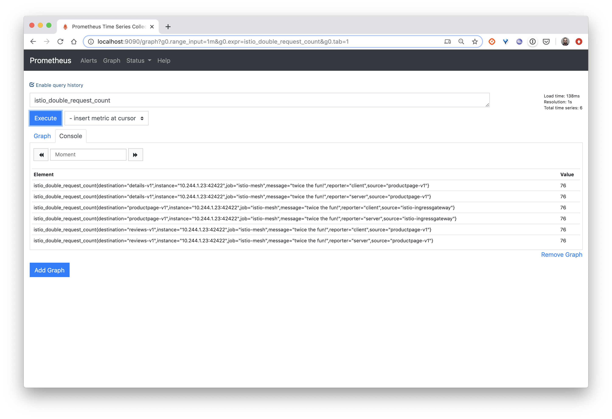

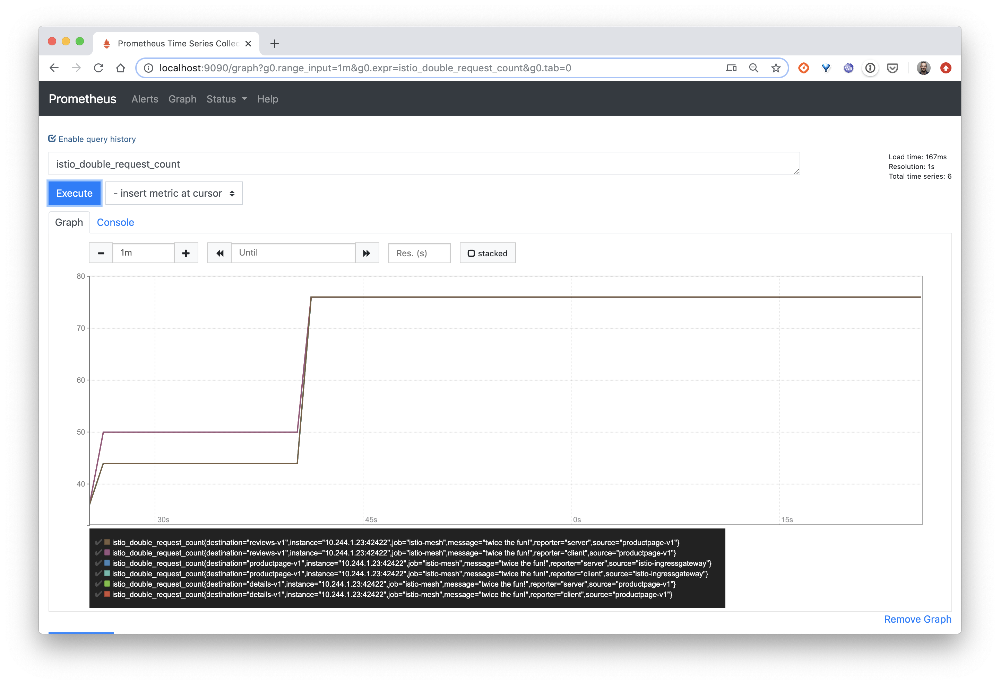

### Logs

Lancez la commande suivante, celle-ci permet à Istio de générer et collecter des logs.

```
$ kubectl apply -f samples/bookinfo/telemetry/log-entry.yaml
instance.config.istio.io/newlog created
handler.config.istio.io/newloghandler created
rule.config.istio.io/newlogstdio created
```

Comme pour la partie metrics, la spécification *samples/bookinfo/telemetry/log-entry.yaml* définit différentes ressources:

- une ressource de type *instance* nommée *newlog* qui configure *Mixer* afin de générer des entrées de log pour chaque requête. La clé *variable* définit les différents champs présent dans chaque log
- une ressource de type *handler* nommée *newloghandler* définit comment les logs reçus doivent être traités
- une ressource de type *rule* spécifie que les logs générés par l'instance *newlog* doivent être traités par le handler *newloghandler*

Reloadez plusieurs fois l'application depuis votre navigateur afin de générer des logs puis visualisez ceux-ci avec la commande suivante:

```
$ kubectl logs -n istio-system -l istio-mixer-type=telemetry -c mixer
```

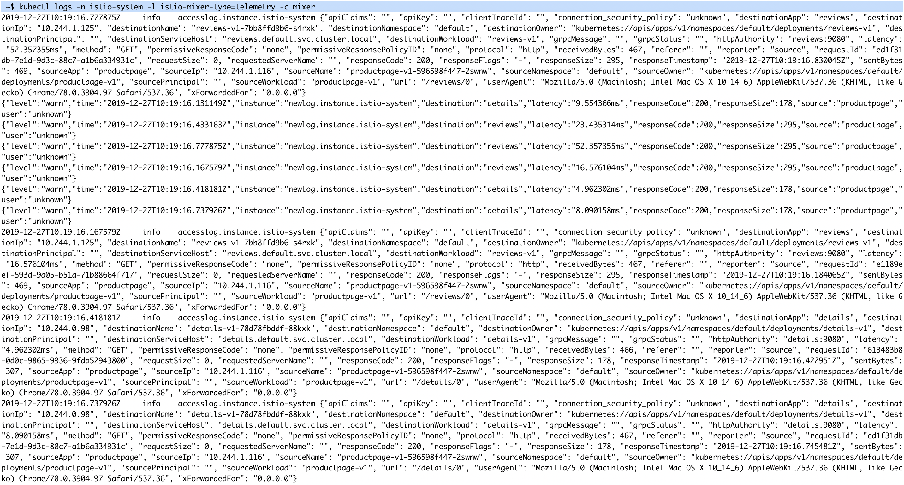

### Tracing

Dans cette partie, nous allons voir comment Istio permet de suivre une requête lors de son parcours entre les différents services de l'application.

Note: chaque service de l'application positionne certains headers HTTP afin de pouvoir identifer une requête tout au long de son cycle de vie

Plusieurs backends sont disponibles pour la gestion du tracing (*Jaeger*, *Zipkin*, *LightStep*), nous utiliserons ici *Jaeger*. Lancez l'interface de *Jaeger* avec la commande suivante:

```
$ istioctl dashboard jaeger
```

Reloadez plusieurs fois l'application *bookinfo* depuis votre navigateur afin de générer des traces, puis depuis l'interface de *Jaeger* visualisez les différentes requètes reçues sur la page *productpage*:

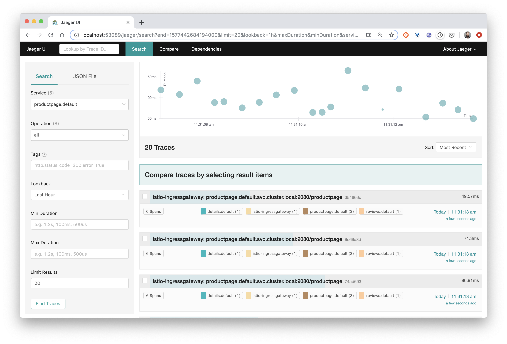

Puis cliquez sur l'une des traces afin d'obtenir les détails du cheminement au travers des différents services.

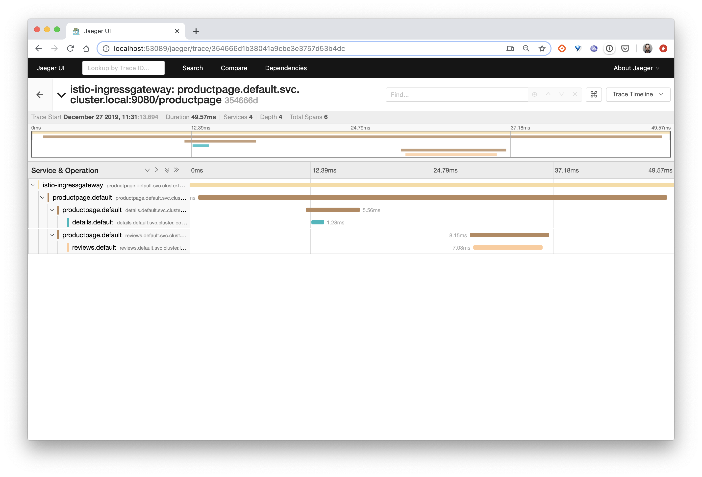

Vous pouvez ensuite effectuer un CTRL-C sur le terminal qui a lancé l'interface *Jaeger*.

## Visualisation du mesh

Nous allons à présent visualiser les élements du mesh à l'aide de l'interface *Kiali*. Etant donné que nous avons utilisé le profil *demo*, ce composant est déjà déployé. Nous pouvons le vérifer avec la commande suivante:

```
$ kubectl -n istio-system get svc kiali
NAME    TYPE        CLUSTER-IP       EXTERNAL-IP   PORT(S)     AGE
kiali   ClusterIP   10.245.100.113   <none>        20001/TCP   4h8m
```

Lancez l'interface web à l'aide de la commande suivante:

```
$ istioctl dashboard kiali
```

Note: les credentials par défaut sont *admin* / *admin*

Cette interface permet d'observer les différents services déployés mais également de définir différentes rêgles, par exemple pour la gestion du traffic.

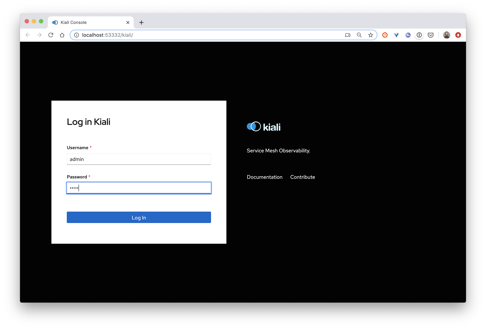

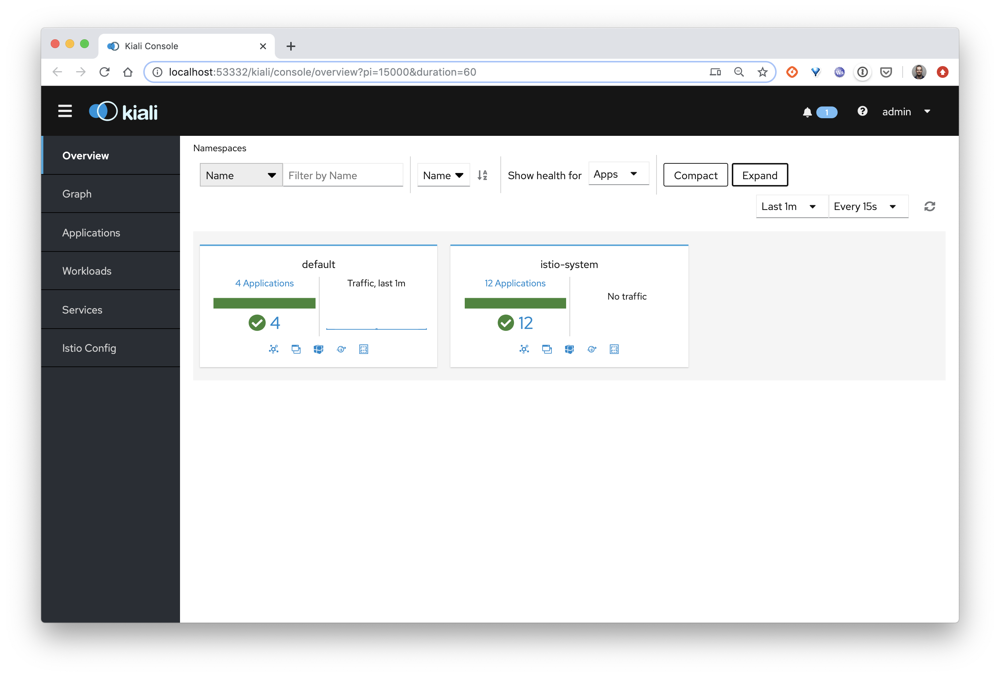

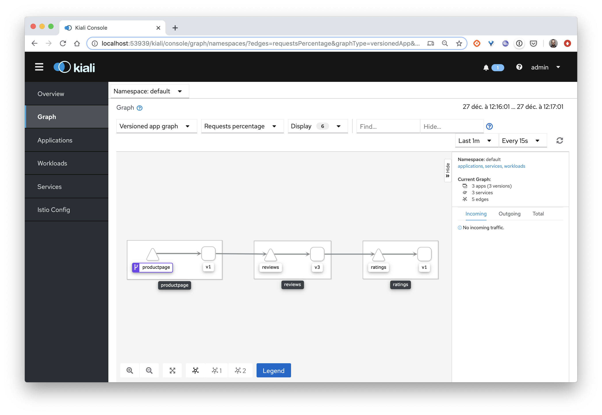

Nous n'irons pas dans le détails de l'utilisation de cette interface ici mais n'hésitez pas à l'explorer afin par exemple de modifier les poids affectés aux différentes versions du service *reviews*.

## Cleanup

Utilisez la commande suivante afin de supprimer l'ensemble des élements installés avec le profil *demo*:

```
$ istioctl manifest generate --set profile=demo | kubectl delete -f -
```
