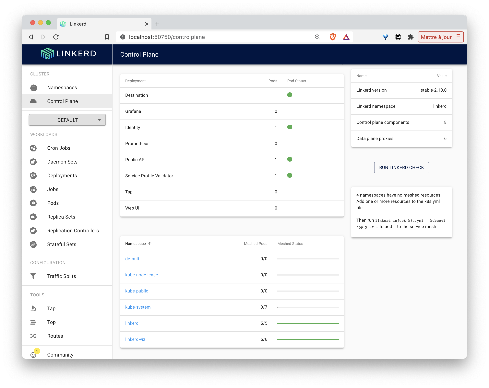
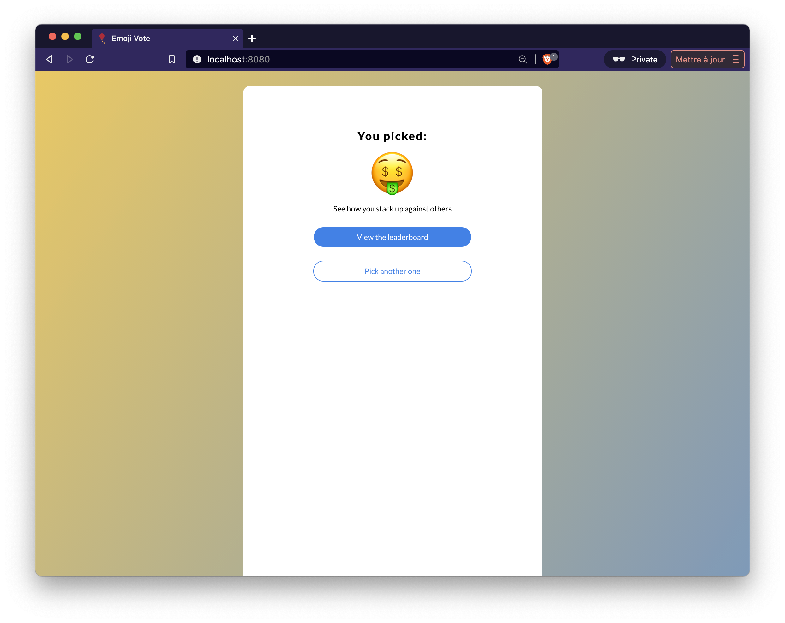
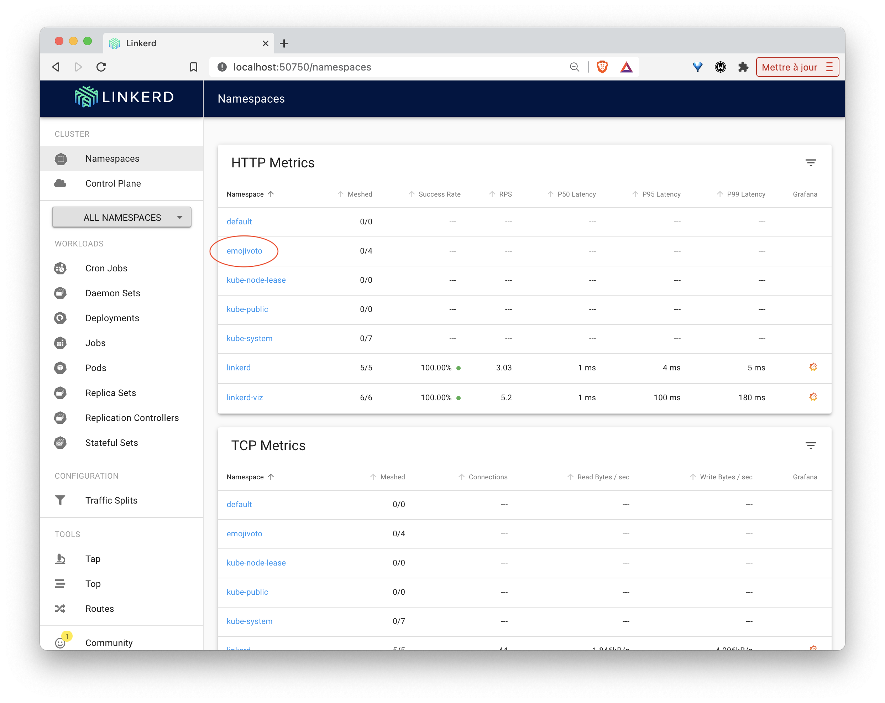
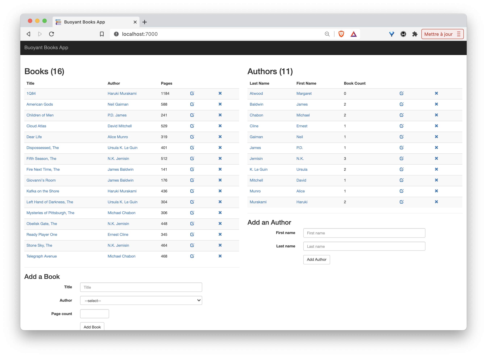
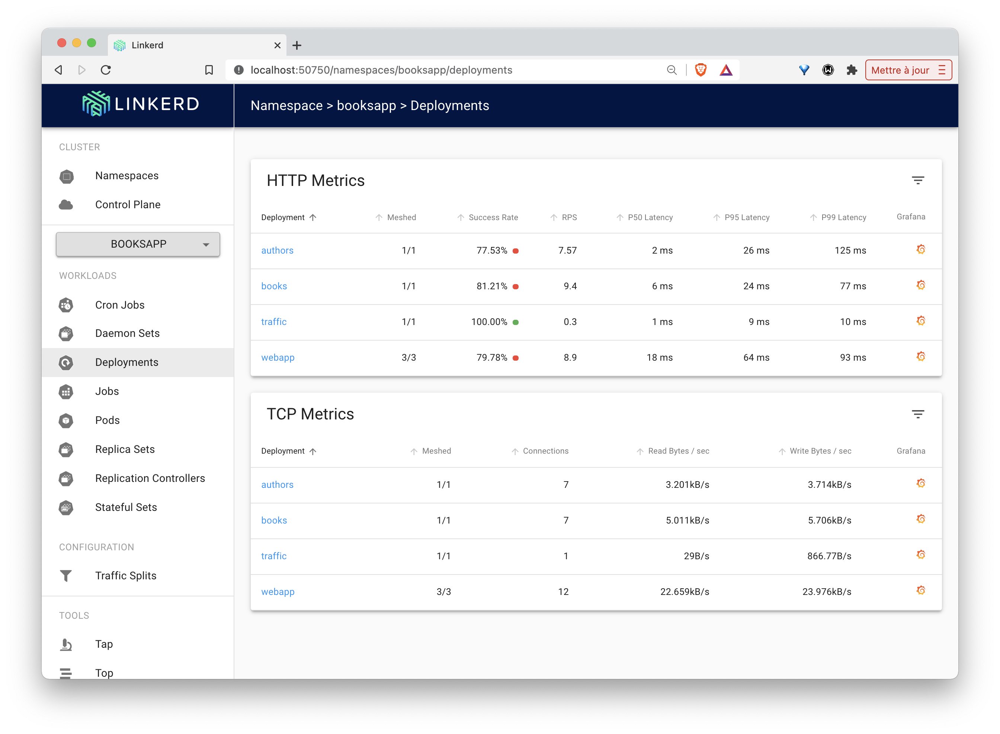

## Pré-requis

Pour faire cet exercice, il vous suffit d'avoir accès à un cluster Kubernetes.

Si vous souhaitez créer un cluster local rapidement, vous pouvez installer Multipass ([https://multipass.run](https://multipass.run)) et lancer les commandes suivantes afin de déployer un cluster k3s (cela ne prendra que quelques minutes):

```
$ curl -sfL https://static.techwhale.io/mpk3s.sh -o mpk3s.sh
$ ./mpk3s.sh
```

Utilisez ensuite le fichier *mpk3s.cfg* créé lors de l'installation pour configurer *kubectl*

```
$ export KUBECONFIG=$PWD/mpk3s.cfg

$ kubectl get nodes
NAME    STATUS   ROLES    AGE   VERSION
k3s-1   Ready    master   3m3s    v1.17.0+k3s.1
k3s-2   Ready    <none>   2m26s   v1.17.0+k3s.1
k3s-3   Ready    <none>   107s    v1.17.0+k3s.1
```

## Installation de Linkerd

Lancez les commandes suivantes afin de récupérer les binaires de *Linkerd* et de les mettre à disposition dans votre PATH:

```
$ curl -sL https://run.linkerd.io/install | sh
$ export PATH=$PATH:$HOME/.linkerd2/bin
```

La commande suivante permet de s'assurer que *Linkerd* peut être installé sur le cluster:

```
$ linkerd check --pre
```

Vous devriez obtenir le résultat ci-dessous qui montre que toutes les vérifications sont ok:

```
kubernetes-api
--------------
√ can initialize the client
√ can query the Kubernetes API

kubernetes-version
------------------
√ is running the minimum Kubernetes API version
√ is running the minimum kubectl version

pre-kubernetes-setup
--------------------
√ control plane namespace does not already exist
√ can create Namespaces
√ can create ClusterRoles
√ can create ClusterRoleBindings
√ can create CustomResourceDefinitions
√ can create PodSecurityPolicies
√ can create ServiceAccounts
√ can create Services
√ can create Deployments
√ can create CronJobs
√ can create ConfigMaps
√ no clock skew detected

pre-kubernetes-capability
-------------------------
√ has NET_ADMIN capability
√ has NET_RAW capability

pre-linkerd-global-resources
----------------------------
√ no ClusterRoles exist
√ no ClusterRoleBindings exist
√ no CustomResourceDefinitions exist
√ no MutatingWebhookConfigurations exist
√ no ValidatingWebhookConfigurations exist
√ no PodSecurityPolicies exist

linkerd-version
---------------
√ can determine the latest version
√ cli is up-to-date

Status check results are √
```

Note: si vous avez une erreur *clock skew detected*, assurez-vous d'installer le package *ntp* sur chacun des nodes

Il suffit maintenant d'installer les différentes ressources de *Linkerd* dans le cluster:

```
$ linkerd install | kubectl apply -f -
```

De nombreuses ressources sont créées comme l'illustre le résultat suivant:

```
namespace/linkerd created
clusterrole.rbac.authorization.k8s.io/linkerd-linkerd-identity created
clusterrolebinding.rbac.authorization.k8s.io/linkerd-linkerd-identity created
serviceaccount/linkerd-identity created
clusterrole.rbac.authorization.k8s.io/linkerd-linkerd-controller created
clusterrolebinding.rbac.authorization.k8s.io/linkerd-linkerd-controller created
serviceaccount/linkerd-controller created
clusterrole.rbac.authorization.k8s.io/linkerd-linkerd-destination created
clusterrolebinding.rbac.authorization.k8s.io/linkerd-linkerd-destination created
serviceaccount/linkerd-destination created
role.rbac.authorization.k8s.io/linkerd-heartbeat created
rolebinding.rbac.authorization.k8s.io/linkerd-heartbeat created
serviceaccount/linkerd-heartbeat created
clusterrolebinding.rbac.authorization.k8s.io/linkerd-linkerd-web-admin created
serviceaccount/linkerd-web created
customresourcedefinition.apiextensions.k8s.io/serviceprofiles.linkerd.io created
customresourcedefinition.apiextensions.k8s.io/trafficsplits.split.smi-spec.io created
clusterrole.rbac.authorization.k8s.io/linkerd-linkerd-prometheus created
clusterrolebinding.rbac.authorization.k8s.io/linkerd-linkerd-prometheus created
serviceaccount/linkerd-prometheus created
serviceaccount/linkerd-grafana created
clusterrole.rbac.authorization.k8s.io/linkerd-linkerd-proxy-injector created
clusterrolebinding.rbac.authorization.k8s.io/linkerd-linkerd-proxy-injector created
serviceaccount/linkerd-proxy-injector created
secret/linkerd-proxy-injector-tls created
mutatingwebhookconfiguration.admissionregistration.k8s.io/linkerd-proxy-injector-webhook-config created
clusterrole.rbac.authorization.k8s.io/linkerd-linkerd-sp-validator created
clusterrolebinding.rbac.authorization.k8s.io/linkerd-linkerd-sp-validator created
serviceaccount/linkerd-sp-validator created
secret/linkerd-sp-validator-tls created
validatingwebhookconfiguration.admissionregistration.k8s.io/linkerd-sp-validator-webhook-config created
clusterrole.rbac.authorization.k8s.io/linkerd-linkerd-tap created
clusterrole.rbac.authorization.k8s.io/linkerd-linkerd-tap-admin created
clusterrolebinding.rbac.authorization.k8s.io/linkerd-linkerd-tap created
clusterrolebinding.rbac.authorization.k8s.io/linkerd-linkerd-tap-auth-delegator created
serviceaccount/linkerd-tap created
rolebinding.rbac.authorization.k8s.io/linkerd-linkerd-tap-auth-reader created
secret/linkerd-tap-tls created
apiservice.apiregistration.k8s.io/v1alpha1.tap.linkerd.io created
podsecuritypolicy.policy/linkerd-linkerd-control-plane created
role.rbac.authorization.k8s.io/linkerd-psp created
rolebinding.rbac.authorization.k8s.io/linkerd-psp created
configmap/linkerd-config created
secret/linkerd-identity-issuer created
service/linkerd-identity created
deployment.apps/linkerd-identity created
service/linkerd-controller-api created
service/linkerd-destination created
deployment.apps/linkerd-controller created
service/linkerd-dst created
deployment.apps/linkerd-destination created
cronjob.batch/linkerd-heartbeat created
service/linkerd-web created
deployment.apps/linkerd-web created
configmap/linkerd-prometheus-config created
service/linkerd-prometheus created
deployment.apps/linkerd-prometheus created
configmap/linkerd-grafana-config created
service/linkerd-grafana created
deployment.apps/linkerd-grafana created
deployment.apps/linkerd-proxy-injector created
service/linkerd-proxy-injector created
service/linkerd-sp-validator created
deployment.apps/linkerd-sp-validator created
service/linkerd-tap created
deployment.apps/linkerd-tap created
```

Il est ensuite nécessaire de s'assurer que l'ensemble des composants a été correctement créé:

```
$ linkerd check
```

Si tout s'est déroulé correctement, vous devriez obtenir tous les voyants au vert comme dans le résultat ci-dessous:

```
kubernetes-api
--------------
√ can initialize the client
√ can query the Kubernetes API

kubernetes-version
------------------
√ is running the minimum Kubernetes API version
√ is running the minimum kubectl version

linkerd-config
--------------
√ control plane Namespace exists
√ control plane ClusterRoles exist
√ control plane ClusterRoleBindings exist
√ control plane ServiceAccounts exist
√ control plane CustomResourceDefinitions exist
√ control plane MutatingWebhookConfigurations exist
√ control plane ValidatingWebhookConfigurations exist
√ control plane PodSecurityPolicies exist

linkerd-existence
-----------------
√ 'linkerd-config' config map exists
√ heartbeat ServiceAccount exist
√ control plane replica sets are ready
√ no unschedulable pods
√ controller pod is running
√ can initialize the client
√ can query the control plane API

linkerd-api
-----------
√ control plane pods are ready
√ control plane self-check
√ [kubernetes] control plane can talk to Kubernetes
√ [prometheus] control plane can talk to Prometheus
√ no invalid service profiles

linkerd-version
---------------
√ can determine the latest version
√ cli is up-to-date

control-plane-version
---------------------
√ control plane is up-to-date
√ control plane and cli versions match

Status check results are √
```

## Visualisation

*Linkerd* expose sa propre interface web, celle-ci peut être lancée avec la commande suivante:

```
$ linkerd dashboard &
```

Cette interface montre les différents éléments présent dans le cluster. Pour le moment, seuls les composants de *Linkerd* font parti du *Mesh*.




## Application emojivoto

Afin d'illustrer les fonctionnalités de base de *Linkerd*, vous allez installer l'application *emojivoto* (application microservices présentée dans la documentation officielle de *Linkerd*).

### Déploiement de l'application

Utilisez la commande suivante pour créer les différentes ressources de l'application:

```
$ curl -sL https://run.linkerd.io/emojivoto.yml | kubectl apply -f -
namespace/emojivoto created
serviceaccount/emoji created
serviceaccount/voting created
serviceaccount/web created
service/emoji-svc created
service/voting-svc created
service/web-svc created
deployment.apps/emoji created
deployment.apps/vote-bot created
deployment.apps/voting created
deployment.apps/web created
```

Note: un générateur de traffic est également déployé afin d'envoyer régulièrement des requêtes à l'application

### Accès à l'application

Afin d'avoir accès à l'application depuis votre machine locale, utilisez la sous-commande *port-forward* afin d'exposer le service nommé *web-svc*:

```
$ kubectl -n emojivoto port-forward svc/web-svc 8080:80
```

L'application *emojivoto* est alors disponible à l'adresse [http://localhost:8080](http://localhost:8080). Il est donc possible de voter pour son Emoji favori :)




Note: le vote sur certains emojis (par exemple le doughnut) entrenera une erreur, celles-ci ont été introduites volontairement dans l'application

Remarquez alors que le nouveau namespace *emojivoto* est maintenant disponible depuis l'interface web de Linkerd. L'application n'étant pas encore gérée par *Linkerd*, aucun de ces services ne sont encore dans le mesh (colonne *Meshed* de l'interface).



### Gestion de l'application avec Linkerd

Afin d'ajouter les fonctionnalités de *Linkerd* à l'application *emojivoto*, nous allons modifier chaque Pod de l'application de façon à ajouter un nouveau container faisant office de proxy à l'intérieur de chacun d'entre eux. Cette opération se fait facilement au moyen de la commande ci-dessous qui va modifier la spécification de l'ensemble des déployments du namespace *emojivoto*:

```
$ kubectl get -n emojivoto deploy -o yaml | linkerd inject - | kubectl apply -f -
deployment "emoji" injected
deployment "vote-bot" injected
deployment "voting" injected
deployment "web" injected

deployment.apps/emoji configured
deployment.apps/vote-bot configured
deployment.apps/voting configured
deployment.apps/web configured
```

Les proxy *Linkerd* sont maintenant installés dans chaque microservice de l'application. Nous pouvons le vérifier avec la commande suivante:

```
$ linkerd -n emojivoto check --proxy
kubernetes-api
--------------
√ can initialize the client
√ can query the Kubernetes API

kubernetes-version
------------------
√ is running the minimum Kubernetes API version
√ is running the minimum kubectl version

linkerd-config
--------------
√ control plane Namespace exists
√ control plane ClusterRoles exist
√ control plane ClusterRoleBindings exist
√ control plane ServiceAccounts exist
√ control plane CustomResourceDefinitions exist
√ control plane MutatingWebhookConfigurations exist
√ control plane ValidatingWebhookConfigurations exist
√ control plane PodSecurityPolicies exist

linkerd-existence
-----------------
√ 'linkerd-config' config map exists
√ heartbeat ServiceAccount exist
√ control plane replica sets are ready
√ no unschedulable pods
√ controller pod is running
√ can initialize the client
√ can query the control plane API

linkerd-api
-----------
√ control plane pods are ready
√ control plane self-check
√ [kubernetes] control plane can talk to Kubernetes
√ [prometheus] control plane can talk to Prometheus
√ no invalid service profiles

linkerd-version
---------------
√ can determine the latest version
√ cli is up-to-date

linkerd-data-plane
------------------
√ data plane namespace exists
√ data plane proxies are ready
√ data plane proxy metrics are present in Prometheus
√ data plane is up-to-date
√ data plane and cli versions match

Status check results are √
```

### Debugging à l'aide des metrics

Depuis l'interface web de Linkerd, il est alors possible de visualiser différentes metrics. Celles-ci pouvant être utilisées pour mettre en évidence un fonctionnement anormal de l'application et affiner son origine.

Note: ces metrics sont générées par l'ensemble des requêtes envoyées régulièrement par le générateur de traffic déployé avec l'application


Vous pourrez notamment identifier qu'un vote sur l'emoji Doughnut résulte constamment en une erreur. Ces informations sont importantes pour aider à identifier la source du problème.

### Cleanup

Il suffit de supprimer l'application puis le namespace associé avec la commande suivante:

```
$ curl -sL https://run.linkerd.io/emojivoto.yml \
  | kubectl -n emojivoto delete -f -
```

## Application Book

Afin d'illustrer les fonctionnalités plus avancées de *Linkerd*, vous allez installer l'application *bookapp* (application microservices présentée dans la documentation officielle de *Linkerd*).

Cette application comporte 3 microservices comme l'illustre le schéma suivant:


Note: un générateur de traffic est également déployé afin d'envoyer régulièrement des requêtes à l'application

### Déploiement de l'application

Utilisez la commande suivante pour créer le namespace *bookapp* et les différentes ressources de l'application dans ce namespace:

```
$ kubectl create ns booksapp

$ curl -sL https://run.linkerd.io/booksapp.yml | kubectl -n booksapp apply -f -
```

Vérifiez ensuite que toutes les ressources ont été correctement créées:

```
$ kubectl -n booksapp get all
```

### Accès à l'application

Afin d'avoir accès à l'application depuis votre machine locale, utilisez la sous-commande *port-forward* afin d'exposer le service nommé *webapp*:

Note: assurez-vous de lancer cette commande depuis un terminal ou vous aurez positionné la variable d'environnement KUBECONFIG au préalable

```
$ kubectl -n booksapp port-forward svc/webapp 7000
```

L'application est alors disponible à l'adresse [http://localhost:7000](http://localhost:7000).



Si vous essayez d'ajouter un livre, vous obtiendrez cependant régulièrement une erreur:


Nous verrons dans une des prochaines sections comment identifier celle-ci plus précisément.

Depuis l'interface web de Linkerd, on peut également voir que le namespace *bookapp* a été détecté, mais pour le moment aucun des services n'est présent dans le mesh (0/9)


### Gestion de l'application avec Linkerd

Afin d'ajouter les fonctionnalités de *Linkerd* à l'application nous allons modifier chaque Pod de l'application de façon à ajouter un nouveau container faisant office de proxy à l'intérieur de chacun d'entre eux. Comme nous l'avions fait pour l'application *emojivoto*. Utilisez pour cela la commande suivante:

```
$ kubectl get -n booksapp deploy -o yaml | linkerd inject - | kubectl apply -f -
deployment "authors" injected
deployment "books" injected
deployment "traffic" injected
deployment "webapp" injected

deployment.apps/authors configured
deployment.apps/books configured
deployment.apps/traffic configured
deployment.apps/webapp configured
```

Les proxy *Linkerd* sont maintenant installés dans chaque microservice de l'application. Nous pouvons le vérifier avec la commande suivante:

```
$ linkerd -n booksapp check --proxy
kubernetes-api
--------------
√ can initialize the client
√ can query the Kubernetes API

kubernetes-version
------------------
√ is running the minimum Kubernetes API version
√ is running the minimum kubectl version

linkerd-config
--------------
√ control plane Namespace exists
√ control plane ClusterRoles exist
√ control plane ClusterRoleBindings exist
√ control plane ServiceAccounts exist
√ control plane CustomResourceDefinitions exist
√ control plane MutatingWebhookConfigurations exist
√ control plane ValidatingWebhookConfigurations exist
√ control plane PodSecurityPolicies exist

linkerd-existence
-----------------
√ 'linkerd-config' config map exists
√ heartbeat ServiceAccount exist
√ control plane replica sets are ready
√ no unschedulable pods
√ controller pod is running
√ can initialize the client
√ can query the control plane API

linkerd-api
-----------
√ control plane pods are ready
√ control plane self-check
√ [kubernetes] control plane can talk to Kubernetes
√ [prometheus] control plane can talk to Prometheus
√ no invalid service profiles

linkerd-version
---------------
√ can determine the latest version
√ cli is up-to-date

linkerd-data-plane
------------------
√ data plane namespace exists
√ data plane proxies are ready
√ data plane proxy metrics are present in Prometheus
√ data plane is up-to-date
√ data plane and cli versions match

Status check results are √
```

### Debugging à l'aide de live metrics

Depuis l'interface web de Linkerd, listez les deployments qui sont dans le namespace *bookapp*:



Vous pourrez notamment voir l'évolution des "Success Rates" pour chaque requête envoyée à l'application par le générateur de traffic.

Sélectionnez le deployment *webapp* afin d'obtenir d'avantage d'information.


Nous pouvons voir que les requêtes POST sur le endpoint */books.json* du deployment *book* posent problème. En allant un peu plus loin, vous pourriez voir que cette requète renvoie souvent des erreurs 500.


### Debugging à l'aide de ServiceProfile

Linkerd utilise des ressources de type *ServiceProfile* afin d'obtenir des informations supplémentaires sur les services et notamment des metrics, stockés dans Prometheus, pour chaque endpoint. Un *ServiceProfile* peut être créé manuellement ou bien en utilisant une spécification existante au format OpenAPI (Swagger).

Il existe pour chacun des microservices de l'application *bookapp* une spécification OpenAPI. La commande ci-dessous:
- récupère cette spécification pour le microservice *webapp*
- opère quelques manipulations textuelles sur celle-ci afin de créer une spécification de type *ServiceProfile*
- créé cette ressource dans le cluster

```
$ curl -sL https://run.linkerd.io/booksapp/webapp.swagger \
  | linkerd -n booksapp profile --open-api - webapp \
  | kubectl -n booksapp apply -f -
serviceprofile.linkerd.io/webapp.booksapp.svc.cluster.local created
```

Lancez la commande ci-dessus puis vérifiez le contenu du *ServiceProfile* ainsi créé:

```
$ kubectl get serviceprofile webapp.booksapp.svc.cluster.local -n booksapp -o yaml
apiVersion: linkerd.io/v1alpha2
kind: ServiceProfile
metadata:
  name: webapp.booksapp.svc.cluster.local
  namespace: booksapp
  ...
spec:
  routes:
  - condition:
      method: GET
      pathRegex: /
    name: GET /
  - condition:
      method: POST
      pathRegex: /authors
    name: POST /authors
  - condition:
      method: GET
      pathRegex: /authors/[^/]*
    name: GET /authors/{id}
  - condition:
      method: POST
      pathRegex: /authors/[^/]*/delete
    name: POST /authors/{id}/delete
  - condition:
      method: POST
      pathRegex: /authors/[^/]*/edit
    name: POST /authors/{id}/edit
  - condition:
      method: POST
      pathRegex: /books
    name: POST /books
  - condition:
      method: GET
      pathRegex: /books/[^/]*
    name: GET /books/{id}
  - condition:
      method: POST
      pathRegex: /books/[^/]*/delete
    name: POST /books/{id}/delete
  - condition:
      method: POST
      pathRegex: /books/[^/]*/edit
    name: POST /books/{id}/edit
```

Le nom de ce *ServiceProfile* correspond au FQDN du service. A chaque fois qu'un proxy recevra une requête contenant ce FQDN dans le header *Host*, il utilisera la configuration spécifiée dans le *ServiceProfile* correspondant.

Créez également les ressources de type *ServiceProfile* pour les microservices authors et books:

```
$ curl -sL https://run.linkerd.io/booksapp/authors.swagger \
  | linkerd -n booksapp profile --open-api - authors \
  | kubectl -n booksapp apply -f -
serviceprofile.linkerd.io/authors.booksapp.svc.cluster.local created

$ curl -sL https://run.linkerd.io/booksapp/books.swagger \
  | linkerd -n booksapp profile --open-api - books \
  | kubectl -n booksapp apply -f -
serviceprofile.linkerd.io/books.booksapp.svc.cluster.local created
```

Utilisez la commande suivante afin de lister les statistiques cumulées pour les différentes routes du services *webapp*:

```
$ linkerd -n booksapp routes svc/webapp
ROUTE                       SERVICE   SUCCESS      RPS   LATENCY_P50   LATENCY_P95   LATENCY_P99
GET /                        webapp   100.00%   0.5rps          30ms          39ms          40ms
GET /authors/{id}            webapp   100.00%   0.5rps          15ms          20ms          20ms
GET /books/{id}              webapp   100.00%   1.0rps          19ms          29ms          30ms
POST /authors                webapp   100.00%   0.5rps          22ms          29ms          30ms
POST /authors/{id}/delete    webapp   100.00%   0.6rps          38ms          49ms          50ms
POST /authors/{id}/edit      webapp     0.00%   0.0rps           0ms           0ms           0ms
POST /books                  webapp    46.21%   2.2rps          25ms          38ms          40ms
POST /books/{id}/delete      webapp   100.00%   0.5rps          17ms          28ms          30ms
POST /books/{id}/edit        webapp    42.25%   1.2rps          76ms         110ms         182ms
[DEFAULT]                    webapp     0.00%   0.0rps           0ms           0ms           0ms
```

Ces metrics donnent des informations qui pourraient aider à l'identification de la sources des erreurs.

### Retries

Si l'erreur ne peut pas être corrigée tout de suite, il peut être intéressant de relancer la requête automatiquement lorsque celle-ci échoue. Ce comportement peut facilement être mis en place en utilisant une clé *retry* dans la spécification de la ressource *ServiceProfile*.

La commande suivante donne des metrics relatives aux requêtes provenant du deployment *books* et a destination de *authors*:

```
$ linkerd -n booksapp routes deploy/books --to svc/authors
ROUTE                       SERVICE   SUCCESS      RPS   LATENCY_P50   LATENCY_P95   LATENCY_P99
DELETE /authors/{id}.json   authors     0.00%   0.0rps           0ms           0ms           0ms
GET /authors.json           authors     0.00%   0.0rps           0ms           0ms           0ms
GET /authors/{id}.json      authors     0.00%   0.0rps           0ms           0ms           0ms
HEAD /authors/{id}.json     authors    56.21%   2.8rps           7ms          17ms          19ms
POST /authors.json          authors     0.00%   0.0rps           0ms           0ms           0ms
[DEFAULT]                   authors     0.00%   0.0rps           0ms           0ms           0ms   
```

On voit ici que la requête *HEAD* sur le endpoint */authors/{id}.json*  a un taux de succès légèrement supérieur à 50%:

Modifiez le *ServiceProfile* nommé *authors.booksapp.svc.cluster.local* de façon à ce que la clé *isRetryable: true* soit ajoutée sur la route */authors/{id}.json* utilisant la methode HEAD.

Vous pouvez utiliser pour cela la sous-commande *edit* de kubectl:

```
$ kubectl -n booksapp edit sp/authors.booksapp.svc.cluster.local
```

puis modifier la condition nommée *HEAD /authors/{id}.json* de la façon suivante:

```
spec:
  routes:
  ...
  - condition:
      method: HEAD
      pathRegex: /authors/[^/]*\.json
    isRetryable: true
    name: HEAD /authors/{id}.json
```

Après quelques secondes, vous devriez observer que le taux de succès de la requête précédente est maintenant de 100%:

```
$ linkerd -n booksapp routes deploy/books --to svc/authors
ROUTE                       SERVICE   SUCCESS      RPS   LATENCY_P50   LATENCY_P95   LATENCY_P99
DELETE /authors/{id}.json   authors     0.00%   0.0rps           0ms           0ms           0ms
GET /authors.json           authors     0.00%   0.0rps           0ms           0ms           0ms
GET /authors/{id}.json      authors     0.00%   0.0rps           0ms           0ms           0ms
HEAD /authors/{id}.json     authors   100.00%   1.9rps          14ms          86ms          97ms
POST /authors.json          authors     0.00%   0.0rps           0ms           0ms           0ms
[DEFAULT]                   authors     0.00%   0.0rps           0ms           0ms           0ms
```

### Timeout

Il est également possible de configurer un timeout de façon à limiter le traitement d'une requète qui prendrait trop de temps. Ce comportement peut facilement être mis en place en utilisant la clé *timeout* dans la spécification de la ressource *ServiceProfile*.

En utilisant la commande suivante, listez les requêtes à destinations du service *books* et notez que la latence est relativement élevée lorsque qu'une requête de type *PUT* est envoyée sur le endpoint */books/{id}.json*:

```
$ linkerd -n booksapp routes deploy/webapp --to svc/books
ROUTE                     SERVICE   SUCCESS      RPS   LATENCY_P50   LATENCY_P95   LATENCY_P99
DELETE /books/{id}.json     books   100.00%   0.6rps          14ms          19ms          20ms
GET /books.json             books   100.00%   1.2rps          13ms          19ms          20ms
GET /books/{id}.json        books   100.00%   1.9rps           8ms          18ms          20ms
POST /books.json            books   100.00%   1.3rps          28ms          89ms          98ms
PUT /books/{id}.json        books   100.00%   0.7rps          79ms         160ms         192ms
[DEFAULT]                   books     0.00%   0.0rps           0ms           0ms           0ms
```

En utilisant la sous-commande *edit* de *kubectl*:

```
$ kubectl -n booksapp edit sp/books.booksapp.svc.cluster.local
```

modifiez la condition nommée *PUT /books/{id}.json* de la façon suivante:

```
apiVersion: linkerd.io/v1alpha2
kind: ServiceProfile
metadata:
  ...
  name: books.booksapp.svc.cluster.local
  namespace: booksapp
spec:
  routes:
  ...
  - condition:
      method: PUT
      pathRegex: /books/[^/]*\.json
    name: PUT /books/{id}.json
    timeout: 25ms
```

Après quelques secondes, vous devriez observer que la latence des requêtes en question a diminué, au détriment du taux de succès qui a baissé légèrement:

```
$ linkerd -n booksapp routes deploy/webapp --to svc/books
ROUTE                     SERVICE   SUCCESS      RPS   LATENCY_P50   LATENCY_P95   LATENCY_P99
DELETE /books/{id}.json     books   100.00%   0.7rps          10ms          19ms          20ms
GET /books.json             books   100.00%   1.3rps           9ms          26ms          29ms
GET /books/{id}.json        books   100.00%   2.3rps           6ms          13ms          19ms
POST /books.json            books   100.00%   1.3rps          21ms          78ms          96ms
PUT /books/{id}.json        books    74.55%   0.9rps          56ms          96ms          99ms
[DEFAULT]                   books     0.00%   0.0rps           0ms           0ms           0ms
```

### Cleanup

Il suffit de supprimer l'application puis le namespace associé avec la commande suivante:

```
$ curl -sL https://run.linkerd.io/booksapp.yml \
  | kubectl -n booksapp delete -f - \
  && kubectl delete ns booksapp
```
