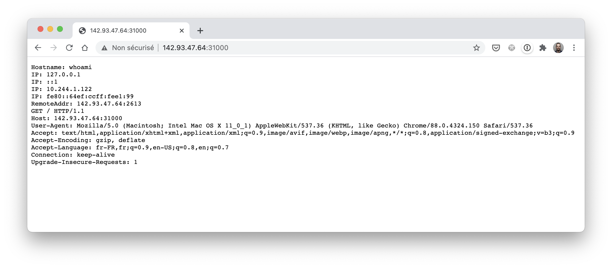

## Exercice

Dans cet exercice, vous allez créer un Pod et l'exposer à l'extérieur du cluster en utilisant un Service de type *NodePort*.

### 1. Création d'un Pod

Créez un fichier *www_pod.yaml* définissant un Pod ayant les propriétés suivantes:
- nom: *www*
- label associé au Pod: *app: www* (ce label est à spécifier dans les metadatas du Pod)
- nom du container: *nginx*
- image du container: *nginx:1.16-alpine*

### 2. Lancement du Pod

Créer le Pod avec la commande suivante:

```
$ kubectl apply -f www_pod.yaml
```

### 3. Définition d'un service de type NodePort

Créez un fichier *www_service_NodePort.yaml* définissant un service ayant les caractéristiques suivantes:
- nom: *www-np*
- type: *NodePort*
- un selector permettant le groupement des Pods ayant le label *app: www*.
- forward des requètes vers le port *80* des Pods sous-jacents
- exposition du port *80* à l'intérieur du cluster
- exposition du port *31000* sur chacun des nodes du cluster (pour un accès depuis l'extérieur)

### 4. Lancement du Service

A l'aide de *kubectl* créez le Service défini dans *www_service_NodePort.yaml*

### 5. Accès au Service depuis l'extérieur

Lancez un navigateur sur le port 31000 de l'une des machines du cluster.

Si vous utilisez **minikube**, vous n'avez qu'un seul node et l'URL sera de la forme *http://192.168.99.100:31000*



### 6. Cleanup

Supprimez l'ensemble des ressources créés dans cet exercice

---


## Correction

### 1. Création du Pod

La spécification du Pod est la suivante:

```
apiVersion: v1
kind: Pod
metadata:
  name: www
  labels:
    app: www
spec:
  containers:
  - name: nginx
    image: nginx:1.16-alpine
```

### 2. Lancement du Pod

La commande suivante permet de créer le Pod:

```
$ kubectl apply -f www_pod.yaml
```

### 3. Définition d'un Service de type NodePort

La spécification du Service demandé est la suivante:

```
apiVersion: v1
kind: Service
metadata:
  name: www-np
  labels:
    app: www
spec:
  selector:
    app: www
  type: NodePort
  ports:
  - port: 80
    targetPort: 80
    nodePort: 31000
```

### 4. Lancement du Service

La commande suivante permet de lancer le Service:

```
$ kubectl apply -f www_service_NodePort.yaml
service "www-np" created
```

### 6. Cleanup

Les ressources peuvent être supprimées avec les commandes suivantes:

```
$ kubectl delete po/www
$ kubectl delete svc/www-np
```
